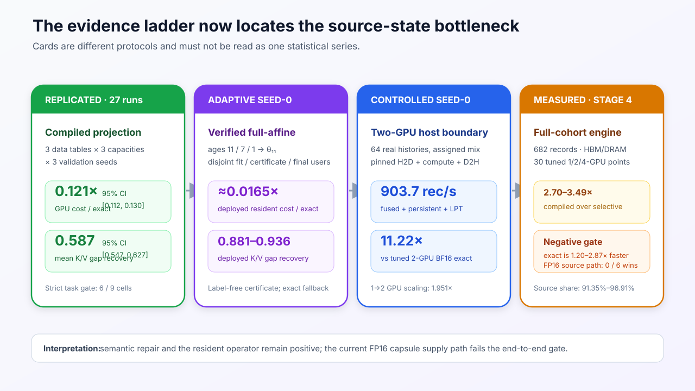

# CohortKV: Compiled Cross-Version K/V Migration for Streaming Generative Recommendation

**Anonymous Authors**

*Systems-paper working draft, 26 July 2026. The evaluation deliberately distinguishes replicated
results, adaptive seed-0 design evidence, and interface validation. Section 10 states the
experiments still required before submission.*

## Abstract

Streaming generative recommenders update their model while retaining long user histories.
Persisted prefix key/value (K/V) avoids re-encoding histories, but updates make it version-stale:
reuse is cheap but semantically mismatched, whereas exact recomputation replays the history. We
present **CohortKV** for migrating stale HSTU K/V across model versions. CohortKV treats a
source/target pair as a compilation and execution unit, not as a prediction that reuse is safe.
Its compiler fits a shared
`fresh − cheap` residual over cached old layer-normalized states and folds the repair into one
affine projection. A label-free semantic certificate records the least-cost qualifying program
and an exact fallback. A fused operator executes the program with length masking and direct K/V
writes; a destination engine exposes a target version only after complete manifest coverage.

Across 27 independently trained chains spanning three data tables and three capacities, compiled
repair costs 0.121× exact recomputation on average (95% CI [0.112, 0.130]) and recovers 0.587 of
the stale-to-fresh K/V gap (95% CI [0.547, 0.627]). Only 6/9 cells pass a strict task-quality gate,
showing why task quality cannot decide which cohorts may skip synchronization. In an adaptive
seed-0 long-context study, verified full-affine programs cost about 0.064× exact and recover
0.887–0.936 of the K/V gap. On a controlled seed-0 64-record two-A40 trace with matched host
residency and target publication, the fused path reaches 903.7 records/s, scales 1.951× from one
to two GPUs, and is 11.22× faster than a tuned BF16 exact baseline. The multi-destination
transaction is interface-validated; complete-cohort, identical-destination performance remains
an open experiment.

## 1. Introduction

Generative recommendation reframes a user's ordered behavior as a sequence and predicts the next
item from that history. Architectures such as HSTU are designed for high-cardinality,
non-stationary streams and make long histories computationally useful [1]. At the same time,
recommender systems continuously learn from new interactions so that new preferences and content
can enter the model quickly [2]. These two properties create a systems conflict that does not
appear when either the model or its derived state is short lived: a serving system wants to retain
the expensive representation of each long history, while streaming training repeatedly changes
the model under which that representation was computed.

For HSTU, the persistent representation includes the attention keys and values at every layer.
Let \(C_v(x)=F(\theta_v,x)\) denote the prefix K/V generated for history \(x\) by model version
\(\theta_v\). After training publishes \(\theta_t\), the system may keep using \(C_v(x)\), but
current queries then combine current-model computation with an old-model prefix. Alternatively, it
may compute \(C_t(x)\) exactly, which restores current-model semantics at the cost of replaying the
entire history. Unlike ordinary eviction restoration, the source state has not merely moved: its
meaning is tied to a different model version.

Existing K/V systems make the boundary precise. HCache restores evicted state from intermediate
activations under the same model [3]. DroidSpeak already supports K/V sharing across
same-architecture fine-tuned LLM variants through selective layer recomputation [4], so
cross-model K/V by itself is not our novelty. MTServe persists generative-recommendation K/V
across visits and manages where that state resides [5], but its published workflow does not define
a source-to-target model-version transform. CohortKV instead compiles such a transform over
persistent HSTU state produced by successive streaming versions and applies it to a fixed
target-version update cohort.

This problem is not solved by choosing a universal cache lifetime. Across the model-version
chains in this repository, older versions generally drift farther in K/V space, but age is not a
calibrated predictor of ranking impact. Some exact maintenance endpoints are close to zero or even
negative because a newly trained model is not guaranteed to rank every fixed evaluation slice
better than its predecessor. Per-user K/V drift is likewise uninformative about who benefits from
maintenance. A system that uses age, drift, or observed task gain to decide whether a cohort is
“safe” to reuse would therefore confuse current-model state fidelity with an application-quality
prediction.

CohortKV instead asks a narrower question: given a fixed set of old states, how can the system
move them toward a declared current-model K/V target more cheaply than exact replay? The
opportunity comes from HSTU's data path. Each layer produces K/V by applying the layer's K/V
projections to a normalized hidden state. If the old normalized state is retained, applying the
current projections gives a cheap approximation. CohortKV measures the shared residual from this
approximation to fresh K/V on a small version-pair sample, fits that residual as an affine function
of the old normalized state, and folds the result into one prepacked projection. The per-record
path remains one matrix operation rather than executing a learned correction after the projection.

Turning that algebra into a system requires two further steps. First, the operator must fuse the
affine epilogue, respect valid sequence lengths, and write destination-ready K/V; otherwise small
kernel savings can disappear in packing and padding. Second, a complete update must move many
mixed-source records through HBM and host or storage boundaries, partition work across GPUs, and
make no partial target version visible. CohortKV therefore comprises exactly three layers:

1. a **version-cohort migration compiler** that fits and certifies a shared source-to-target
   program without recommendation labels;
2. a **capsule-to-K/V operator** that executes the program in one fused, length-aware pass; and
3. a **destination-oriented update engine** that transforms a fixed record set and atomically
   publishes one target-version manifest.

Figure 1 shows the job boundary. Training publishes checkpoints but is not part of the job;
request arrivals, hotness, routing, and training/serving co-location are also outside the present
scope. The version cohort connects the three layers: it keys compilation, homogeneous batching,
program residency, extent placement, and metadata. It never predicts that stale reuse is harmless.
Every stale cohort receives compiled synchronization, with stronger replay and exact recomputation
available under the published semantic contract.


**Figure 1: Cross-version invalidation and the CohortKV job boundary.** Training and foreground
serving are deliberately outside the fixed destination-update job.

Our current evidence supports the following contributions, with explicit maturity boundaries:

- We formulate model-version K/V migration as version-cohort compilation and develop a shared
  affine repair with label-free semantic certification and exact fallback. A frozen, simpler
  compiled family is replicated across 27 trained chains; the attention-weighted verified compiler
  is currently an adaptive seed-0 design result.
- We implement a Triton capsule-to-K/V operator and a mixed-cohort multi-GPU host pipeline. On a
  controlled two-A40, 64-record trace, the operator advantage survives pinned-host input and
  complete K/V publication and yields an 11.22× speedup over a separately tuned BF16 exact path
  with the same host-residency and target-publication boundary.
- We design and implement a common HBM, DRAM, POSIX, and remote-object transaction that publishes
  a target version only after complete coverage. This contribution is interface-validated; its
  complete-cohort, identical-boundary performance comparison is intentionally left open rather
  than inferred from the controlled trace.

## 2. Background, semantics, and scope

### 2.1 HSTU prefix K/V

The repository uses a modular, simplified HSTU that preserves the two properties required by this
study: pointwise unnormalized attention and first-class K/V output. For layer \(\ell\), let
\(h^\ell_\theta(x)\) be its input hidden sequence and

\[
z^\ell_\theta(x)=\operatorname{Norm}^\ell_\theta
                 \left(h^\ell_\theta(x)\right).
\]

The concatenated K/V output is

\[
y^\ell_\theta(x)
=
\left[k^\ell_\theta(x),v^\ell_\theta(x)\right]
=
z^\ell_\theta(x)P^\ell_\theta+b^\ell_\theta,
\tag{1}
\]

where \(P^\ell_\theta\) concatenates the current K and V projection weights. The complete cache
has shape \([L,B,S,2D_{kv}]\) before the K/V split. Sequence lengths accompany every batch, and
positions beyond each valid length are zeroed.

The serving experiment predicts item \(t+1\) from hidden state \(t\). A fresh request recomputes
the complete history with the current model. A stale request supplies an old-version prefix K/V
and computes the latest token with the current model. Fresh and stale therefore use the same
history and current query path; only the model version that produced the resident prefix differs.

### 2.2 Migration capsules

Exact current K/V needs \(z^\ell_t(x)\), which in turn depends on current hidden propagation
through all preceding blocks. CohortKV retains a **migration capsule**

\[
Z_v(x)=\{z^1_v(x),\ldots,z^L_v(x)\}
\]

with the record ID, valid length, and **migration anchor version** \(v\). Producing target K/V does
not change this anchor: a capsule can remain anchored at \(v\) while its output declares
**served K/V target** \(t\). Keeping these two version fields separate prevents a migrated
approximation from masquerading as a freshly captured current capsule.

For equal precision and hidden/K/V widths, one normalized state per layer is half the size of both
K and V. In the controlled long-context trace, unpadded FP16 capsules are exactly 50% of logical
FP16 K/V capacity; padded capsules occupy 1.507 GiB versus 2.998 GiB of logical old K/V. This is an
explicit space-for-update-time trade-off, not free metadata.

### 2.3 Version cohort

A **version cohort** is the pair

\[
\gamma=(v,t)
\]

shared by records whose capsules are anchored at \(v\) and whose K/V must target \(t\). CohortKV
fits and publishes one program per \(\gamma\), keeps the relevant programs resident on every
worker, and retains \(\gamma\) in each output extent. Several source versions may share one target
job, but their programs remain distinct. The current implementation requires the programs in one
job to share layer count, hidden width, K/V width, and target version.

### 2.4 Fixed destination-update job

The system contract is:

> Given materialized old capsules, published source-to-target programs, a fixed complete record
> set, execution GPUs, and an explicit destination, produce target-version K/V for every record
> and make one complete manifest visible.

| Inside the current boundary | Outside the current boundary |
|---|---|
| Source/target program selection from published artifacts | Streaming training and checkpoint production |
| Cohort grouping, length bucketing, and GPU placement | Online request arrivals and per-user hotness |
| H2D, migration compute, D2H when required | Foreground inference interference and SLO scheduling |
| HBM, DRAM, POSIX, or remote-object publication contract | Automatic destination or cache-tier selection |
| Complete coverage, duplicate rejection, commit, abort | Cross-destination distributed transactions |

The destination is an input rather than a policy decision. HBM, DRAM, a local filesystem, and a
remote object store answer different endpoint questions and are not compared as if their
completion times were interchangeable.

## 3. Motivation and design requirements

### 3.1 Stale reuse leaves a maintenance opportunity

We first separate three quantities at a fixed current endpoint:

- **full-compute streaming value**: current streaming model with current K/V, relative to a frozen
  base model;
- **full-reuse streaming value**: current streaming model consuming the old prefix K/V, relative
  to the frozen base model;
- **cache-maintenance value**: full compute minus full reuse.

The primary KuaiRand [6] Top-50k/all-chunks protocol finds a full-compute BestRank value of 3837.67
(95% CI [3389.91, 4285.44]), of which stale reuse retains 2952.11
([2700.21, 3204.02]). The remaining maintenance value is 885.56
([460.24, 1310.88]), a 23.1% staleness tax. The aligned theta5 screen shows a positive mean
maintenance gap in all three evaluated tables:

| Dataset/table | Full compute | Full reuse | Maintenance |
|---|---:|---:|---:|
| KuaiRand | 484.34 [462.15, 506.54] | 399.02 [370.79, 427.26] | 85.32 [53.74, 116.91] |
| Tenrec QB, fixed horizon | 94.70 [70.49, 118.90] | 64.38 [54.41, 74.35] | 30.31 [14.08, 46.55] |
| Tenrec QK, Top-5k | 47.34 [29.20, 65.47] | 34.34 [20.55, 48.13] | 13.00 [5.70, 20.30] |

Values are BestRank improvements and intervals use four training seeds. QB and QK are related
tables from Tenrec [7], not independent industrial domains, and their time is ordinal rather
than a shared calendar. The result establishes a cross-table opportunity, not universal task
harm from staleness.

**Requirement 1.** A stale cohort needs a synchronization path cheaper than exact history replay;
plain reuse is a baseline, not a publishable target state.

### 3.2 Age and task quality are not admission oracles

We next vary data and model capacity in a frozen 3×3 screen. All nine cells have positive
full-compute and full-reuse streaming value in 4/4 seeds, but the mean BestRank staleness tax is
neither uniformly positive nor monotone with capacity.

| Cell | Parameters | Layers / hidden | Mean staleness tax | Positive maintenance seeds | Cheap projection / exact, seed 0 |
|---|---:|---:|---:|---:|---:|
| KuaiRand small | 3.27 M | 3 / 64 | 0.128 | 3/4 | 0.198 |
| KuaiRand medium | 5.09 M | 6 / 96 | 0.102 | 4/4 | 0.188 |
| KuaiRand large | 7.16 M | 9 / 128 | 0.360 | 4/4 | 0.187 |
| QB small | 3.27 M | 3 / 64 | 0.015 | 3/4 | 0.197 |
| QB medium | 5.09 M | 6 / 96 | −0.060 | 1/4 | 0.188 |
| QB large | 7.16 M | 9 / 128 | 0.548 | 4/4 | 0.185 |
| QK small | 0.39 M | 3 / 64 | 0.126 | 3/4 | 0.204 |
| QK medium | 0.77 M | 6 / 96 | 0.233 | 4/4 | 0.188 |
| QK large | 1.40 M | 9 / 128 | −0.005 | 3/4 | 0.186 |

The last column is a resident-GPU cost diagnostic rather than a replicated quality statistic.
Compute scales cleanly, while task maintenance does not: large KuaiRand and QB expose substantial
taxes, but large QK is near zero. At a fixed target, every 3×3 age curve has monotonicity
violations. In the adaptive seed-0 16-layer long-context diagnostic, age strongly orders K/V
drift, yet after removing the special base-to-stream boundary it explains only 6.15% of MeanRank
variation, compared with 60.9% explained by current version identity.

Nor does a per-user signal repair this problem. Relative K/V drift and maintenance utility have a
correlation of 0.020 (95% CI [−0.012, 0.052]), and the investigated JVP/Fisher route is not cheaper
than the operation it would govern. We retain this only as a negative result.

**Requirement 2.** Version identity may organize work, but neither age, drift, nor observed task
gain decides whether a stale cohort can bypass synchronization. The system should verify
current-model semantic fidelity without recommendation labels and retain exact recomputation as
the endpoint. Because exact is a semantic reference rather than a ranking upper bound, recovery
above 100% and negative task gaps must remain signed.

### 3.3 HSTU exposes a compilable repair

Equation (1) separates two sources of cross-version error: the current K/V projections have
changed, and the normalized hidden state that feeds them has changed. Applying current
\(P_t^\ell,b_t^\ell\) to old \(z_v^\ell\) repairs the first source at low cost but omits current
hidden propagation. Across datasets, this cheap projection costs roughly one tenth to one fifth
of exact replay and closes a material, though incomplete, fraction of the K/V gap.

The remaining error is structured at the version-pair level. Fitting a shared map from old
\(z_v^\ell\) to `fresh − cheap` K/V and compiling it into the current projection yields one
homogeneous operator for the cohort. Earlier structural screens delimit alternatives: plain
prefix replay is never selected once compiled projection and residual transport share one action
library; all 54 matched recent-token partial actions are slower at the evaluated length; arbitrary
contiguous intervals add negligible value relative to their \(O(L^2)\) planner. These
discovery-stage actions remain baselines rather than the active method.

**Requirement 3.** Move adaptation out of the per-record path. Compile a shared residual into one
affine projection, and use progressive current-model replay or exact recomputation only for a
stricter semantic tier.

### 3.4 Kernel cost is not job cost

A compiled matrix operation can still lose end-to-end if the runtime repeatedly moves programs,
pads unrelated lengths, allocates outputs, serializes device work, or compares against an exact
baseline with a different publication boundary. The controlled trace contains mixed source
versions and long histories, so H2D, compute, D2H, output layout, and multi-GPU imbalance are all
visible.

A controlled seed-0 page/jagged experiment reinforces the need for endpoint discipline.
Compaction improves the host-backed path by only 1.019× and is 0.984× the one-record design at the
HBM boundary. HBM itself is 2.159× faster than host publication because it removes D2H; that is a
destination difference, not a faster migration operator.

**Requirement 4.** The operator must write final-layout K/V, and system speedups must survive a
matched source-residency and target-publication boundary. Destination placement must be explicit,
with complete-version visibility separated from kernel timing.

| Observation | Resulting mechanism | Evaluation question |
|---|---|---|
| Reuse leaves a maintenance gap. | Unconditional compiled synchronization plus exact endpoint. | Does the opportunity persist across tables and capacities? |
| Age and task quality are not calibrated. | Version-pair execution key and label-free semantic contract. | Does fidelity/cost replicate even when task gates fail? |
| HSTU exposes old normalized states and current projections. | Shared residual folded into one affine program. | How much K/V gap closes at measured GPU cost? |
| Movement can erase kernel savings. | Fused direct-write operator and destination job. | Does the gain survive the same endpoint, and what remains open? |

## 4. CohortKV overview

Figure 2 shows how one version cohort coordinates the system. The compiler defines **what**
transformation is semantically admissible, the operator defines **how** one capsule batch becomes
K/V, and the engine defines **where and when** complete extents become visible.


**Figure 2: Three-layer CohortKV architecture.** Version cohorts organize execution; they do not
predict safe reuse.

1. **Compile.** For each \((v,t)\), calibration records expose old capsules and exact current K/V.
   The compiler fits candidate affine repairs, measures GPU cost, and evaluates label-free cache,
   score-vector, and top-100 semantic views on disjoint certificate users. It publishes one
   selected action and ordered stronger fallbacks ending in exact recomputation.
2. **Execute.** A worker validates that the capsule anchor matches the program source. Programs
   for all source versions in the job remain resident. The fused operator projects old normalized
   states, adds bias, masks padding, splits K/V, and writes a preallocated target extent.
3. **Publish.** The engine groups and buckets fixed records, assigns byte-weighted extents across
   GPUs, and follows the destination's publication mode. Host destinations pipeline H2D, compute,
   D2H, and publication in bounded waves. HBM writes directly on the destination GPU. A manifest
   becomes visible only after complete, duplicate-free record coverage.

The update coordinator merely resolves job specifications and invokes these layers. It does not
compile programs, infer reuse safety, choose a destination, schedule online requests, or provide
durable job recovery, so we do not present it as a fourth contribution.

## 5. Version-cohort migration compiler

### 5.1 Cheap projection and residual decomposition

For cohort \((v,t)\), applying the current projection to an old capsule gives

\[
\widetilde y_{\text{cheap}}^\ell
=z_v^\ell P_t^\ell+b_t^\ell.
\tag{2}
\]

Calibration records additionally expose exact current
\(y_t^\ell=z_t^\ell P_t^\ell+b_t^\ell\), so the target residual is

\[
r^\ell=y_t^\ell-\widetilde y_{\text{cheap}}^\ell.
\tag{3}
\]

The compiler fits a ridge-regularized affine map

\[
r^\ell \approx
(z_v^\ell-\mu^\ell)A^\ell+\bar r^\ell.
\tag{4}
\]

In the capacity study, \(A^\ell\) may be truncated to a low-rank factorization during fitting.
The factorization changes offline statistical capacity but not online work: before publication,
the compiler folds it into

\[
\widehat P^\ell=P_t^\ell+A^\ell,\qquad
\widehat b^\ell=b_t^\ell+\bar r^\ell-\mu^\ell A^\ell.
\tag{5}
\]

Execution is therefore one affine projection,
\(\widehat y^\ell=z_v^\ell\widehat P^\ell+\widehat b^\ell\), with the same matrix shape for every
fitted rank. It is an approximation to current K/V, not an equivalence to current hidden
propagation.

For the long-context design, the compiler fits a full-affine \(A^\ell\). Uniform regression treats
all prefix positions equally even though the current request does not. The selected design weights
each valid token-layer example by an HSTU attention-use statistic computed from current queries and
keys, normalizes weights to unit mean, and caps them at eight. This changes fitting only; program
shape, online state, and kernel work remain unchanged. No recommendation labels enter the fit.

### 5.2 Label-free semantic contract

A cheap transformation should not be selected merely because it performs well on the records used
to fit it. CohortKV separates fit, hyperparameter-selection, certificate, and final-test users.
For certificate user \(u\), it evaluates three error views:

\[
e_{\text{cache}}=\text{relative K/V error},\quad
e_{\text{score}}=1-\cos(s_a,s_t),\quad
e_{\text{top100}}=1-\operatorname{overlap}_{100}(a,t).
\]

Here \(s_a\) and \(s_t\) are full-catalog score vectors under action \(a\) and exact current K/V.
The certificate measures how much of the reuse-to-exact error gap the action closes:

\[
\operatorname{recovery}(a)=
\frac{e_{\text{reuse}}-e_a}
     {e_{\text{reuse}}-e_{\text{exact}}}.
\tag{6}
\]

The current long-context contract requires, for all three views:

- a recovery target of at least 70%;
- a one-sided 90% bootstrap lower bound on ratio-of-means recovery of at least 70%;
- at least 80% per-user coverage after a one-sided 90% Wilson lower bound; and
- a measured GPU cost no greater than 30% of exact for the primary action.

The compiler chooses the least-cost action that passes fidelity and budget. If no action passes the
budget, it may publish the least-cost fidelity-certified overflow action. If no approximate action
passes, exact recomputation is forced. The artifact also contains an ordered fallback chain.
Recommendation labels are withheld until final task evaluation.

“Label-free” does not mean “cost-free.” Certification recomputes exact current K/V for its probe
users and compares full-catalog score vectors. This cost is paid once per version pair and is
excluded from the v2 per-record runtime. A complete update experiment must report compiler and
certificate time, cohort size, and amortized cost.

This contract verifies a synchronization implementation, not the proposition that the current
model will improve a ranking metric. An action can pass semantic fidelity even when exact current
K/V is worse than stale reuse on a particular task slice.

### 5.3 Higher-fidelity tier and exact endpoint

The active cohort-tiered action library contains:

1. compiled affine repair;
2. residual-\(p\) replay; and
3. exact current-model recomputation.

Residual-\(p\) executes the first \(p\) current-model blocks exactly, computes the boundary
displacement

\[
\Delta_p=h_p^t-h_p^v,
\]

and approximates deeper states by \(h_\ell^v+\Delta_p\) before the current layer's
`Norm + Wk/Wv` projection. It supplies a predefined structural escalation tier without a per-user
predictor or another learned online operator. Exact recomputation is the terminal K/V reference.
In the primary 50% replicated operating point, all 27 held-out chains select compiled projection;
at the 75% discovery point, three large cells select residual depths 5, 6, and 7. In the long-context
certificate, an earlier **structural prefix-replay** library uses p4 and p8 rather than
residual-delta transport. Structural p8 is retained as a fallback only where it passes; it is not
hard-coded as a middle tier. The two action families are controls from different protocols and are
not pooled as if they were the same method.

### 5.4 Published program

An immutable migration program records source version, target version, layer count, input/K/V
widths, compiled weights and biases, and fitting metadata. The verified plan records the contract,
each action's cost and certificates, the selected action, selection reason, and fallback order.
At runtime, a source mismatch, tensor-shape mismatch, or device mismatch is an error rather than an
implicit conversion.

## 6. Capsule-to-K/V operator

### 6.1 Reference and packed paths

The reference operator executes Equation (5) in FP32 and materializes the concatenated projection
before splitting K/V. A packed FP16 path instead uses batched matrix multiplication over flattened
record-token rows. It expands the bias, applies a valid-length mask, converts to the capsule dtype,
and returns K/V views. This path establishes a strong framework baseline and isolates the value of
the custom epilogue.

### 6.2 Fused direct-write kernel

The Triton operator consumes:

- a contiguous FP16 capsule \([L,B,S,H]\);
- contiguous FP16 weights \([L,H,2D_{kv}]\);
- biases \([L,2D_{kv}]\); and
- one valid length per record.

Its grid spans layers, row tiles over \(B\times S\), and output-width tiles. Each program
accumulates the \(H\)-dimension in FP32, adds the layer bias, derives record and token positions
from the flattened row, and replaces padded positions with zero. Output offsets below
\(D_{kv}\) write directly to the contiguous K tensor; the remaining offsets write directly to V.
The operator thus avoids a separate mask, split, and contiguous-copy epilogue.

The output retains record IDs, the capsule's migration anchor, the program's served K/V target,
and valid lengths. Numerical validation compares packed and fused FP16 output against the FP32
reference, including padding zeros and finite-value checks.

### 6.3 Variable-length organization

Padding is a systems cost even though it is semantically masked. The host runtime sorts records
into length buckets and constructs small homogeneous batches within each source cohort. In the
controlled seed-0 layout search, removing length bucketing reduces migration throughput from
863.2 to 643.1 records/s; the selected 32-token bucket also outperforms adjacent 16- and 64-token
buckets.

We separately implemented a jagged capsule layout with per-record offsets and compact outputs that
match the dense fused values. It is useful when many short fragments can be coalesced, but it is
not a positive result on the current long-context trace (§9.6). CohortKV therefore treats
jagged/page compaction as a conditional layout mechanism, not as a defining contribution.

## 7. Destination-oriented update engine

### 7.1 Program residency and mixed-source execution

A job may contain several source versions but exactly one target. Each worker holds one prepared
program per source version and selects it from the capsule anchor. Programs are replicated across
workers; record extents are partitioned. The current multi-GPU engine supports round-robin,
greedy input-order, and longest-processing-time-first (LPT) placement. LPT estimates an extent's
work from capsule and output bytes and greedily assigns the next largest extent to the least-loaded
worker.

The program table is small relative to long-context state. In the controlled seed-0 two-GPU run,
three FP16 programs replicated across both GPUs occupy 96.2 MiB; the target K/V is partitioned and
needs no peer transfer.

### 7.2 Host-staged pipeline

Figure 3 shows one host-staged wave. CPU capsules are pinned, copied asynchronously to the assigned
GPU, transformed by the resident program, and copied into persistent pinned target extents.
Separate H2D, compute, and D2H streams allow adjacent batches to overlap. A single publication
worker stages completed extents, while a bounded queue applies backpressure. Wave size bounds
transformed output residency after source capsules have been materialized.


**Figure 3: Host-staged execution and publication.** The bounded wave and publication queue do not
yet bound total source residency because the caller materializes the complete capsule-batch
sequence.

The direct-HBM mode answers a different endpoint question. It preallocates target extents on the
destination GPUs and keeps the output there, so it has neither D2H nor host publication. The
current implementation requires computation to occur on the destination GPU and does not perform
cross-GPU P2P publication.

### 7.3 Destination transaction

Every backend exposes the same logical transaction:

```text
begin(job, target_version, expected_record_ids)
  -> stage(extent_id, target K/V)*
  -> commit(complete version manifest)
  -> or abort()
```

An extent records stable record and extent IDs; migration anchor and served K/V target; layer,
valid-token, K/V-width, dtype, and logical-byte metadata; destination location and device; and an
optional serialized-payload checksum. Commit rejects duplicate or missing records, duplicate
extent IDs, and target-version disagreement. The manifest is the visibility point: staged state
without a committed manifest is not a published target version.

The four current backends are:

| Destination | Data path and visibility | Current evidence |
|---|---|---|
| HBM | Compute on destination GPU; manifest points to resident device extents | Functional single-/multi-GPU direct write |
| DRAM | Pinned H2D → transform → D2H; in-memory manifest retains CPU extents | Byte-exact readback and abort validation |
| POSIX filesystem | Host path; immutable serialized extents; same-filesystem directory rename publishes manifest and objects | Functional interface with checksum and optional `fsync`; no physical SSD benchmark |
| Remote object | Host path; immutable object uploads; manifest object written last | Client protocol and in-memory reference store; no network benchmark |

For POSIX, each extent and the manifest are written through a temporary file and atomically
replaced; the staged directory is renamed into the target-version namespace at commit. For the
remote protocol, the system assumes atomic individual object puts and uses a manifest-last commit
marker. These semantics do not constitute a distributed transaction across destinations.

### 7.4 Failure boundary

An exception before commit aborts the transaction. DRAM and HBM drop private staging maps; POSIX
removes the private staging directory; the remote adapter deletes unreferenced objects recorded by
the transaction. The current coordinator has no durable resume log, so process recovery and
idempotent resumption are outside the claim.

## 8. Implementation

CohortKV is implemented in Python 3 and PyTorch. The simplified HSTU exposes per-layer normalized
states and first-class K/V. Compiler artifacts are ordinary tensors plus serializable metadata.
The reference and packed operators use PyTorch; the fused operator uses Triton with tunable
\(M,N,K\) tiles, warp count, and pipeline stages.

The CUDA streaming executor maintains separate copy and compute streams, optionally pins capsule
inputs, and may write into persistent pinned output pools. The multi-GPU executor creates one
single-device worker per GPU and combines per-device timing, bytes, record count, token count,
program replicas, and assigned-work imbalance. The destination-oriented engine adds bounded
host-staged waves, a bounded publication queue, direct-HBM dispatch, and job-level commit timing.

The implementation contains a thin plan-first coordinator that resolves a job specification into
programs, capsule shards, devices, and a destination. It intentionally does not infer whether a
version may be reused, create source capsules, compile programs, or choose a storage tier.

The v4 implementation is a vertical slice rather than the final measured system. In particular:

- host-staged transform and publication buffers are bounded, but the caller currently materializes
  the entire CPU capsule-batch sequence;
- HBM execution retains the entire target and currently runs as one direct job;
- verified plans serialize stronger fallbacks, but the destination engine currently consumes
  compiled affine programs and does not automatically execute the plan's residual/structural/exact
  fallback chain;
- exact recomputation does not yet publish through the same v4 destination transaction; and
- POSIX and remote backends have correctness tests but no physical-device or network measurement.

## 9. Evaluation

### 9.1 Questions and protocol

We organize the evaluation around four questions:

- **RQ1:** Is cross-version K/V maintenance a meaningful opportunity across data tables and model
  capacities?
- **RQ2:** Does compiled cohort repair scale in measured GPU cost and current-model semantic
  fidelity, including when task quality is an unreliable gate?
- **RQ3:** Does the operator advantage survive matched host-resident sources, the same target K/V
  publication boundary, and mixed-source two-GPU execution?
- **RQ4:** Which destination semantics are implemented, and what performance evidence remains
  missing?

The primary datasets are the standard KuaiRand-1K logs [6] and the QB/QK ordered-exposure tables
from Tenrec [7]. The random-exposure KuaiRand log is excluded from training. The item vocabulary
is fit only on the base period. Training uses only targets from the current stream date/window,
evaluation positives are engaged items, and the model predicts item \(t+1\) from hidden state
\(t\). Ranking uses the full base-fitted catalog. Hidden-state and K/V computation respect
sequence lengths and zero padding. BestRank is the minimum catalog rank among a user's engaged
positives, so lower is better; a reported BestRank gain is the baseline rank minus the evaluated
rank and is positive when ranking improves.

All comparisons use the stale-serving semantics from §2.1: old-version prefix K/V plus the latest
token under the current model versus a complete current-model forward on the same history. GPU
cost is measured rather than replaced by a hand-written constant. For replicated claims, the
training seed is the statistical unit; users within one trained model are diagnostics.

We label four evidence levels:

- **replicated** for frozen multi-seed protocols;
- **controlled seed-0** for real-checkpoint but adaptive compiler/system development;
- **interface-validated** for executable correctness without a performance admission result; and
- **open** for required evidence not yet available.

Figure 4 summarizes these levels. The cards are separate protocols and not one inferential series.



**Figure 4: Evidence ladder and maturity boundary.** Algorithm cost/fidelity is replicated; the
more sophisticated compiler and runtime are preliminary; destination performance is not yet
claimed.

### 9.2 RQ1: Opportunity across data and capacity

The aligned cross-table result in §3.1 and the stronger Top-50k/all-chunks KuaiRand result show that
streaming value can coexist with a measurable maintenance gap. The 3×3 screen sharpens the claim:
all nine cells benefit from streaming training and retain some of that benefit under reuse in all
four seeds, but only some cells have a substantial positive mean maintenance endpoint.

This distinction matters for the system design. The cost opportunity scales smoothly: the cheap
projection requires 0.185–0.204× exact resident-GPU time in the seed-0 diagnostic as depth/width
grow. The task opportunity does not: large KuaiRand and large QB have 0.360 and 0.548 mean
BestRank staleness taxes, while large QK is −0.005. A mechanism can therefore be valuable as a
current-model state transform even when a particular task slice supplies little positive
maintenance value.

Fixed-endpoint age curves also reject a universal update window. Every 3×3 curve is non-monotone,
and early ages vary in sign. The long-context theta0/4/10-to-theta11 study deliberately includes
ages 11, 7, and 1. These cohorts are useful as distinct compilation and batching keys; their age
alone is insufficient as a quality-admission policy.

**Answer to RQ1.** The evaluated streams expose both a repeatable systems pressure and a
dataset/capacity boundary. This motivates an efficient semantic transform, not a claim that every
cohort has positive ranking maintenance value.

### 9.3 RQ2: Replicated compiled migration

The frozen cohort-tiered validation spans KuaiRand, QB, and QK; small, medium, and large models;
and three non-discovery training seeds per cell, for 27 independent model-version chains. At the
primary 50% fidelity target, every validation run selects a compiled projection.

| Metric | Result |
|---|---:|
| Mean GPU cost / exact | 0.1211 [0.1118, 0.1304] |
| Mean stale-to-fresh K/V recovery | 0.5867 [0.5466, 0.6267] |
| Test splits meeting the 50% fidelity target | 25/27 |
| Positive BestRank / rank-utility / NDCG@100 signs | 20/27 · 24/27 · 20/27 |
| Strict positive-mean BestRank + rank-utility cells | 6/9 |

The failed strict cells are informative. QB-small has essentially zero mean rank-utility effect;
QB-medium exact recomputation itself has negative BestRank in all three validation seeds; and
QK-large has a near-zero, unstable exact endpoint. The compiled transform nevertheless follows the
available endpoint. Selected and exact have the same sign in 23/27 BestRank, 27/27 rank-utility,
and 25/27 NDCG@100 cases. When the exact endpoint is positive, selected is also positive in 18/20,
24/24, and 19/20 cases, with median signed-gap recoveries of 0.907, 0.972, and 0.966. These pooled
cross-cell values are descriptive, not new inferential replications.

At a 75% discovery target, six cells remain on compiled projection while the three large
KuaiRand/QB/QK cells choose residual depths 5/6/7, giving a version-dependent action curve. Plain
prefix replay is never chosen in the unified library. Because this operating point is discovery
evidence, the paper uses the replicated 50% result as its primary claim.

**Answer to RQ2.** Compiled repair replicates as a low-cost K/V-fidelity mechanism, but task
quality rejects a universal admission claim. This is why every stale cohort receives repair and
the compiler certifies semantic fidelity rather than predicted ranking gain.

### 9.4 RQ2 continued: Verified long-context compiler

The sophisticated compiler is evaluated on a 16-layer, hidden/K/V-width-512 HSTU with maximum
full sequence 2048, about 0.181 billion parameters, and target theta11 on D16. This is an
**adaptive seed-0 design study**, not an independent replication. The 682 evaluable users are
partitioned into 40 full-affine fit users, 60 users used by earlier hyperparameter selection,
60 new certificate users, and 522 final-test users. The certificate does not access
recommendation labels. These roles are disjoint in the final protocol, but earlier design rounds
had already inspected this seed's former test population; the complete result therefore remains
adaptive rather than confirmatory.

| Age | Selected action | Certificate cost / exact | Worst recovery LB | Worst coverage LB | Final cost / exact | Final K/V recovery | Score cosine | Top-100 overlap |
|---:|---|---:|---:|---:|---:|---:|---:|---:|
| 11 | compiled full affine | 0.0627 | 0.8530 | 0.9224 | 0.0638 | 0.8865 | 0.999770 | 0.9695 |
| 7 | compiled full affine | 0.0631 | 0.8373 | 0.9005 | 0.0640 | 0.8911 | 0.999913 | 0.9797 |
| 1 | compiled full affine | 0.0631 | 0.9228 | 0.9459 | 0.0641 | 0.9356 | 0.999994 | 0.9948 |

Projection-only is within the 30% budget but fails cache and top-100 fidelity at all three ages.
Structural p4 costs about 0.323× and fails the 70% cache contract. Structural p8 costs about
0.549×; it passes at ages 11 and 1 and is retained there as a fallback, but fails at age 7. All
three cohorts select the cheaper full-affine program; exact is the terminal fallback.

The selected action is fixed before the final users' labels are read. At the harmful age-11
endpoint, it recovers 98.8% of the signed MeanRank and AUC gaps, 90.3% of the NDCG@100 gap, and
88.9% of the Hit@100 gap. At age 7, stale reuse happens to beat exact current K/V on MeanRank and
AUC. The migrated state follows the current model and therefore gives up that accidental gain.
This is the intended semantics, and a direct demonstration that exact K/V is not a ranking-quality
upper bound.

The result shows that a label-free contract can select and publish a high-fidelity program on a
disjoint final set. It does not establish that the full-affine compiler generalizes across
training seeds; that freeze-and-replicate experiment remains open.

### 9.5 RQ3: Operator and controlled two-GPU runtime

The operator microbenchmark uses a representative resident batch with one record and sequence
width 2047.

| Operator | Median time | Speedup from previous row | Relative K/V error from FP32 | Contiguous K/V |
|---|---:|---:|---:|---|
| FP32 reference | 3.119 ms | — | 0 | no |
| Packed FP16 `baddbmm` | 0.838 ms | 3.72× | 3.66e−4 | no |
| Fused FP16 Triton | 0.706 ms | 1.19× | 3.66e−4 | yes |

The fused epilogue also changes the complete one-GPU host path from 162.5 to 138.1 ms, a 1.176×
improvement over packed FP16. Persistent output allocation is neutral in steady-state throughput
(138.2 ms versus 138.1 ms) but fixes destination addresses and removes first-registration
variance, so it is retained as an interface choice rather than claimed as an optimization.

The end-to-end trace contains 64 real histories sampled from the verified compiler's disjoint final
users: 13 theta0, 19 theta4, and 32 theta10 records assigned deterministically, totaling 98,252
logical prefix tokens. The model is the 16-layer long-context HSTU above. Both migration and exact
paths start from host-resident inputs and end with complete FP16 K/V in persistent pinned host
memory. Migration reads old normalized capsules, whereas exact recomputation reads raw histories;
the source representations are necessarily different, but their residency and target-publication
boundary match. Both include pinned H2D, operator/model execution, pinned D2H, worker overhead, and
scheduling. Both exclude checkpoint loading, old-capsule materialization, compiler fitting,
foreground serving, and storage below host DRAM. Exact recomputation is independently tuned, uses
batch 2, and reports BF16 and FP32 model execution; migration uses batch 1, 32-token buckets, and
three in-flight batches. Timings are medians of three complete runs after one warmup on two NVIDIA
A40 GPUs. The systems trace reads no recommendation labels; its quality provenance is the separate
522-user verified-compiler evaluation and is not re-estimated as an independent result on these
64 records.

| Configuration | Completion | Throughput | Assigned-work imbalance |
|---|---:|---:|---:|
| Fused, persistent, 1 GPU | 138.2 ms | 463.2 records/s | 0 |
| Fused, persistent, round robin, 2 GPUs | 71.60 ms | 893.9 records/s | 0.36% |
| Fused, persistent, LPT, 2 GPUs | 70.82 ms | 903.7 records/s | 0.03% |
| Exact BF16, 1 GPU | 1.564 s | 40.9 records/s | 0 |
| Exact BF16, 2 GPUs | 794.3 ms | 80.6 records/s | 0.02% |
| Exact FP32, 2 GPUs | 1.116 s | 57.3 records/s | 0.02% |

The selected migration path scales 1.951× from one to two GPUs, or 97.5% parallel efficiency.
LPT adds only 1.011× over round robin on this already fine-grained trace; its measured value is
reduced imbalance, not a large standalone speedup. Relative to the independently tuned two-GPU
BF16 exact path, migration is 11.22× faster at the same host boundary. The BF16 exact path itself
publishes FP16 K/V with 3.53e−3 relative error from FP32 and no NaN/Inf.

This trace is assigned rather than an organic model-version population, and 64 records are not the
complete update cohort. The result establishes that the operator advantage survives real capsule
reads, complete K/V writeback, and two-GPU execution under a controlled endpoint. It does not
establish v4 full-cohort destination performance. The 11.22× point also trades exact replay for the
separately certified approximate programs; it is not a claim of exact numerical equivalence.

**Answer to RQ3.** The fused operator changes both resident-kernel and complete host-boundary time;
cohort batching and simple extent placement preserve the gain across two local GPUs. The claim is
bounded to this seed-0 model, trace, hardware, and host endpoint.

### 9.6 RQ4: Layout boundary and destination correctness

The jagged v3 experiment compacts valid tokens and matches dense fused K/V element-for-element.
The resident fused operator remains 1.182× faster than packed FP16, but end-to-end compaction
yields only 1.019× on the host path and 0.984× at the direct-HBM boundary relative to one-record
execution. We therefore retain its representation and validation machinery without claiming a
positive layout result.

The v4 destination engine has executable HBM, DRAM, POSIX, and remote-reference paths. Tests
validate:

- byte-exact CPU readback for DRAM, filesystem, and remote objects;
- HBM direct-write numerical agreement;
- single- and two-GPU host-staged publication;
- rejection of duplicate, missing, wrong-version, and wrong-device extents;
- invisibility of incomplete transactions; and
- checksum/readback plus manifest-last publication for serialized backends.

These are tiny synthetic or interface-scale tests, not performance benchmarks. The host path
bounds wave output and pending publication after capsule materialization, but not the total source
set. The engine also does not yet dispatch a verified plan's stronger fallback actions. There is
no current comparison in which compiled migration and exact recomputation publish the complete
real cohort through the same HBM or DRAM v4 transaction. POSIX has not been measured on an
identified SSD, and the remote adapter has no network transport.

**Answer to RQ4.** The architecture's destination and failure semantics are implemented, while its
system admission experiment is still open. No full-cohort, SSD, network, or remote-GPU speedup is
claimed.

## 10. Discussion and limitations

### 10.1 When CohortKV applies

CohortKV assumes that source and target models expose compatible layer and projection shapes and
that old normalized states are retained. It is most attractive when histories are long, a model
update affects many cached records, and one version-pair program can amortize calibration. A small
cohort, short histories, frequent architecture changes, or an update interval longer than cache
lifetime can favor exact recomputation or simply rebuilding state on demand.

### 10.2 Capsule capacity and creation cost

The capsule adds substantial state: unpadded FP16 `Norm(x)` is 50% of FP16 K/V at equal widths.
The current controlled result begins after capsule materialization and therefore does not include
its creation or source-storage bandwidth. A complete paper result must measure compressed capsule
layouts, physical bytes, creation cost, and the update-frequency break-even point. CohortKV does
not currently show that the capacity trade-off is universally favorable.

### 10.3 External validity

The model is a modular, simplified HSTU rather than the production-scale system in the original
HSTU work [1]. KuaiRand is the only local long-context chain with the complete current design.
QB and QK broaden ordered-exposure evidence but are related Tenrec tables and lack a shared global
calendar. The sophisticated full-affine compiler and systems runtime are adaptive seed-0. Their
hyperparameters and certificate must be frozen on new training seeds or accepted external
checkpoints before confirmatory generalization claims.

### 10.4 Exact state versus task quality

The objective is current-model state fidelity. Exact recomputation supplies \(C_t(x)\), but a
current model may rank a fixed slice worse than a stale combination. CohortKV neither promises to
improve the current model nor preserves accidental gains from stale state. If an application wants
model rollback or online quality control, that is a separate model-management mechanism, not a
cache-migration admission rule.

### 10.5 Incomplete destination admission

The strongest current end-to-end number uses a controlled 64-record host boundary. Before the
destination engine can be the primary systems contribution, the evaluation must:

1. lazily scan the complete source capsule set;
2. run every eligible fixed update record;
3. dispatch the published selected action and exercise at least one automatic escalation through
   its residual/structural/exact fallback chain;
4. publish compiled and independently tuned exact paths through the same HBM and DRAM
   transactions;
5. report 1/2/4-GPU completion, tokens/s, physical and logical bytes, peak source/HBM/staging/target
   memory, backpressure, program amortization, and manifest commit; and
6. inject failures before and during publication.

Physical POSIX/SSD and network backends require separate protocols. Until those results exist, the
destination layer is an implemented architecture with correctness evidence, not a completed
out-of-core performance claim.

## 11. Related work

### 11.1 Streaming recommendation and model update

HSTU motivates generative recommendation over high-cardinality, non-stationary streams and
demonstrates the value of long sequential histories [1]. CohortKV studies a systems consequence:
the histories' derived K/V outlive the model version that created them. Ekko reduces model-update
latency by disseminating recommender parameter updates and managing model replicas [2]. We borrow
its observation that recommender freshness is operationally important, but CohortKV is not a model
publication system: training, checkpoint validation, WAN dissemination, and model rollback are
outside its boundary.

### 11.2 K/V memory, restoration, and hierarchical storage

vLLM derives a memory manager and serving engine from the dynamic allocation properties of
same-model autoregressive K/V [8]. CachedAttention retains same-conversation K/V across requests
and overlaps hierarchical loading and saving [9]. HCache restores same-model state from
intermediate activations, balancing recomputation with I/O and addressing pipeline and layout
challenges [3]. MTServe persists per-user generative-recommendation K/V across visits and focuses
on GPU/host placement, asynchronous movement, and replacement [5]; it does not define a
transformation from state produced by one model version to the K/V semantics of another.

These systems establish that K/V-specific structure should shape kernels, movement, and storage.
CohortKV addresses a different validity event: streaming training changes the model, so an intact
resident state is nevertheless stale. It transforms a source-version capsule toward a declared
target version before destination publication. It does not claim novelty for hierarchical
storage, cache replacement, or ordinary same-model restoration.

### 11.3 Cross-model K/V

DroidSpeak is the closest cross-model system. It allows same-architecture fine-tuned LLM variants
to share K/V by selectively recomputing some layers and reusing the rest, then pipelines
recomputation with cache loading [4]. Consequently, “cross-model K/V reuse” alone is not a
CohortKV contribution. The distinction is the workload and transformation: CohortKV handles
successive streaming recommender versions, compiles an HSTU old-`Norm(x)` affine
source-to-target program, certifies label-free current-model semantic views, and transforms a fixed
complete record set into a target-version manifest. A final submission should compare directly
against DroidSpeak-style selective layer recomputation on compatible models.

### 11.4 Execution units and observation-driven systems

Orca derives iteration-level scheduling and selective batching from autoregressive model
semantics, making the iteration a shared unit across scheduler and engine [10]. CohortKV similarly
uses the source/target version cohort across compiler, batcher, placement, and manifest, but not as
an online scheduling or safety prediction. DistServe maps prefill/decode interference, resource
coupling, and communication to disaggregation, independent provisioning, and placement [11].
CohortKV follows the same observation-to-design discipline: maintenance opportunity motivates
repair; unreliable task signals motivate semantic certification; HSTU structure motivates
compilation; and movement overhead motivates the destination engine.

| System | Model relation | Retained source state | Primary action | System unit / output |
|---|---|---|---|---|
| HCache [3] | same model | intermediate activation | restore after eviction | request/chunk K/V |
| DroidSpeak [4] | fine-tuned LLM variants, same architecture | another variant's K/V | selective layer recomputation + reuse | request prefill |
| MTServe [5] | no source→target version transform | persisted per-user K/V | place/load/evict | serving-time page/chunk cache |
| CohortKV | successive streaming HSTU versions | old per-layer `Norm(x)` capsule | compiled affine repair + certified fallback | fixed version cohort → target manifest |

## 12. Conclusion

Persistent recommender K/V is not only a capacity object; under streaming training it is
model-versioned derived state. CohortKV organizes its update around a source/target version cohort,
compiles shared repair into one affine HSTU projection, executes it with a fused direct-write
operator, and publishes a complete target version through an explicit destination transaction.
Across 27 replicated model chains, compiled repair is consistently cheaper than exact K/V
recomputation and closes a majority of the state gap on average, while the 6/9 task gate shows why
version cohorts must not become reuse-safety predictions. A seed-0 long-context compiler and
matched two-GPU host benchmark demonstrate the potential of the full path. The next decisive step
is not a stronger narrative but a complete-cohort, identical-destination compiled-versus-exact
experiment and frozen compiler replication.

## References

[1] Jiaqi Zhai et al. “Actions Speak Louder than Words: Trillion-Parameter Sequential Transducers
for Generative Recommendations.” ICML 2024. <https://arxiv.org/abs/2402.17152>

[2] Chijun Sima et al. “Ekko: A Large-Scale Deep Learning Recommender System with Low-Latency
Model Update.” OSDI 2022. <https://www.usenix.org/conference/osdi22/presentation/sima>

[3] Shiwei Gao, Youmin Chen, and Jiwu Shu. “Fast State Restoration in LLM Serving with HCache.”
EuroSys 2025. <https://doi.org/10.1145/3689031.3696072>

[4] Yuhan Liu et al. “DroidSpeak: KV Cache Sharing Across Fine-tuned Model Variants.” NSDI 2026.
<https://www.usenix.org/conference/nsdi26/presentation/liu-yuhan>

[5] Xin Wang et al. “MTServe: Efficient Serving for Generative Recommendation Models with
Hierarchical Caches.” arXiv:2604.22881, 2026. <https://arxiv.org/abs/2604.22881>

[6] Chongming Gao et al. “KuaiRand: An Unbiased Sequential Recommendation Dataset with Randomly
Exposed Videos.” CIKM 2022. <https://arxiv.org/abs/2208.08696>

[7] Guanghu Yuan et al. “Tenrec: A Large-scale Multipurpose Benchmark Dataset for Recommender
Systems.” arXiv:2210.10629, 2023. <https://arxiv.org/abs/2210.10629>

[8] Woosuk Kwon et al. “Efficient Memory Management for Large Language Model Serving with
PagedAttention.” SOSP 2023. <https://doi.org/10.1145/3600006.3613165>

[9] Bin Gao et al. “Cost-Efficient Large Language Model Serving for Multi-turn Conversations with
CachedAttention.” USENIX ATC 2024.
<https://www.usenix.org/conference/atc24/presentation/gao-bin-cost>

[10] Gyeong-In Yu et al. “ORCA: A Distributed Serving System for Transformer-Based Generative
Models.” OSDI 2022. <https://www.usenix.org/conference/osdi22/presentation/yu>

[11] Yinmin Zhong et al. “DistServe: Disaggregating Prefill and Decoding for Goodput-optimized
Large Language Model Serving.” OSDI 2024.
<https://www.usenix.org/conference/osdi24/presentation/zhong-yinmin>

## Appendix A. Artifact-to-claim map

| Paper claim | Protocol / record | Aggregate artifact |
|---|---|---|
| Top-50k/all-chunks opportunity | KuaiRand data-utilization protocol | `results/scaling/kuairand_data_utilization_summary.json` |
| Cross-table aligned theta5 opportunity | ordered exposure v1 | `results/exposure/cache_version_matrix_cross_dataset_summary.json` |
| 3×3 capacity and age screen | capacity v2 | `results/motivation_scale/capacity_v2_summary.json` |
| 27-chain compiled repair | cohort-tiered migration v1 | `results/motivation_scale/cohort_tiered_migration_v1_summary.json` |
| Long-context motivation | KuaiRand 4+12 seed-0 | `results/motivation_scale/long_context_4plus12_motivation_all_pairs_exploration_seed0.json` |
| Verified compiler | verified cohort compiler v1 | `results/motivation_scale/long_context_4plus12_verified_compiler_seed0.json` |
| Fused operator and two-GPU host path | two-GPU migration system v2 | `results/system/kuairand_long_context_4plus12_two_gpu_migration_system_seed0.json` |
| Jagged layout boundary | cohort jagged system v3 | `results/system/kuairand_long_context_4plus12_cohort_jagged_system_seed0.json` |
| Destination transaction | destination out-of-core v4 | implementation/tests; no performance aggregate |

Artifact paths are repository-relative. Raw per-seed files and checkpoints remain local and are not
merged across protocol families.
