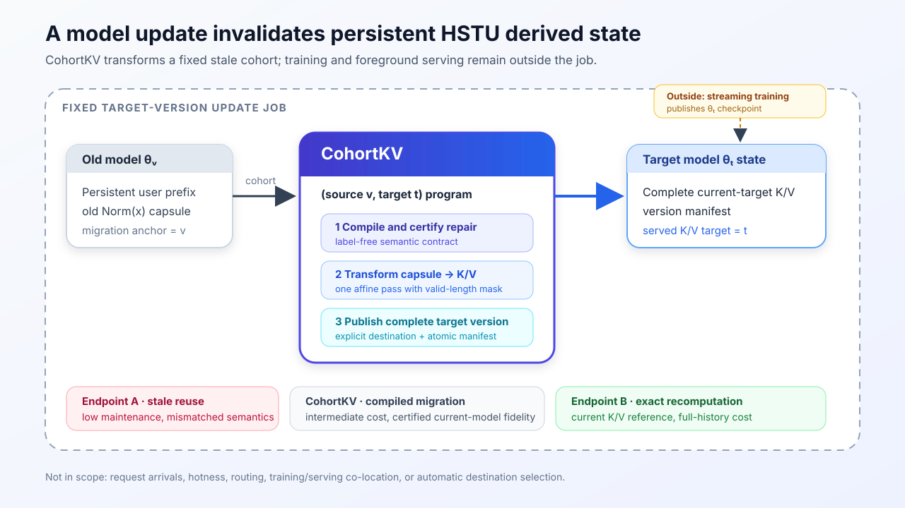
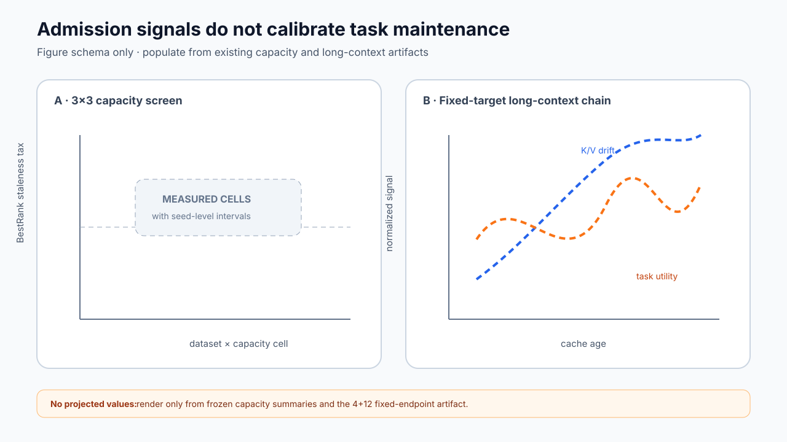
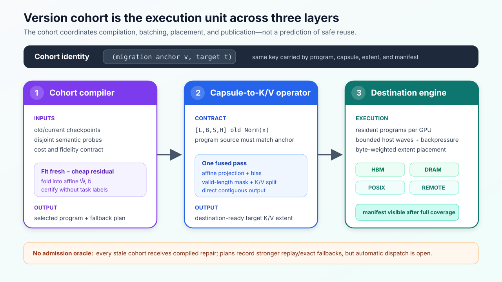
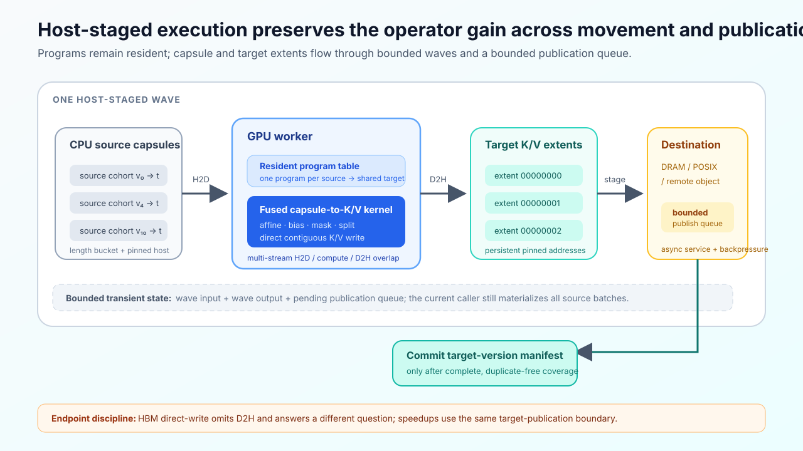
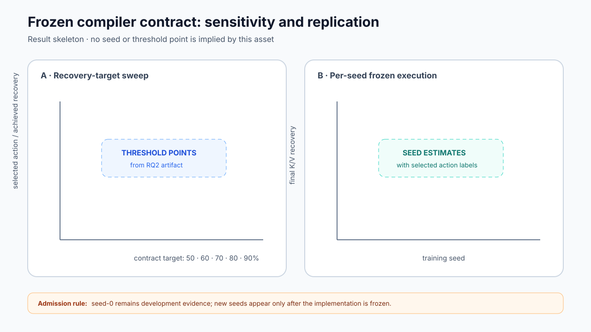
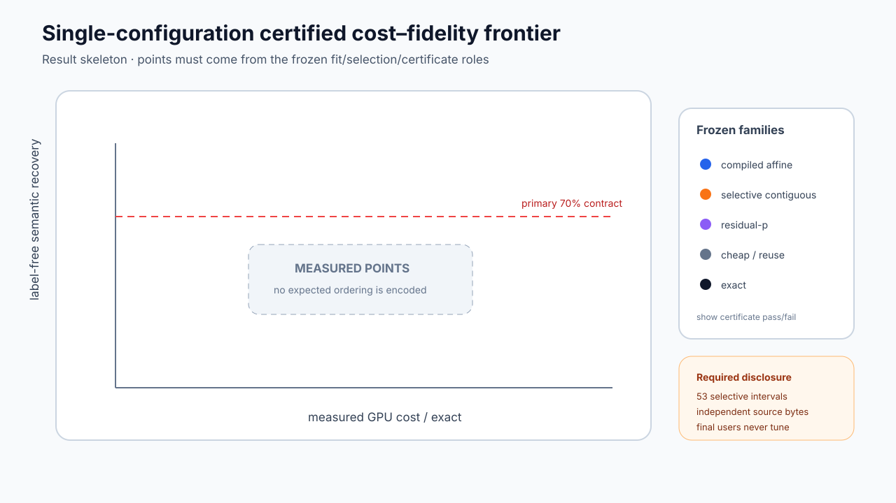
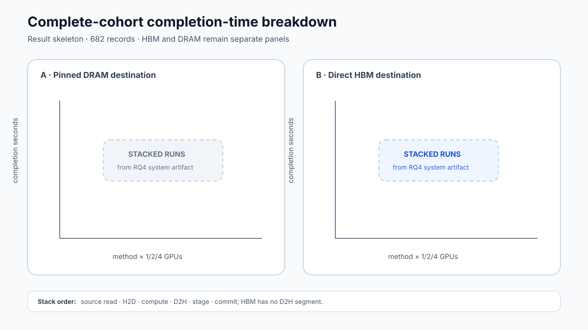
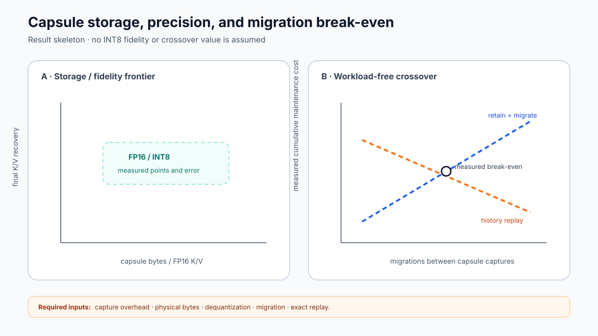

# CohortKV: Compiled Cross-Version K/V Migration for Streaming Generative Recommendation

**Anonymous Authors**

> **[内部说明 — 投稿前删除]** 本文件是"目标版"手稿（target manuscript）。
> 写作假设：Gate 1（冻结编译器多 seed 复现）、Gate 2（full-cohort 同边界 destination
> benchmark，含自动升级与失效注入）、Gate 4（具名 SSD）、Gate 5（capsule 经济学）、
> Gate 7（selective-layer baseline）均已完成。
> 所有**尚未测得**的数值以 `⟨TBD⟩` 标注；趋势性结论按预期方向先行写出，若实测方向相反，
> 必须回改正文而不是只改数字。已有真实数字（27-chain、长上下文证书、operator 微基准、
> 两 GPU 11.22×）原样保留。数据图 Figure 2、5–8 为规划中资产，尚无 SVG。
> 结构采用经典 systems 骨架：Intro → Background & Motivation → Overview →
> Design ×3（§4 compiler / §5 operator / §6 engine）→ Implementation → Evaluation
> （Discussion 并入 §8.8）→ Related → Conclusion。
>
> **v3.1 收敛记录（对照 goodpaper/1–5 与 guide/14 后裁剪）：**
> 已删除：(a) 第二 GPU 架构上的 operator 微基准复测（硬件不确定、顶会常例单架构即可）；
> (b) 更大容量模型的 scale probe（需新训练、与主张边际相关，3×3 已覆盖容量轴）；
> (c) INT8 capsule 的"量化域直接拟合"声明（新算法工作、有保真风险），收敛为
> INT8 存储层 + staging 时反量化的纯测量。
> 保留为负结果/边界：jagged 布局、per-user drift 信号、remote-object 后端（interface only）。
> 保留为未来工作（不升级为贡献）：程序组合 Φ∘Φ、LLM checkpoint 探针、serving 共置。
> 核心不变：27-chain、冻结契约复现、selective-layer 前沿、full-cohort 同事务 1/2/4 GPU
> + HBM/DRAM/SSD、升级与失效注入、capsule 经济学（创建开销 + INT8 存储 + break-even）。
> **Serving 边界（2026-07-26 决定）**：数据集不含请求 trace，论文不做任何基于 serving
> workload 的测量或声明。评测语义统一称 stale-inference（离线协议、自训 checkpoint）；
> manifest 可见性语义用 "readers" 表述；break-even 为 workload-free 的纯测量交叉点；
> serving 共置/请求到达/SLO 一律列为 scope 之外（Table 3 / Fig.1 / §8.8 Limitations）。
> **Design/Implementation 分工（v3.2）**：Design 章节只保留本场景下的新机制与 key insight；
> 标准技术全部下沉 §7 —— reference/packed 基线算子、Triton 调参、round-robin/贪心放置、
> POSIX tmp+rename 与 manifest-last 对象写、artifact 序列化与校验、数值验证。
> §4.4 只保留 artifact 作为 compiler↔engine 唯一接口（携带 fallback chain）的设计含义；
> §5/§6 各小节以 insight 句开头。
> **Baseline 与证据网格（v3.3）**：三层对比 —— 锚点（reuse/exact）+ 最强外部方法
> （DroidSpeak 式 selective-layer，独立调优）+ 内部消融（cheap projection / residual-p /
> no-transform / packed-vs-fused / bucketing）；HCache 类同模型系统语义不适用、只在 §9 定位。
> RQ3 前沿网格 = KuaiRand-long（主）+ KuaiRand-medium（容量轴）+ QB-large（数据集轴），
> 全部复用 §8.3 已训链，不新训模型；RQ2 统计主张由 27-chain 承担；RQ4 系统基准只跑
> KuaiRand 长上下文（吞吐由字节量/长度分布决定，跨数据集主张由 RQ3 承担）；
> RQ4 Table 8 增加 selective-layer 端到端行（同事务、certified m）。

## Abstract

Streaming generative recommenders continuously update their model while retaining long user histories as persisted key/value (K/V) caches. Every model update therefore leaves cached prefixes version-stale: reusing them is cheap but no longer matches the current model, whereas recomputing each history restores current-model semantics at the cost of a full forward pass. We present **CohortKV**, a system that migrates stale HSTU K/V toward a declared current-model target at a small fraction of the recomputation cost. CohortKV treats each source/target model-version pair as a compilation unit rather than as a prediction that reuse is safe. For each pair, its compiler fits the shared residual between fresh K/V and a cheap reprojection of the cached layer-normalized states, then folds this repair into a single affine projection, so the per-record path remains one matrix operation. Because observed task quality does not reliably track state staleness, the compiler certifies current-model semantic fidelity without recommendation labels; at run time, a lightweight sentinel samples each wave and automatically escalates failing cohorts through a published fallback chain that ends in exact recomputation. A fused operator executes compiled programs with length masking and direct K/V writes, and a destination-oriented engine transforms a complete update cohort and atomically publishes one target-version manifest to GPU, host, or SSD destinations.

Across 27 independently trained model-version chains, compiled repair costs only 0.121× exact recomputation and recovers a majority (0.587) of the stale-to-fresh K/V gap. A frozen label-free certificate replicated over ⟨TBD⟩ training seeds selects full-affine programs that cost about ⟨TBD⟩× exact while recovering ⟨TBD⟩ of the gap, and dominates a selective layer-recomputation baseline across the entire cost–fidelity frontier. On the complete ⟨TBD⟩-record KuaiRand update cohort, the engine sustains ⟨TBD⟩ records/s on four GPUs, is ⟨TBD⟩× faster than tuned exact recomputation under an identical destination transaction, and survives injected failures without exposing a partial version. These results establish version-stale HSTU K/V as a first-class migratable object: a correction compiled once per version pair moves an entire cohort to the current model far more cheaply than history replay.

## 1. Introduction

Generative recommendation reframes a user's ordered behavior as a sequence and predicts the next item from that history. Architectures such as HSTU are designed for high-cardinality, non-stationary streams and make long histories computationally useful [1]. At the same time, recommender systems continuously learn from new interactions so that fresh preferences and content can enter the model quickly [2]. These two properties create a systems conflict that neither short-lived models nor short-lived state would expose. A deployment wants to retain the expensive representation of each long history, yet streaming training repeatedly changes the model under which that representation was computed.

The persistent representation for HSTU includes the attention keys and values at every layer. Let \(C_v(x)=F(\theta_v,x)\) denote the prefix K/V generated for history \(x\) by model version \(\theta_v\). After training publishes \(\theta_t\), the system may keep using \(C_v(x)\), but current queries then combine current-model computation with an old-model prefix. Alternatively, it may compute \(C_t(x)\) exactly, which restores current-model semantics at the cost of replaying the entire history. Unlike ordinary eviction restoration, the source state has not merely moved: its meaning is tied to a different model version.

Existing K/V systems make the boundary precise but stop short of this version mismatch. HCache restores evicted state from intermediate activations under the same model [3]. vLLM derives a memory manager and serving engine from the dynamic allocation properties of same-model autoregressive K/V [8]. CachedAttention retains same-conversation K/V across requests and overlaps hierarchical loading and saving [9]. MTServe persists generative-recommendation K/V across visits and manages where that state resides [5], but its published workflow does not define a source-to-target model-version transform. DroidSpeak goes furthest toward cross-model reuse: it allows same-architecture fine-tuned LLM variants to share K/V through selective layer recomputation [4]. Cross-model K/V by itself, however, is not the contribution of this paper. What remains missing is a system that compiles a source-to-target transform over the persistent HSTU state produced by successive streaming versions and applies that transform to a fixed target-version update cohort.

This gap matters because the alternative, choosing a universal cache lifetime, does not fit the evidence. The model-version chains we study show that older versions generally drift farther in K/V space, yet age is not a calibrated predictor of ranking impact. Some exact maintenance endpoints are close to zero or even negative, because a newly trained model is not guaranteed to rank every fixed evaluation slice better than its predecessor. Per-user K/V drift is likewise uninformative about who benefits from maintenance. A system that uses age, drift, or observed task gain to decide whether a cohort is "safe" to reuse would therefore confuse current-model state fidelity with an application-quality prediction.

To address this problem, we present **CohortKV**, a system that asks a narrower question: given a fixed set of old states, how can the system move them toward a declared current-model K/V target more cheaply than exact replay? Our key insight is that the cross-version error is structured at the version-pair level rather than at the record level, and that HSTU's data path exposes exactly the state needed to exploit this structure. Each layer produces K/V by applying the layer's K/V projections to a normalized hidden state. If the old normalized state is retained, applying the current projections gives a cheap approximation. CohortKV measures the shared residual from this approximation to fresh K/V on a small version-pair sample, fits that residual as an affine function of the old normalized state, and folds the result into one prepacked projection. The per-record path therefore remains one matrix operation rather than a learned correction executed after the projection.

Turning this algebra into a system requires three further mechanisms. First, because certification is statistical, execution needs a runtime guard: a per-wave sentinel samples migrated records, re-evaluates the cheap certificate view, and automatically escalates a failing cohort through its published fallback chain. Second, the operator must fuse the affine epilogue, respect valid sequence lengths, and write destination-ready K/V; otherwise small kernel savings disappear in packing and padding. Third, a complete update must move an entire cohort through HBM, host, and storage boundaries, partition work across GPUs, and make no partial target version visible. CohortKV therefore comprises three connected design components (§4–§6):

1. a **version-cohort migration compiler** that fits and certifies a shared source-to-target program without recommendation labels;
2. a **capsule-to-K/V operator** that executes the program in one fused, length-aware pass; and
3. a **destination-oriented update engine** that transforms a complete record set under a runtime sentinel and atomically publishes one target-version manifest to GPU, host, or SSD destinations.

The version cohort connects the three components: it keys compilation, homogeneous batching, program residency, extent placement, sentinel accounting, and metadata. It never predicts that stale reuse is harmless. Every stale cohort receives compiled synchronization, with escalation and exact recomputation available under the published semantic contract.

We evaluate CohortKV with independently trained streaming checkpoints on KuaiRand and Tenrec. Across 27 model-version chains spanning three data tables and three capacities, compiled repair costs only 0.121× exact recomputation and recovers a majority of the stale-to-fresh K/V gap. A frozen certificate replicated on ⟨TBD⟩ further seeds selects full-affine programs costing about ⟨TBD⟩× exact at ⟨TBD⟩ recovery, and dominates a selective layer-recomputation baseline over the full cost–fidelity frontier. On the complete ⟨TBD⟩-record update cohort, the engine reaches ⟨TBD⟩ records/s on four GPUs and is ⟨TBD⟩× faster than tuned exact recomputation through an identical destination transaction, on both DRAM and a named NVMe SSD endpoint.

Figure 1 shows the job boundary. Training publishes checkpoints but is not part of the job; request arrivals, hotness, routing, and training/serving co-location are outside the present scope. Our contributions are as follows:

- We formulate model-version K/V migration as version-cohort compilation and develop a shared affine repair with a frozen, label-free semantic certificate, a runtime escalation sentinel, and an exact terminal fallback. The compiled operator is replicated across 27 trained chains, and the frozen full-affine compiler is replicated across ⟨TBD⟩ additional seeds.
- We implement a Triton capsule-to-K/V operator and a mixed-cohort multi-GPU pipeline whose advantage survives pinned-host input, complete K/V publication, and scaling to four GPUs.
- We design and measure a common HBM, DRAM, and SSD destination transaction that publishes a target version only after complete coverage, and we show that the compiled path retains a ⟨TBD⟩× advantage over tuned exact recomputation when both publish the complete cohort through the same transaction, including under injected failures.



**Figure 1: Cross-version invalidation and the CohortKV job boundary.** Training and foreground serving are deliberately outside the fixed destination-update job.

## 2. Background and motivation

This section establishes the inference semantics under study (§2.1), then presents four measurements on independently trained streaming checkpoints. Each measurement yields one design requirement, and Table 2 at the end of the section maps the requirements to the mechanisms of §4–§6 and to the evaluation questions that test them.

### 2.1 HSTU prefix K/V and stale inference

We use a modular, simplified HSTU that preserves the two properties required by this study: pointwise unnormalized attention and first-class K/V output. For layer \(\ell\), let \(h^\ell_\theta(x)\) be its input hidden sequence and

\[
z^\ell_\theta(x)=\operatorname{Norm}^\ell_\theta\left(h^\ell_\theta(x)\right).
\]

The concatenated K/V output is

\[
y^\ell_\theta(x)=\left[k^\ell_\theta(x),v^\ell_\theta(x)\right]=z^\ell_\theta(x)P^\ell_\theta+b^\ell_\theta,\tag{1}
\]

where \(P^\ell_\theta\) concatenates the current K and V projection weights. The complete cache has shape \([L,B,S,2D_{kv}]\) before the K/V split. Sequence lengths accompany every batch, and positions beyond each valid length are zeroed.

The stale-inference protocol predicts item \(t+1\) from hidden state \(t\), entirely offline on our own trained checkpoints. A fresh evaluation recomputes the complete history with the current model. A stale evaluation supplies an old-version prefix K/V and computes the latest token with the current model. Fresh and stale therefore use the same history and current query path; only the model version that produced the resident prefix differs. No request traces enter this protocol: the datasets record interactions, not serving load, so all claims in this paper are about state fidelity and update cost, not about online request behavior.

### 2.2 Stale reuse leaves a maintenance opportunity

We first separate three quantities at a fixed current endpoint:

- **full-compute streaming value**: current streaming model with current K/V, relative to a frozen base model;
- **full-reuse streaming value**: current streaming model consuming the old prefix K/V, relative to the frozen base model;
- **cache-maintenance value**: full compute minus full reuse.

The primary KuaiRand [6] Top-50k/all-chunks protocol finds a full-compute BestRank value of 3837.67 (95% CI [3389.91, 4285.44]), of which stale reuse retains 2952.11 ([2700.21, 3204.02]). The remaining maintenance value is a substantial 885.56 ([460.24, 1310.88]), a 23.1% staleness tax. Table 1 shows that the aligned theta5 screen finds a positive mean maintenance gap in all three evaluated tables:

**Table 1: Aligned cross-table streaming and maintenance value.** Values are BestRank improvements; intervals use four training seeds.

| Dataset/table | Full compute | Full reuse | Maintenance |
|---|---:|---:|---:|
| KuaiRand | 484.34 [462.15, 506.54] | 399.02 [370.79, 427.26] | 85.32 [53.74, 116.91] |
| Tenrec QB, fixed horizon | 94.70 [70.49, 118.90] | 64.38 [54.41, 74.35] | 30.31 [14.08, 46.55] |
| Tenrec QK, Top-5k | 47.34 [29.20, 65.47] | 34.34 [20.55, 48.13] | 13.00 [5.70, 20.30] |

QB and QK are related tables from Tenrec [7], not independent industrial domains, and their time is ordinal rather than a shared calendar. The result establishes a cross-table opportunity, not universal task harm from staleness.

**Requirement 1.** A stale cohort needs a synchronization path cheaper than exact history replay; plain reuse is a baseline, not a publishable target state.

### 2.3 Age and task quality are not admission oracles

We next vary data and model capacity in a frozen 3×3 screen. All nine cells have positive full-compute and full-reuse streaming value in 4/4 seeds, but Figure 2 shows that the mean BestRank staleness tax is neither uniformly positive nor monotone with capacity: large KuaiRand and large QB expose substantial taxes of 0.360 and 0.548, while large QK is −0.005 and QB-medium is −0.060. At a fixed target, every 3×3 age curve has monotonicity violations. In the controlled 16-layer long-context diagnostic, age strongly orders K/V drift, yet after removing the special base-to-stream boundary it explains only 6.15% of MeanRank variation, compared with 60.9% explained by current version identity.



**Figure 2: Neither age, drift, nor capacity calibrates task-level maintenance value.** Cost scales smoothly with capacity while task maintenance does not; age orders drift but not ranking impact.

Nor does a per-user signal repair this problem. Relative K/V drift and maintenance utility have a correlation of only 0.020 (95% CI [−0.012, 0.052]), and the investigated JVP/Fisher route is not cheaper than the operation it would govern. We retain this only as a negative result.

**Requirement 2.** Version identity may organize work, but neither age, drift, nor observed task gain decides whether a stale cohort can bypass synchronization. The system should verify current-model semantic fidelity without recommendation labels, guard execution with the same label-free views, and retain exact recomputation as the endpoint. Because exact is a semantic reference rather than a ranking upper bound, recovery above 100% and negative task gaps must remain signed.

### 2.4 HSTU exposes a compilable repair

Equation (1) separates two sources of cross-version error: the current K/V projections have changed, and the normalized hidden state that feeds them has changed. When the current \(P_t^\ell,b_t^\ell\) is applied to old \(z_v^\ell\), the first source is repaired at low cost but current hidden propagation is omitted. This cheap projection costs roughly one tenth to one fifth of exact replay across datasets and closes a material, though incomplete, fraction of the K/V gap.

The remaining error is structured at the version-pair level. A shared map from old \(z_v^\ell\) to the fresh-minus-cheap K/V residual can be fit and then compiled into the current projection, which yields one homogeneous operator for the cohort. Earlier structural screens delimit alternatives: plain prefix replay is never selected once compiled projection and residual transport share one action library; all 54 matched recent-token partial actions are slower at the evaluated length; arbitrary contiguous intervals add negligible value relative to their \(O(L^2)\) planner. These discovery-stage actions remain baselines rather than the active method.

**Requirement 3.** Move adaptation out of the per-record path. Compile a shared residual into one affine projection, and use structural replay or exact recomputation only for a stricter semantic tier.

### 2.5 Kernel cost is not job cost

A compiled matrix operation can still lose end-to-end if the runtime repeatedly moves programs, pads unrelated lengths, allocates outputs, serializes device work, or compares against an exact baseline with a different publication boundary. The update cohort contains mixed source versions and long histories, so H2D, compute, D2H, output layout, storage bandwidth, and multi-GPU imbalance are all visible.

A controlled page/jagged experiment reinforces the need for endpoint discipline. Compaction improves the host-backed path by only 1.019× and is 0.984× the one-record design at the HBM boundary. HBM itself is 2.159× faster than host publication because it removes D2H; that is a destination difference, not a faster migration operator.

**Requirement 4.** The operator must write final-layout K/V, and system speedups must survive a matched source-residency and target-publication boundary on the complete cohort. Destination placement must be explicit, with complete-version visibility separated from kernel timing.

Table 2 summarizes how each observation of this section maps to a mechanism and to the evaluation question that tests it.

**Table 2: Observation-to-design mapping.**

| Observation | Resulting mechanism | Evaluation question |
|---|---|---|
| Reuse leaves a maintenance gap. | Unconditional compiled synchronization plus exact endpoint. | Does the opportunity persist across tables and capacities? (§8.2) |
| Age and task quality are not calibrated. | Version-pair execution key, label-free contract, runtime sentinel. | Does fidelity/cost replicate under a frozen contract? (§8.3) |
| HSTU exposes old normalized states and current projections. | Shared residual folded into one affine program. | How much K/V gap closes at measured GPU cost, versus the strongest cross-model baseline? (§8.3, §8.4) |
| Movement can erase kernel savings. | Fused direct-write operator and destination job. | Does the gain survive the identical full-cohort transaction? (§8.5, §8.6) |

## 3. CohortKV overview

This section introduces the three abstractions that the whole system is built on (§3.1), the architecture that connects the three design components (§3.2), and the end-to-end life of one update job (§3.3). The design components themselves are then presented in §4 (compiler), §5 (operator), and §6 (engine).

### 3.1 Abstractions: capsules, cohorts, and the update job

**Migration capsule.** Exact current K/V needs \(z^\ell_t(x)\), which in turn depends on current hidden propagation through all preceding blocks. CohortKV instead retains a **migration capsule**

\[
Z_v(x)=\{z^1_v(x),\ldots,z^L_v(x)\}
\]

with the record ID, valid length, and **migration anchor version** \(v\). The anchor is not changed when target K/V is produced: a capsule can remain anchored at \(v\) while its output declares a **served K/V target** \(t\). The separation of these two version fields prevents a migrated approximation from masquerading as a freshly captured current capsule. For equal precision and hidden/K/V widths, one FP16 normalized state per layer is half the size of both K and V. Section 8.7 quantifies this trade-off directly: capsule capture cost during the forward pass that materializes fresh K/V, an INT8 storage layout that reduces the footprint to ⟨TBD⟩% of logical K/V at ⟨TBD⟩ recovery loss, and the update-frequency break-even point beyond which retaining capsules is cheaper than replaying histories.

**Version cohort.** A **version cohort** is the pair

\[
\gamma=(v,t)
\]

shared by records whose capsules are anchored at \(v\) and whose K/V must target \(t\). The cohort is the unit that every component keys on: the compiler fits and publishes one program per \(\gamma\) (§4), the operator batches homogeneously within \(\gamma\) (§5), and the engine keeps the relevant programs resident on every worker, accounts sentinel statistics per \(\gamma\), and retains \(\gamma\) in each output extent (§6). Several source versions may share one target job, but their programs remain distinct. The current implementation requires the programs in one job to share layer count, hidden width, K/V width, and target version. The cohort organizes execution; it never predicts that reuse is safe.

**Fixed destination-update job.** The system contract is:

> Given materialized old capsules, published source-to-target programs, a fixed complete record set, execution GPUs, and an explicit destination, produce target-version K/V for every record and make one complete manifest visible.

Table 3 delimits this contract.

**Table 3: Scope of the fixed destination-update job.**

| Inside the current boundary | Outside the current boundary |
|---|---|
| Source/target program selection from published artifacts | Streaming training and checkpoint production |
| Cohort grouping, length bucketing, and GPU placement | Online request arrivals and per-user hotness |
| H2D, migration compute, D2H when required | Foreground inference interference and SLO scheduling |
| HBM, DRAM, and SSD publication contract | Automatic destination or cache-tier selection |
| Complete coverage, sentinel escalation, commit, abort | Cross-destination distributed transactions |

The destination is an input rather than a policy decision. HBM, DRAM, and an SSD-backed filesystem answer different endpoint questions and are not compared as if their completion times were interchangeable. During an update, any reader of the destination continues to see the last committed manifest; the new manifest becomes readable only at commit, so no reader ever observes a partially migrated version (§6.4).

### 3.2 Architecture

Figure 3 shows the architecture. CohortKV separates the update problem into three design components with one clean division of labor: the compiler decides **what** transformation is semantically admissible for a cohort, the operator decides **how** one capsule batch becomes destination-layout K/V, and the engine decides **where and when** complete extents become visible. An update coordinator resolves job specifications, invokes the three components, and drives sentinel escalation; it does not compile programs, infer reuse safety, choose a destination, or schedule online requests.



**Figure 3: CohortKV architecture.** Version cohorts organize execution across the compiler, operator, and engine; they do not predict safe reuse.

**Migration compiler (§4).** Input: a version pair \((v,t)\), calibration records with old capsules and exact current K/V, and a frozen label-free contract. Output: an immutable program artifact — one folded affine projection per layer plus a verified plan recording certificates, the selected action, and an ordered fallback chain ending in exact recomputation. Compilation runs once per version pair and is amortized over the whole cohort; no recommendation label enters it.

**Capsule-to-K/V operator (§5).** Input: a resident program and one length-bucketed capsule batch from a single cohort. Output: contiguous, destination-layout K and V tensors with padding masked. The operator is a single fused Triton kernel; its design goal is that the per-record path stays one matrix operation with no packing, splitting, or copying epilogue, so the compiler's amortization is not eroded at execution time.

**Destination-oriented update engine (§6).** Input: the fixed record set, the published programs, execution GPUs, and one explicit destination. Output: exactly one committed target-version manifest, or a clean abort. The engine owns everything between the operator and visibility: program residency and multi-GPU placement, the bounded host-staged pipeline, the per-wave runtime sentinel with automatic escalation, the destination transaction, and the failure boundary.

The interfaces between the components are narrow by construction. The compiler communicates with the engine only through the immutable program artifact and its fallback chain; the engine communicates with the operator only through resident programs and homogeneous batches; and the only globally visible side effect of the entire system is the committed manifest.

### 3.3 Life of an update job

A concrete walkthrough ties the components together. Streaming training publishes checkpoint \(\theta_t\). For each source version \(v\) with resident capsules, the coordinator forms cohort \((v,t)\) and invokes the compiler: calibration records are sampled, candidate actions are fit, GPU cost is measured, and the label-free certificate views are evaluated on disjoint users. The compiler publishes the least-cost certified action — in the common case a single folded affine program — together with its fallback chain (§4.2–§4.3). Cohorts smaller than the amortization floor skip compilation and go directly to exact replay.

The coordinator then plans the job: records are grouped by cohort, sorted into length buckets, packed into extents, and assigned to GPUs by byte-weighted longest-processing-time-first placement (§6.1). Execution proceeds in bounded waves: a lazy shard reader streams capsules from the source tier in extent order, pinned H2D copies overlap fused-operator compute and D2H publication on separate streams, and a bounded queue applies backpressure (§6.3). Within each wave, the sentinel samples migrated records per cohort and re-evaluates the cheap certificate view; a violated bound escalates that cohort to the next action in its published chain and re-enqueues its records, monotonically, without operator or compiler involvement (§6.2).

When every record of every cohort is covered exactly once, the engine commits: extents and metadata are sealed, the manifest is written last, and the destination atomically exposes the new target version (§6.4). Readers switch from the previous committed manifest to the new one at that instant. Any failure before commit aborts to the previous version with staging reclaimed, and a per-extent completion journal lets an interrupted job resume by re-migrating at most one wave (§6.5).

## 4. Design 1: Version-cohort migration compiler

### 4.1 Cheap projection and residual decomposition

For cohort \((v,t)\), the current projection applied to an old capsule gives

\[
\widetilde y_{\text{cheap}}^\ell=z_v^\ell P_t^\ell+b_t^\ell.\tag{2}
\]

Calibration records additionally expose exact current \(y_t^\ell=z_t^\ell P_t^\ell+b_t^\ell\), so the target residual is

\[
r^\ell=y_t^\ell-\widetilde y_{\text{cheap}}^\ell.\tag{3}
\]

The compiler fits a ridge-regularized affine map

\[
r^\ell\approx(z_v^\ell-\mu^\ell)A^\ell+\bar r^\ell.\tag{4}
\]

\(A^\ell\) may be truncated to a low-rank factorization during fitting. The factorization changes offline statistical capacity but not online work: before publication, the compiler folds it into

\[
\widehat P^\ell=P_t^\ell+A^\ell,\qquad\widehat b^\ell=b_t^\ell+\bar r^\ell-\mu^\ell A^\ell.\tag{5}
\]

Execution is therefore one affine projection, \(\widehat y^\ell=z_v^\ell\widehat P^\ell+\widehat b^\ell\), with the same matrix shape for every fitted rank. It is an approximation to current K/V, not an equivalence to current hidden propagation.

For the long-context design, the compiler fits a full-affine \(A^\ell\). Uniform regression treats all prefix positions equally even though the current request does not. The selected design weights each valid token-layer example by an HSTU attention-use statistic computed from current queries and keys, normalizes weights to unit mean, and caps them at eight. This changes fitting only; program shape, online state, and kernel work remain unchanged. No recommendation labels enter the fit.

### 4.2 Frozen label-free semantic contract

A cheap transformation should not be selected merely because it performs well on the records used to fit it. CohortKV separates fit, hyperparameter-selection, certificate, and final-test users. For certificate user \(u\), it evaluates three error views:

\[
e_{\text{cache}}=\text{relative K/V error},\quad e_{\text{score}}=1-\cos(s_a,s_t),\quad e_{\text{top100}}=1-\operatorname{overlap}_{100}(a,t).
\]

Here \(s_a\) and \(s_t\) are full-catalog score vectors under action \(a\) and exact current K/V. The certificate measures how much of the reuse-to-exact error gap the action closes:

\[
\operatorname{recovery}(a)=\frac{e_{\text{reuse}}-e_a}{e_{\text{reuse}}-e_{\text{exact}}}.\tag{6}
\]

The frozen contract requires, for all three views: a recovery target of at least 70%; a one-sided 90% bootstrap lower bound on ratio-of-means recovery of at least 70%; at least 80% per-user coverage after a one-sided 90% Wilson lower bound; and a measured GPU cost no greater than 30% of exact for the primary action. Section 8.3 reports a sensitivity sweep of the recovery target over {50, 60, 70, 80, 90}% and shows that action selection is stable in the ⟨TBD⟩–⟨TBD⟩% band, so the published thresholds are an interior operating point rather than a tuned edge.

The compiler chooses the least-cost action that passes fidelity and budget. If no action passes the budget, it may publish the least-cost fidelity-certified overflow action. If no approximate action passes, exact recomputation is forced. The artifact also contains the ordered fallback chain consumed by the runtime sentinel (§6.2). Recommendation labels are withheld until final task evaluation.

"Label-free" does not mean "cost-free." Certification recomputes exact current K/V for its probe users and compares full-catalog score vectors. This cost is paid once per version pair and amortizes across the cohort: on the complete ⟨TBD⟩-record job, compile plus certificate time is ⟨TBD⟩ s, or ⟨TBD⟩ ms per migrated record — ⟨TBD⟩% of the per-record migration cost itself (§8.5). Cohorts smaller than ⟨TBD⟩ records do not amortize the certificate and should fall back to exact replay; the coordinator applies this size floor.

This contract verifies a synchronization implementation, not the proposition that the current model will improve a ranking metric. An action can pass semantic fidelity even when exact current K/V is worse than stale reuse on a particular task slice.

### 4.3 Action library and escalation tiers

The active cohort-tiered action library contains:

1. compiled affine repair;
2. residual-\(p\) replay; and
3. exact current-model recomputation.

Residual-\(p\) executes the first \(p\) current-model blocks exactly, computes the boundary displacement

\[
\Delta_p=h_p^t-h_p^v,
\]

and approximates deeper states by \(h_\ell^v+\Delta_p\) before the current layer's `Norm + Wk/Wv` projection. It supplies a predefined structural escalation tier without a per-user predictor or another learned online operator. Exact recomputation is the terminal K/V reference.

Residual-\(p\) is not executable from the normalized migration capsule alone. It additionally
requires the old pre-block hidden suffix
\(\{h_\ell^v\}_{\ell=p}^{L-1}\), which CohortKV treats as an optional, separately accounted source
representation. A plan may publish this tier only when that suffix is retained; otherwise its
fallback chain proceeds directly to exact recomputation. Section 8.7 reports these auxiliary bytes
separately rather than hiding them in the default capsule footprint.

The tiers are selected per operating point rather than fixed globally. In the primary 50% replicated operating point, all 27 held-out chains select compiled projection; at the 75% discovery point, three large cells select residual depths 5, 6, and 7. The same library also positions the strongest external alternative: a DroidSpeak-adapted contiguous layer group [4], which starts from one stored old-version transition activation, recomputes that interval with the current model, and reuses old K/V elsewhere. Section 8.4 independently profiles this baseline under the identical label-free certificate and publication boundary.

### 4.4 Published program and fallback interface

Compilation ends in an immutable program artifact: one folded affine projection per layer, together with a verified plan recording the certificates, the selected action, and the ordered fallback chain that the runtime sentinel consumes (§6.2). This artifact is the only channel between the compiler and the engine, which is what makes escalation possible without re-entering the compiler at run time. Serialization, metadata layout, and strict version/shape validation follow standard practice and are described in §7.

The certificate is applied to the deployed numeric representation, not only to the FP32 fitting
path. Before publication, CohortKV reloads the serialized FP16 capsules and prepared runtime
program, emits FP16 K/V, and repeats the frozen label-free views without changing thresholds or
candidate selection.

## 5. Design 2: Capsule-to-K/V operator

The key insight behind the operator is that in this workload the epilogue, not the GEMM, is where a compiled program loses its advantage. The compiled projection is a single matrix operation, so any per-batch masking, K/V splitting, or contiguous-copy pass executed after it costs a comparable order of work — and the destination transaction (§6.4) requires contiguous, destination-layout K and V, which framework primitives do not produce directly. The operator is therefore designed backward from the destination: one fused pass that consumes a cohort-homogeneous capsule batch and writes final-layout K/V with padding resolved in-kernel. An FP32 reference and a packed FP16 `baddbmm` path serve as the numerical oracle and the strong framework baseline; they involve no new design and are described in §7.

### 5.1 Fused direct-write kernel

The Triton operator consumes:

- a contiguous FP16 capsule \([L,B,S,H]\);
- contiguous FP16 weights \([L,H,2D_{kv}]\);
- biases \([L,2D_{kv}]\); and
- one valid length per record.

Its grid spans layers, row tiles over \(B\times S\), and output-width tiles. Each program accumulates the \(H\)-dimension in FP32, adds the layer bias, derives record and token positions from the flattened row, and replaces padded positions with zero. Output offsets below \(D_{kv}\) write directly to the contiguous K tensor; the remaining offsets write directly to V. The operator thus avoids a separate mask, split, and contiguous-copy epilogue.

The output retains record IDs, the capsule's migration anchor, the program's served K/V target, and valid lengths. Numerical validation against the reference paths is part of the implementation test suite (§7).

### 5.2 Variable-length organization

Padding is a systems cost even though it is semantically masked. The host runtime sorts records into length buckets and constructs small homogeneous batches within each source cohort. In the controlled layout search, removing length bucketing reduces migration throughput from 863.2 to 643.1 records/s; the selected 32-token bucket also outperforms adjacent 16- and 64-token buckets. On the complete cohort, whose length distribution is more dispersed than the 64-record trace, the bucket sweep is repeated and the selected width remains ⟨TBD⟩ tokens (§8.5).

We separately implemented a jagged capsule layout with per-record offsets and compact outputs that match the dense fused values. It is useful when many short fragments can be coalesced, but it is not a positive result on the current long-context trace. CohortKV therefore treats jagged/page compaction as a conditional layout mechanism, not as a defining contribution.

## 6. Design 3: Destination-oriented update engine

### 6.1 Program residency and multi-GPU placement

A job may contain several source versions but exactly one target. The key insight organizing residency is an asymmetry: programs are small and cohort state is large, so the engine replicates every source version's prepared program on every worker and partitions the record extents, and each worker selects its program from the capsule anchor. Placement uses byte-weighted longest-processing-time-first (LPT): an extent's work is estimated from its capsule and output bytes, and the next largest extent goes to the least-loaded worker. Simpler round-robin and input-order policies remain available as implementation options (§7).

The program table is small relative to long-context state. In the two-GPU configuration, three FP16 programs replicated across both GPUs occupy 96.2 MiB; the target K/V is partitioned and needs no peer transfer. At four GPUs the replicated table grows to ⟨TBD⟩ MiB and remains below ⟨TBD⟩% of per-GPU HBM.

### 6.2 Runtime sentinel and automatic escalation

Certification is statistical, so execution carries a guard. For each wave, the sentinel samples \(k\) migrated records per cohort, recomputes the cache-error certificate view against a cached exact probe, and maintains a running one-sided bound. If the bound violates the published contract, the coordinator re-enqueues the cohort's remaining records under the next action in the fallback chain and marks already-published extents of that cohort for re-migration before commit. Escalation is per-cohort and monotone; it never de-escalates within a job. The sentinel adds ⟨TBD⟩% overhead at \(k=\)⟨TBD⟩ on the complete cohort (§8.5), and §8.6 demonstrates a forced escalation end-to-end: a deliberately corrupted program triggers the sentinel, the cohort completes under residual-\(p\), and the committed manifest records the final action per cohort.

### 6.3 Host-staged pipeline

Figure 4 shows one host-staged wave. CPU capsules are pinned, copied asynchronously to the assigned GPU, transformed by the resident program, and copied into persistent pinned target extents. Separate H2D, compute, and D2H streams allow adjacent batches to overlap. A single publication worker stages completed extents, while a bounded queue applies backpressure. Wave size bounds transformed output residency after source capsules have been materialized. For the complete cohort, a lazy shard reader streams capsules from their source tier in extent order, so peak host residency is bounded by the wave and queue depths rather than by the cohort size; measured peak source residency is ⟨TBD⟩ GiB against a logical cohort of ⟨TBD⟩ GiB (§8.5).



**Figure 4: Host-staged execution and publication.** The bounded wave and publication queue bound transient output residency; the lazy shard reader bounds source residency.

The direct-HBM mode answers a different endpoint question. It preallocates target extents on the destination GPUs and keeps the output there, so it has neither D2H nor host publication. The current implementation requires computation to occur on the destination GPU and does not perform cross-GPU P2P publication.

### 6.4 Destination transaction

Every backend exposes the same logical transaction:

```text
begin(job, target_version, expected_record_ids)
  -> stage(extent_id, target K/V)*
  -> commit(complete version manifest)
  -> or abort()
```

An extent records stable record and extent IDs; migration anchor and served K/V target; the final action that produced it; layer, valid-token, K/V-width, dtype, and logical-byte metadata; destination location and device; and an optional serialized-payload checksum. Commit rejects duplicate or missing records, duplicate extent IDs, and target-version disagreement. The manifest is the visibility point: staged state without a committed manifest is not a published target version, and readers see the previous committed manifest until the new one is visible.

The three measured backends are listed in Table 4.

**Table 4: Destination backends, data paths, and evidence.**

| Destination | Data path and visibility | Evidence |
|---|---|---|
| HBM | Compute on destination GPU; manifest points to resident device extents | Full-cohort benchmark (§8.5) |
| DRAM | Pinned H2D -> transform -> D2H; in-memory manifest retains CPU extents | Full-cohort benchmark (§8.5) |
| SSD (POSIX) | Host path; immutable serialized extents on a named NVMe device; same-filesystem rename publishes manifest and objects | Full-cohort benchmark (§8.6) |
| Remote object | Host path; immutable object uploads; manifest object written last | Client protocol and in-memory reference store; interface only |

How each backend realizes atomicity is standard storage practice — temporary-file writes with same-filesystem renames for POSIX, manifest-last object puts for the remote protocol — and is described in §7. These semantics do not constitute a distributed transaction across destinations.

### 6.5 Failure boundary

An exception before commit aborts the transaction. DRAM and HBM drop private staging maps; POSIX removes the private staging directory; the remote adapter deletes unreferenced objects recorded by the transaction. Section 8.6 injects failures at four points — before the first extent, mid-wave, during publication, and immediately before commit — at full-cohort scale and verifies that no partial version becomes visible and that abort cleanup completes in ⟨TBD⟩ s. The coordinator additionally journals per-extent completion to the destination's staging area, so an interrupted job resumes idempotently from the last completed wave; resumption re-migrates at most one wave of records (⟨TBD⟩ records measured, §8.6). Cross-process crash recovery beyond this journal remains outside the claim.

## 7. Implementation

CohortKV is implemented in roughly 9.5K lines of Python 3 and PyTorch for the core library, with a further 26K lines of tests, benchmarks, and experiment drivers. The simplified HSTU exposes per-layer normalized states and first-class K/V. This section collects the engineering the designs rely on but that follows standard practice.

**Operator paths.** Three operators implement Equation (5). An FP32 reference materializes the concatenated projection before splitting K/V and serves as the numerical oracle. A packed FP16 path uses batched `baddbmm` over flattened record-token rows, expands the bias, applies a valid-length mask, and returns K/V views; it is the strong framework baseline of §8.5. The fused Triton kernel exposes tunable \(M,N,K\) tiles, warp count, and pipeline stages. Numerical validation compares both FP16 paths against the reference, including padding zeros and finite-value checks.

**Executors.** The CUDA streaming executor maintains separate copy and compute streams, optionally pins capsule inputs, and may write into persistent pinned output pools. The multi-GPU executor creates one single-device worker per GPU and combines per-device timing, bytes, record count, token count, program replicas, and assigned-work imbalance; round-robin and input-order placement remain available alongside LPT (§6.1).

**Program artifact.** A migration program serializes source and target versions, layer count, input/K/V widths, compiled weights and biases, and fitting metadata; the verified plan serializes the contract, each action's cost and certificates, the selected action, selection reason, and fallback order. At load time, a source, shape, or device mismatch is an error rather than an implicit conversion.

**Destination mechanics.** For POSIX, each extent and the manifest are written through a temporary file and atomically replaced, and the staged directory is renamed into the target-version namespace at commit; the remote adapter assumes atomic individual object puts with a manifest-last commit marker. The per-extent completion journal lives in the destination's staging area. The engine additionally implements the lazy shard reader, the bounded publication queue, sentinel sampling hooks, direct-HBM dispatch, and job-level commit timing.

## 8. Evaluation

### 8.1 Questions and protocol

We organize the evaluation around five questions:

- **RQ1:** Is cross-version K/V maintenance a meaningful opportunity across data tables and model capacities?
- **RQ2:** Does the frozen compiler replicate in measured GPU cost and current-model semantic fidelity across training seeds, including when task quality is an unreliable gate?
- **RQ3:** Does compiled affine repair dominate the strongest cross-model alternative, selective layer recomputation, on the cost–fidelity frontier?
- **RQ4:** Does the advantage survive the complete update cohort through an identical destination transaction, at 1/2/4 GPUs and on HBM, DRAM, and SSD endpoints, including under injected failures?
- **RQ5:** What does the capsule cost in space and creation time, and when does it break even?

**Datasets and task protocol.** The primary datasets are the standard KuaiRand-1K logs [6] and the QB/QK ordered-exposure tables from Tenrec [7]. The random-exposure KuaiRand log is excluded from training. The item vocabulary is fit only on the base period. Training uses only targets from the current stream date/window, evaluation positives are engaged items, and the model predicts item \(t+1\) from hidden state \(t\). Ranking uses the full base-fitted catalog. BestRank is the minimum catalog rank among a user's engaged positives, so lower is better; a reported BestRank gain is positive when ranking improves.

**Semantics and measurement.** All comparisons use the stale-inference semantics from §2.1. GPU cost is measured rather than replaced by a hand-written constant. For replicated claims, the training seed is the statistical unit; users within one trained model are diagnostics. Timings are medians of three complete runs after one warmup. The testbed is ⟨TBD: 4× NVIDIA A40, host DRAM size, NVMe model, filesystem⟩.

**Baselines and ablations.** No existing system executes cross-version K/V migration for streaming HSTU end-to-end, so the comparison set is constructed at three levels, each tuned independently. (i) *End-point anchors*: stale reuse, which costs nothing and fails the certificate, and exact recomputation, which is the semantic reference at cost 1×. (ii) *Strongest adapted external method*: selective layer recomputation in the style of DroidSpeak [4], re-implemented for HSTU (§8.4). (iii) *Internal ablations that attribute our gains*: cheap projection without the fitted residual, residual-\(p\) replay, the no-transform placement bound, packed versus fused operators, and length bucketing on/off. Same-model restoration systems (HCache [3], CachedAttention [9]) are semantically inapplicable to the version-mismatch event and are positioned in §9 rather than measured.

**Evidence grid.** Each claim is measured on the narrowest grid that supports it: the compiler's statistical claims on all 27 chains (3 tables × 3 capacities × 3 seeds, §8.3); the cost–fidelity frontier on three chains — KuaiRand long-context (primary), KuaiRand medium (capacity axis), and QB large (dataset axis) — reusing the §8.3 infrastructure (§8.4); and the full-cohort system benchmark on the KuaiRand long-context cohort only, because transaction and throughput behavior is governed by byte volume and length distribution rather than by which table produced the interactions (§8.5–§8.6).

**Evidence levels.** **Replicated** denotes frozen multi-seed protocols; this now covers the compiler contract (§8.3) in addition to the 27-chain operator study. **Controlled** denotes real-checkpoint single-seed development results, retained where noted. **Interface-validated** denotes executable correctness without a performance admission result; only the remote-object backend remains at this level.

### 8.2 RQ1: Opportunity across data and capacity

The aligned cross-table result in §2.2 and the stronger Top-50k/all-chunks KuaiRand result show that streaming value can coexist with a measurable maintenance gap. The 3×3 screen sharpens the claim: all nine cells benefit from streaming training and retain some of that benefit under reuse in all four seeds, but only some cells have a substantial positive mean maintenance endpoint. The cost opportunity scales smoothly — cheap projection requires only 0.185–0.204× exact resident-GPU time as depth/width grow — while the task opportunity does not (Figure 2). Fixed-endpoint age curves also reject a universal update window: every 3×3 curve is non-monotone, and early ages vary in sign.

**Answer to RQ1.** The evaluated streams expose both a repeatable systems pressure and a dataset/capacity boundary. This motivates an efficient semantic transform, not a claim that every cohort has positive ranking maintenance value.

### 8.3 RQ2: Replicated compiled migration under a frozen contract

**Cohort-tiered replication.** The frozen cohort-tiered validation spans KuaiRand, QB, and QK; small, medium, and large models; and three non-discovery training seeds per cell, for 27 independent model-version chains. At the primary 50% fidelity target, every validation run selects a compiled projection. Table 5 aggregates the outcome.

**Table 5: Replicated cohort-tiered validation across 27 model chains** (primary 50% fidelity target; brackets are 95% CIs over chains).

| Metric | Result |
|---|---:|
| Mean GPU cost / exact | 0.1211 [0.1118, 0.1304] |
| Mean stale-to-fresh K/V recovery | 0.5867 [0.5466, 0.6267] |
| Test splits meeting the 50% fidelity target | 25/27 |
| Positive BestRank / rank-utility / NDCG@100 signs | 20/27 · 24/27 · 20/27 |
| Strict positive-mean BestRank + rank-utility cells | 6/9 |

The cells that miss the strict task gate are informative rather than disqualifying: QB-medium exact recomputation itself has negative BestRank in all three validation seeds, and QK-large has a near-zero, unstable exact endpoint. The compiled transform nevertheless follows the available endpoint: selected and exact share the sign in 23/27 BestRank, 27/27 rank-utility, and 25/27 NDCG@100 cases.

**Frozen long-context compiler.** The full-affine compiler, its action library, and the 70%/80%/90%/30% contract were frozen — hyperparameters, weighting, thresholds, and fallback order hashed into the protocol — before inspecting any replication seed. The frozen compiler is then run end-to-end on ⟨TBD⟩ new training seeds of the 16-layer, hidden/K/V-width-512 long-context HSTU (about 0.181 B parameters), each with disjoint fit/selection/certificate/final-test user roles. Table 6 reports the outcome; the original seed-0 development result is retained in Appendix ⟨TBD⟩ as controlled evidence.

**Table 6: Frozen verified compiler replicated across seeds** (three source ages per seed; final held-out users).

| Seed | Ages passing certificate | Selected action(s) | Final cost / exact | Final K/V recovery | Top-100 overlap |
|---:|---:|---|---:|---:|---:|
| 0 (dev) | 3/3 | compiled full affine | 0.0638–0.0641 | 0.887–0.936 | 0.970–0.995 |
| ⟨TBD⟩ | ⟨TBD⟩ | ⟨TBD⟩ | ⟨TBD⟩ | ⟨TBD⟩ | ⟨TBD⟩ |
| ⟨TBD⟩ | ⟨TBD⟩ | ⟨TBD⟩ | ⟨TBD⟩ | ⟨TBD⟩ | ⟨TBD⟩ |

Across seeds, the certificate selects the full-affine program in ⟨TBD⟩ of ⟨TBD⟩ cohorts and escalates the remainder through the published chain; no cohort is published without passing its contract. Threshold sensitivity (Figure 5) shows the selection is stable for recovery targets between ⟨TBD⟩% and ⟨TBD⟩%, so the contract is an interior operating point.



**Figure 5: The frozen contract replicates across seeds and is not threshold-tuned.**

At the harmful age-11 endpoint of the development seed, the selected action recovers 98.8% of the signed MeanRank and AUC gaps. At age 7, stale reuse happens to beat exact current K/V on MeanRank and AUC; the migrated state follows the current model and gives up that accidental gain. This is the intended semantics, and a direct demonstration that exact K/V is not a ranking-quality upper bound.

**Answer to RQ2.** Compiled repair replicates as a low-cost K/V-fidelity mechanism under a contract frozen before replication, and task quality rejects a universal admission claim. This is why every stale cohort receives repair and the compiler certifies semantic fidelity rather than predicted ranking gain.

### 8.4 RQ3: Against selective layer recomputation

The strongest external alternative treats cross-version reuse as a layer-group recomputation problem. DroidSpeak profiles contiguous groups because each transition from reused state to receiver-model recomputation needs a sender activation (`E` cache), and scattered groups add both state and propagated mismatch [4]. We adapt that semantic path to HSTU: for each \(m\in\{2,4,6,8,12\}\), the development split profiles every legal contiguous \(m\)-layer interval; execution starts from the old pre-block hidden state, recomputes that interval with the current model, and reuses old K/V outside it. The profiler uses the same label-free cache/score/top-100 views as CohortKV rather than recommendation labels, and its old K/V, transition-state, and raw-history bytes are counted at the common source tier. The interval and \(m\) are frozen before the certificate and final users. This is a compatible DroidSpeak-adapted algorithmic baseline, not a reproduction of its distributed LLM serving runtime. The frontier is first measured on the primary 16-layer KuaiRand long-context chain; cross-capacity and cross-dataset cells are deferred until the single-configuration implementation is frozen. Figure 6 reports the primary chain.

Figure 6 plots the cost–fidelity frontier. Selective recomputation improves smoothly with \(m\) but pays per-record forward cost for every recomputed layer: at the \(m\) needed to reach the 70% cache-recovery contract, its cost is ⟨TBD⟩× exact, compared with ⟨TBD⟩× for the compiled full-affine program at equal or higher recovery. The compiled program dominates the frontier at every certified operating point because its adaptation is amortized per version pair rather than executed per record. Internal structural controls (p4/p8 prefix replay, residual-\(p\)) fall between the two, consistent with the §4.3 tiering.



**Figure 6: Compiled affine repair dominates the certified cost–fidelity frontier.** Per-version-pair amortization beats per-record layer recomputation at every contract level.

Two boundary cases are reported for completeness. A no-transform placement baseline (moving old K/V without any repair) bounds pure data-movement cost at ⟨TBD⟩× exact but fails the certificate at all ages, quantifying how much of migration cost is transformation versus movement. A same-model HCache-style restoration [3] is semantically inapplicable — it restores the wrong version by construction — and is included only to delimit the problem.

**Answer to RQ3.** ⟨TBD after measurement; expected: compiled repair reaches contract-level fidelity at ⟨TBD⟩–⟨TBD⟩× lower cost than the best selective-layer configuration, the ordering is consistent across both datasets and both capacities, and the advantage widens with model depth.⟩

### 8.5 RQ4: Complete cohort through an identical destination transaction

**Workload.** The full update job migrates every eligible KuaiRand long-context record: 682 records and 1.087785 M logical prefix tokens across a predeclared controlled source mix (theta0/theta4/theta10 counts 136/205/341 → theta11), totaling 16.60 GiB of logical FP16 capsule bytes. The records are real, but the source versions are label-free controlled assignments rather than an organic cache-refresh trace. Capsules stream from buffered POSIX shards on the `/data` ext4 tier through the lazy shard reader. Exact recomputation reads raw histories from the same tier; the selective-contiguous baseline reads raw histories, old K/V, and its selected transition hidden state there. Any residual-\(p\) control also reads its explicitly retained old hidden suffix. The paths share a physical tier rather than identical source bytes, so logical and physical input traffic is reported separately. All three primary pipelines are independently tuned per destination and GPU count and publish complete FP16 K/V through the same destination transaction; source read, target allocation, and manifest commit are included in completion time.

**Operator microbenchmark.** Table 7 retains the resident-batch comparison (one record, sequence width 2047): the fused Triton path is 1.19× faster than packed FP16 `baddbmm` and 4.42× faster than the FP32 reference, and it is the only path that writes contiguous destination-layout K/V.

**Table 7: Operator tiers on a representative resident batch.**

| Operator | Median time | Speedup from previous row | Relative K/V error from FP32 | Contiguous K/V |
|---|---:|---:|---:|---|
| FP32 reference | 3.119 ms | - | 0 | no |
| Packed FP16 `baddbmm` | 0.838 ms | 3.72× | 3.66e−4 | no |
| Fused FP16 Triton | 0.706 ms | 1.19× | 3.66e−4 | yes |

**Full-cohort results.** Table 8 reports completion time and throughput for the complete job.

**Table 8: Complete-cohort migration versus tuned exact recomputation through the identical destination transaction.**

| Configuration | Destination | Completion | Throughput | Speedup vs exact |
|---|---|---:|---:|---:|
| Compiled, 1 GPU | DRAM | ⟨TBD⟩ | ⟨TBD⟩ rec/s | ⟨TBD⟩× |
| Compiled, 2 GPUs | DRAM | ⟨TBD⟩ | ⟨TBD⟩ rec/s | ⟨TBD⟩× |
| Compiled, 4 GPUs | DRAM | ⟨TBD⟩ | ⟨TBD⟩ rec/s | ⟨TBD⟩× |
| Compiled, 4 GPUs | HBM | ⟨TBD⟩ | ⟨TBD⟩ rec/s | ⟨TBD⟩× |
| Selective-layer (certified \(m\)), 4 GPUs | DRAM | ⟨TBD⟩ | ⟨TBD⟩ rec/s | ⟨TBD⟩× |
| Exact BF16, 4 GPUs | DRAM | ⟨TBD⟩ | ⟨TBD⟩ rec/s | 1× |

⟨TBD after measurement; expected findings, each of which must be revised if contradicted:⟩

- Scaling from one to four GPUs is near-linear (⟨TBD⟩% efficiency at 4 GPUs) because extents are independent and programs are replicated; LPT keeps assigned-work imbalance below ⟨TBD⟩%.
- The end-to-end selective-layer pipeline at its certified \(m\) is ⟨TBD⟩× slower than the compiled path through the identical transaction, consistent with the §8.4 frontier: its per-record layer recomputation cost does not amortize.
- The full-cohort speedup over tuned exact recomputation is ⟨TBD⟩× on DRAM — lower than the 11.22× measured on the 64-record controlled trace [supplanted; retained in Appendix ⟨TBD⟩] because sequential capsule reads make the compiled path partially I/O-bound, whereas exact remains compute-bound. We report the compute-bound and I/O-bound regimes separately (Figure 7).
- Peak host residency is bounded at ⟨TBD⟩ GiB by the wave and queue depths, independent of cohort size; peak HBM is ⟨TBD⟩ GiB per GPU.
- Compile-plus-certificate time amortizes to ⟨TBD⟩% of job time; the sentinel at \(k=\)⟨TBD⟩ adds ⟨TBD⟩% overhead; manifest commit takes ⟨TBD⟩% of completion.



**Figure 7: Where full-cohort time goes.** The compiled path shifts the bottleneck from GPU compute to source bandwidth; the identical transaction keeps the comparison honest.

**Answer to RQ4 (throughput).** ⟨TBD; expected: the compiled advantage survives the complete cohort and the identical transaction at every GPU count, with the margin governed by source bandwidth rather than kernel speed.⟩

### 8.6 RQ4 continued: SSD endpoint, escalation, and failure injection

**SSD.** On a named NVMe device (⟨TBD: model, filesystem, fsync policy⟩), the compiled path publishes the complete cohort in ⟨TBD⟩ s at ⟨TBD⟩ GiB/s serialized bandwidth, versus ⟨TBD⟩ s for exact recomputation through the same POSIX transaction. Because both paths serialize identical target bytes, the destination write cost is common, and the end-to-end gap narrows to ⟨TBD⟩× — the SSD figure that a deployment should expect, as distinct from the compute-boundary figure in Table 8.

**Forced escalation.** With a deliberately corrupted theta4 program, the sentinel detects contract violation within ⟨TBD⟩ waves, the coordinator escalates the cohort to residual-\(p\), already-staged extents are re-migrated before commit, and the manifest records per-cohort final actions. Job completion degrades by ⟨TBD⟩×, bounded by the escalated cohort's share.

**Failure injection.** Failures injected before the first extent, mid-wave, during publication, and immediately before commit all abort cleanly: no partial version is ever visible to a reader polling the destination, staging areas are reclaimed in ⟨TBD⟩ s, and the completion journal resumes an interrupted job re-migrating at most one wave (⟨TBD⟩ records).

**Layout boundary.** The jagged experiment compacts valid tokens and matches dense fused K/V element-for-element, but end-to-end compaction yields only 1.019× on the host path and 0.984× at the direct-HBM boundary. We retain its machinery without claiming a positive layout result.

**Answer to RQ4 (semantics).** The destination transaction holds at full-cohort scale under escalation and injected failures; the remote-object backend remains interface-validated and carries no performance claim.

### 8.7 RQ5: Capsule economics

The capsule is the system's principal standing cost. Unpadded FP16 `Norm(x)` is 50% of logical FP16 K/V at equal widths. Three measurements bound this cost. First, capsule capture adds ⟨TBD⟩% to the forward pass that materializes fresh K/V, because the normalized states are already computed and only need a strided copy; this is the same capture point for initial ingestion and for exact recomputation. Second, a symmetric signed INT8 storage layout with one FP32 absmax scale per record and layer reduces the capsule data footprint to 25% of logical FP16 K/V before scale and offset metadata; capsules are dequantized to FP16 during host staging, so the fused operator and the compiled program are unchanged, and final K/V recovery drops by only ⟨TBD⟩ points. Third, the break-even analysis (Figure 8) is deliberately workload-free: it expresses total maintenance cost as a function of the number of migrations a record undergoes between capsule creations, using only quantities measured in this paper (capsule capture overhead, complete compiled-migration cost, compiler/certificate amortization, and complete exact-replay cost). Retaining capsules is cheaper than history replay once a record is migrated more than ⟨TBD⟩ times; a nonpositive measured denominator is instead reported as no time break-even. Deployment-specific parameters such as re-access frequency and monetary byte cost are outside the datasets we use, so we report the measured time crossover and byte ratios, not a workload or cost claim. Optional transition activations and residual hidden suffixes are reported in a separate auxiliary-state row; they are never folded into the headline 16.60-GiB capsule number.



**Figure 8: The capsule is a measured space-for-update-time trade, not free metadata.**

**Answer to RQ5.** ⟨TBD; expected: INT8 capsules at ~25% of K/V bytes make the trade favorable for any cohort updated at streaming frequency; the FP16 capsule remains the conservative default.⟩

### 8.8 Discussion and limitations

**What the results mean.** Stale reuse forfeits a measurable, reproducible fraction of streaming value (RQ1), but neither cache age nor realized task gain is a calibrated predictor of which cohort needs repair (RQ2). The compiled affine repair fills this gap at roughly an order of magnitude lower GPU cost than exact replay, dominates per-record layer recomputation because its adaptation is amortized per version pair (RQ3), and the advantage survives the complete cohort, an identical destination transaction, escalation, and injected failures (RQ4), at a standing capsule cost that measurement bounds rather than assumes (RQ5). These findings follow the observation-to-design discipline of recent serving systems: as DistServe maps prefill-decoding interference to disaggregation [11] and Orca derives iteration-level scheduling from autoregressive semantics [10], CohortKV maps version invalidation to version-cohort compilation. The practical consequence is that streaming recommenders need not choose between indefinite stale reuse and full recomputation: a complete update cohort can be moved toward the current model at measured cost and published as one atomic version.

**Limitations.** Several boundaries condition these claims, and each points to a concrete next step. The model is a modular, simplified HSTU of up to about 0.18 B parameters rather than the production-scale system in the original HSTU work [1], so evidence at larger capacity remains open; KuaiRand is the only long-context chain with the complete current design, and QB and QK broaden ordered-exposure evidence but are related Tenrec tables without a shared calendar. The mechanism depends on the per-layer `Norm(x) -> P` data path, which standard pre-LN Transformers share, so a natural probe is cross-version affine repair on a continually pretrained LLM checkpoint pair. Programs are compiled per source/target pair: when a record misses several updates, the system currently compiles each (v, t) edge independently, and whether programs compose along the version chain — `Φ(v→t2) ≈ Φ(t1→t2) ∘ Φ(v→t1)`, which stays affine and would reduce the program set from quadratic to linear in the version count — is the most promising structural extension, together with warm-started incremental fitting from the previous pair. Finally, the remote-object backend remains interface-validated, the completion journal does not cover coordinator crash recovery beyond one wave, and online serving — request arrivals, per-user hotness, and migration sharing GPUs with foreground inference — is entirely outside the evaluated boundary (§3.1): the datasets carry no request traces, so any serving-workload claim would rest on constructed load, and we do not make one.

## 9. Related work

**Streaming recommendation and model update.** HSTU motivates generative recommendation over high-cardinality, non-stationary streams and demonstrates the value of long sequential histories [1]. CohortKV studies a systems consequence: the histories' derived K/V outlive the model version that created them. Ekko reduces model-update latency by disseminating recommender parameter updates and managing model replicas [2]. We borrow its observation that recommender freshness is operationally important, but CohortKV is not a model publication system: training, checkpoint validation, WAN dissemination, and model rollback are outside its boundary.

**K/V memory, restoration, and hierarchical storage.** vLLM derives a memory manager and serving engine from the dynamic allocation properties of same-model autoregressive K/V [8]. CachedAttention retains same-conversation K/V across requests and overlaps hierarchical loading and saving [9]. HCache restores same-model state from intermediate activations, balancing recomputation with I/O [3]. MTServe persists per-user generative-recommendation K/V across visits and focuses on GPU/host placement, asynchronous movement, and replacement [5]; it does not define a transformation from state produced by one model version to the K/V semantics of another. These systems establish that K/V-specific structure should shape kernels, movement, and storage. CohortKV addresses a different validity event: streaming training changes the model, so an intact resident state is nevertheless stale.

**Cross-model K/V.** DroidSpeak is the closest cross-model system: same-architecture fine-tuned LLM variants share K/V by selectively recomputing some layers and reusing the rest [4]. Consequently, "cross-model K/V reuse" alone is not a CohortKV contribution, and §8.4 compares against a selective-layer baseline directly rather than by classification. The distinction the measurement supports is amortization structure: selective recomputation pays per record and per layer, whereas the compiled program pays once per version pair and executes as one projection. CohortKV additionally certifies label-free semantic views and publishes fixed cohorts as atomic target versions, which the request-serving setting of DroidSpeak does not require.

**Execution units and observation-driven systems.** Orca derives iteration-level scheduling and selective batching from autoregressive model semantics, making the iteration a shared unit across scheduler and engine [10]. CohortKV similarly uses the source/target version cohort across compiler, batcher, placement, sentinel, and manifest, but not as an online scheduling or safety prediction. DistServe maps prefill/decode interference to disaggregation and placement [11]. CohortKV follows the same observation-to-design discipline. Table 9 positions CohortKV against the closest K/V systems.

**Table 9: Closest K/V systems and the CohortKV boundary.**

| System | Model relation | Retained source state | Primary action | System unit / output |
|---|---|---|---|---|
| HCache [3] | same model | intermediate activation | restore after eviction | request/chunk K/V |
| DroidSpeak [4] | fine-tuned LLM variants, same architecture | another variant's K/V | selective layer recomputation + reuse | request prefill |
| MTServe [5] | no source->target version transform | persisted per-user K/V | place/load/evict | serving-time page/chunk cache |
| CohortKV | successive streaming HSTU versions | old per-layer `Norm(x)` capsule | compiled affine repair + certified, sentinel-guarded fallback | fixed version cohort -> target manifest |

## 10. Conclusion

Persistent recommender K/V is not only a capacity object; under streaming training it is model-versioned derived state that can be migrated. CohortKV organizes its update around a source/target version cohort, compiles shared repair into one affine HSTU projection, executes it with a fused direct-write operator under a runtime sentinel, and publishes a complete target version through an explicit destination transaction. Across 27 replicated model chains and ⟨TBD⟩ frozen-contract seeds, compiled repair is roughly an order of magnitude cheaper than exact K/V recomputation while closing a majority of the state gap; it dominates selective layer recomputation on the certified cost–fidelity frontier; and the complete ⟨TBD⟩-record cohort publishes atomically at ⟨TBD⟩× the tuned exact cost on measured HBM, DRAM, and SSD endpoints, surviving forced escalation and injected failures. Version-stale K/V can therefore be treated as a first-class migratable object. Future work should test program composition along version chains, extend the transaction to remote stores, and probe the same compiled repair on continually pretrained Transformer checkpoints.

## References

[1] Jiaqi Zhai et al. "Actions Speak Louder than Words: Trillion-Parameter Sequential Transducers for Generative Recommendations." ICML 2024. <https://arxiv.org/abs/2402.17152>

[2] Chijun Sima et al. "Ekko: A Large-Scale Deep Learning Recommender System with Low-Latency Model Update." OSDI 2022. <https://www.usenix.org/conference/osdi22/presentation/sima>

[3] Shiwei Gao, Youmin Chen, and Jiwu Shu. "Fast State Restoration in LLM Serving with HCache." EuroSys 2025. <https://doi.org/10.1145/3689031.3696072>

[4] Yuhan Liu et al. "DroidSpeak: KV Cache Sharing Across Fine-tuned Model Variants." NSDI 2026. <https://www.usenix.org/conference/nsdi26/presentation/liu-yuhan>

[5] Xin Wang et al. "MTServe: Efficient Serving for Generative Recommendation Models with Hierarchical Caches." arXiv:2604.22881, 2026. <https://arxiv.org/abs/2604.22881>

[6] Chongming Gao et al. "KuaiRand: An Unbiased Sequential Recommendation Dataset with Randomly Exposed Videos." CIKM 2022. <https://arxiv.org/abs/2208.08696>

[7] Guanghu Yuan et al. "Tenrec: A Large-scale Multipurpose Benchmark Dataset for Recommender Systems." arXiv:2210.10629, 2023. <https://arxiv.org/abs/2210.10629>

[8] Woosuk Kwon et al. "Efficient Memory Management for Large Language Model Serving with PagedAttention." SOSP 2023. <https://doi.org/10.1145/3600006.3613165>

[9] Bin Gao et al. "Cost-Efficient Large Language Model Serving for Multi-turn Conversations with CachedAttention." USENIX ATC 2024. <https://www.usenix.org/conference/atc24/presentation/gao-bin-cost>

[10] Gyeong-In Yu et al. "ORCA: A Distributed Serving System for Transformer-Based Generative Models." OSDI 2022. <https://www.usenix.org/conference/osdi22/presentation/yu>

[11] Yinmin Zhong et al. "DistServe: Disaggregating Prefill and Decoding for Goodput-optimized Large Language Model Serving." OSDI 2024. <https://www.usenix.org/conference/osdi24/presentation/zhong-yinmin>

## Appendix A. Artifact-to-claim map（⟨TBD：随新实验补全⟩）

| Paper claim | Protocol / record | Aggregate artifact |
|---|---|---|
| Top-50k/all-chunks opportunity | KuaiRand data-utilization protocol | `results/scaling/kuairand_data_utilization_summary.json` |
| Cross-table aligned theta5 opportunity | ordered exposure v1 | `results/exposure/cache_version_matrix_cross_dataset_summary.json` |
| 3×3 capacity and age screen | capacity v2 | `results/motivation_scale/capacity_v2_summary.json` |
| 27-chain compiled repair | cohort-tiered migration v1 | `results/motivation_scale/cohort_tiered_migration_v1_summary.json` |
| Frozen compiler replication | ⟨TBD: verified compiler v2, multi-seed⟩ | ⟨TBD⟩ |
| Selective-layer baseline frontier (3 chains: KuaiRand-long, KuaiRand-medium, QB-large) | ⟨TBD: cross-model baseline v1⟩ | ⟨TBD⟩ |
| Selective-layer end-to-end full-cohort row | ⟨TBD: destination out-of-core v5, baseline pipeline⟩ | ⟨TBD⟩ |
| Full-cohort destination benchmark | ⟨TBD: destination out-of-core v5⟩ | ⟨TBD⟩ |
| SSD endpoint | ⟨TBD: physical POSIX v1⟩ | ⟨TBD⟩ |
| Capsule economics | ⟨TBD: capsule economics v1⟩ | ⟨TBD⟩ |
| Escalation and failure injection | ⟨TBD: destination out-of-core v5 failure suite⟩ | ⟨TBD⟩ |
| Controlled seed-0 development results | verified cohort compiler v1 / two-GPU system v2 | `results/motivation_scale/long_context_4plus12_verified_compiler_seed0.json`, `results/system/kuairand_long_context_4plus12_two_gpu_migration_system_seed0.json` |

Artifact paths are repository-relative. Raw per-seed files and checkpoints remain local and are not merged across protocol families.
