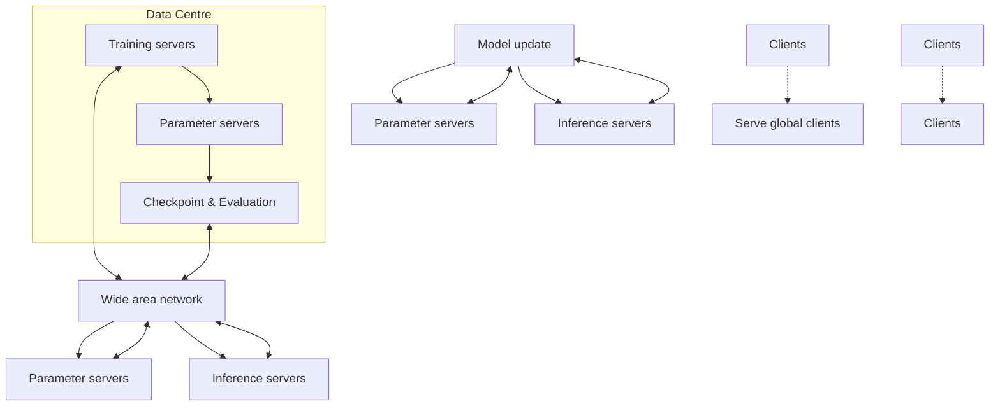
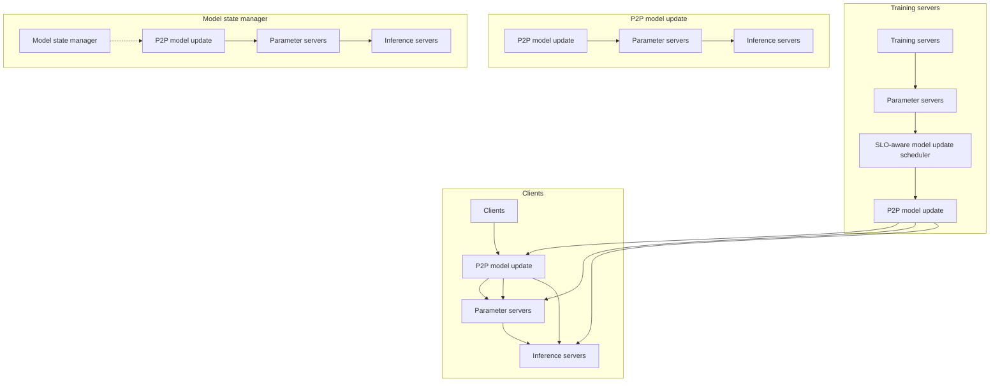
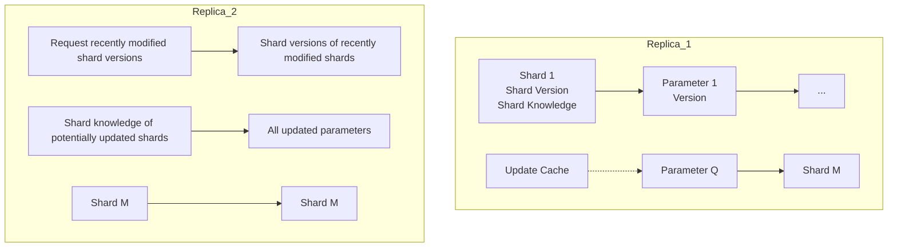
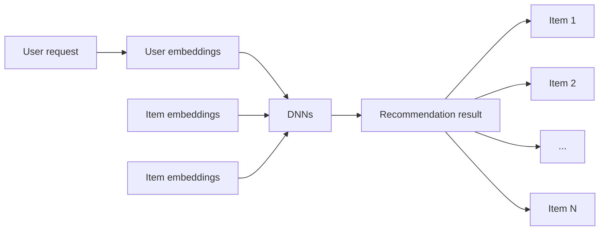

# Ekko: A Large-Scale Deep Learning Recommender System with Low-Latency Model Update

Chijun Sima, Tencent; Yao Fu and Man-Kit Sit, The University of Edinburgh; Liyi Guo, Xuri Gong, Feng Lin, Junyu Wu, Yongsheng Li, and Haidong Rong, Tencent; Pierre-Louis Aublin, IIJ research laboratory; Luo Mai, The University of Edinburgh

https://www.usenix.org/conference/osdi22/presentation/sima

This paper is included in the Proceedings of the 16th USENIX Symposium on Operating Systems Design and Implementation.

July 11–13, 2022 • Carlsbad, CA, USA

978-1-939133-28-1

Open access to the Proceedings of the 16th USENIX Symposium on Operating Systems Design and Implementation is sponsored by

nNetApp

# Ekko: A Large-Scale Deep Learning Recommender System with Low-Latency Model Update

<table><tr><td>Chijun Sima*</td><td colspan="2">Yao Fu*</td><td>Man-Kit Sit</td><td>Liyi Guo</td></tr><tr><td>Tencent</td><td colspan="2">The University of Edinburgh</td><td>The University of Edinburgh</td><td>Tencent</td></tr><tr><td>Xuri Gong</td><td>Feng Lin</td><td>Junyu Wu</td><td>Yongsheng Li</td><td>Haidong Rong</td></tr><tr><td>Tencent</td><td>Tencent</td><td>Tencent</td><td>Tencent</td><td>Tencent</td></tr><tr><td></td><td colspan="2">Pierre-Louis Aublin</td><td colspan="2">Luo Mai</td></tr><tr><td></td><td colspan="2">IIJ research laboratory</td><td colspan="2">The University of Edinburgh</td></tr></table>

## Abstract

Deep Learning Recommender Systems (DLRSs) need to up date models at low latency, thus promptly serving new users and content. Existing DLRSs, however, fail to do so. They train/validate models offline and broadcast entire models to global inference clusters. They thus incur significant model update latency (e.g. dozens of minutes), which adversely affects Service-Level Objectives (SLOs).

This paper describes Ekko, a novel DLRS that enables low-latency model updates. Its design idea is to allow model updates to be immediately disseminated to all inference clusters, thus bypassing long-latency model checkpoint, valida tion and broadcast. To realise this idea, we first design an efficient peer-to-peer model update dissemination algorithm. This algorithm exploits the sparsity and temporal locality in updating DLRS models to improve the throughput and la tency of updating models. Further, Ekko has a model update scheduler that can prioritise, over busy networks, the sending of model updates that can largely affect SLOs. Finally, Ekko has an inference model state manager which monitors the SLOs of inference models and rollbacks the models if SLO detrimental biased updates are detected. Evaluation results show that Ekko is orders of magnitude faster than state-of the-art DLRS systems. Ekko has been deployed in production for more than one year, serves over a billion users daily and reduces the model update latency compared to state-of-the-art systems from dozens of minutes to 2.4 seconds.

## 1 Introduction

Deep Learning Recommender Systems (DLRSs) are a key infrastructure in large technology organisations such as Meta [54], ByteDance [23], Google [15] and NVIDIA [56]. A DLRS often contains a large group of parameter servers that host numerous Machine Learning (ML) models (i.e. embedding tables [10, 26, 54] and deep neural networks [18]). The parameter servers are replicated in geo-distributed data centres for fault-tolerance and low-latency communication with clients. Each data centre has a group of inference servers which pull models from local parameter servers and serve clients with recommendation results. To ensure new users and content can be served promptly, a DLRS must update ML models continuously: it first uses training servers to collect new training data and compute model gradients. It then uses parameter servers to disseminate model updates to model replicas, usually through a Wide-Area Network (WAN).

Large-scale DLRSs need to serve billions of users [15, 23, 54] and they must achieve latency-related Service-Level Objectives (SLOs) [49], e.g. the latency of making a newly created content available to users. To best achieve SLOs, the operators of DLRSs have emerging requirements for achieving low latency in updating models. There are several reasons for this: (i) recent DLRS applications (e.g. YouTube [24] or TikTok [8]) have enabled users to create massive short videos, articles and images. All these contents need to be made available for clients as soon as possible, usually in minutes if not seconds; (ii) data protection laws (e.g. GDPR [60]) allow DLRS users to become anonymous. The behaviours of anonymous users need to be learnt online; (iii) numerous online ML models (e.g. reinforcement learning [74]) have been adopted in production to improve recommendation quality. These models must be continuously updated online to achieve the best possible performance.

Unfortunately, achieving low-latency model updates is extremely difficult in existing DLRSs. Existing systems such as Merlin [56], TFRA [66], Check-N-Run [21] and Big-Graph [39] follow an offline approach to updating models: after having collected new training data, these systems compute gradients for models offline, validate model checkpoints, and broadcast the checkpoints to all data centres. Such a model update process can take minutes and even hours [21]. An alternative approach is to use WAN-optimised ML systems [28] or federated learning systems [37]. These systems update replicated models using locally collected data and lazily synchronise replicas. The lazy synchronisation, however, introduces a non-trivial level of asynchrony, which often adversely affects the achievement of SLOs [28, 42].

We want to explore a DLRS design that can achieve lowlatency model updates without compromising SLOs. Our key idea is to allow training servers to update models (using gradients) online and immediately disseminate model updates to all inference clusters. This design allows us to bypass long-latency update steps, including offline training, model checkpoint, validation and broadcast, thereby reducing model update latency. To make this design feasible, we need to address several challenges: (i) how to efficiently disseminate massive model updates over WANs which have limited bandwidths and heterogeneous network paths [28]; (ii) how to protect SLOs from network congestion that can delay critical updates; and (iii) how to protect SLOs from biased model updates that are detrimental to model accuracy.

This paper introduces Ekko, a novel large-scale DLRS that updates globally replicated models at low latency. The design of Ekko makes several key contributions:

(1) Efficient peer-to-peer model updates dissemination. Existing parameter servers often adopt primary-backup data replication protocols [11, 41, 67] to realise model updates. With massive model updates, however, primary-backup protocols exhibit insufficient scalability due to long update latency [67] and leader bottlenecks [2].

To address these issues, we explore how to enable Peerto-Peer (P2P) [20] model update dissemination. We design an efficient log-less state-based synchronisation algorithm for geo-distributed DLRSs (see §4). This algorithm is effec tive in DLRSs because model updates often hit hot parameters [21], and it only transfers the latest version of a model parameter (i.e. state). Ekko must allow parameter servers to efficiently discover the differences of model states in a P2P manner. To this end, we design (i) model update caches that allow parameter servers to efficiently track and compare model states, (ii) shard versions that can significantly reduce network bandwidth consumption when comparing model states, and (iii) WAN-optimised dissemination topologies that allow pa rameter servers to prioritise bandwidth-affluent intra-DC network paths over bandwidth-limited inter-DC network paths. (2) SLO protection mechanisms. Ekko allows model updates to reach inference clusters without offline model validation. Such a design can make SLOs (particularly those related to the freshness and quality of recommendation results) vulnerable to network congestion and biased updates, both possible in production environments.

To handle network congestion, we design an SLO-aware model update scheduler (see §5). This scheduler computes metrics, including the update freshness priority, the update significance priority and the model priority. These metrics predict the impact of model updates on the inference SLOs. The scheduler computes a priority for each model update online based on these metrics. We integrate the scheduler into parameter servers without changing the decentralised architecture of the P2P model update dissemination in Ekko.

Ekko handles biased updates using a novel inference model state manager. This manager creates a baseline model for each group of inference models. This baseline model receives a small amount of user traffic and serves as the ground truth to the inference model. The manager continuously monitors the quality-related SLOs for baseline and inference models. When biased model updates corrupt the state of the inference model, the manager notifies witness servers to roll back the model to a healthy state.

We evaluate Ekko using both test-bed and large-scale production clusters (see §6). Test-bed experimental results show that Ekko reduces the model update latency by up to 7× compared to state-of-the-art parameter servers, namely Adam [11]. We further run large-scale production experiments with 40 TB models and over 4,600 servers spread across geo-distributed regions. Experimental results show that Ekko disseminates updates in 2.4 seconds while executing 1 billion updates per second (i.e. 212 GB/s). Ekko only uses 3.0% of the total network bandwidth for synchronisation, leaving the rest for training and inference. This second-level latency performance is orders of magnitude faster than the minute-level latency (i.e. 5 minutes [69]) achieved by state-of-the-art DLRS infrastructures (e.g. TFRA [66] and Check-N-Run [21]).

## 2 Low-Latency Model Updates in DLRSs

In this section, we introduce DLRSs and their algorithms for updating models. We then describe their Service-Level Objectives (SLOs) that can benefit from reducing the latency of updating models. Finally, we discuss the system challenges associated with realising low-latency model updates.

## 2.1 DLRSs and model updates

Most technology organisations adopt DLRSs following a system architecture shown in Figure 1. A DLRS often serves clients distributed across the globe ( 1 ). To minimise serving latency, DLRS models (i.e. embedding tables [10, 26, 54] and deep neural networks [18]) are geo-replicated in multiple data centres. When a client’s request arrives, an inference server pulls the model parameters from local parameter servers and infers over this model to answer the request.

Data pipelines collect training data (e.g. new content and user activities) from clients at run-time. The collected data reach training servers in a data centre ( 2 ). The training servers use optimisers [33] to compute gradients that correct corresponding models. All updated models (usually 100s - 1,000s) are persisted as checkpoints ( 3 ). The checkpoints are first validated, and only those that can improve SLOs are disseminated to the parameter servers in inference-oriented data centres over a WAN ( 4 ), finishing the model update process.

In practice, the latency of updating a DLRS model comprises the time of computing model updates and disseminating the updates to global data centres. This latency definition presumes that we have used low-latency message queues, e.g. Kafka [36], to accelerate the training data ingestion. Recent DLRSs, e.g. NVIDIA Merlin [56] and Meta Check-N-Run [21], report minute-level and hour-level latencies in up dating models. Suppose we want to update a DLRS model with a large embedding table (often several TB in size). In this case, it can take tens of minutes to persist this model as a checkpoint and validate the model. It takes another dozen minutes to disseminate this model over a WAN (assuming this WAN provides several Gbps bandwidth [72]).


<details>
<summary>flowchart</summary>


</details>

Figure 1: A typical DLRS architecture.

## 2.2 Reasons for low-latency model updates

DLRSs need to achieve numerous SLOs (usually related to the freshness and quality of recommendation results). Take a short-video recommendation service (e.g. TikTok) as an ex ample. The DLRS model accuracy determines this service’s quality SLOs. The time of making freshly made videos accessible to users decides this service’s freshness SLOs.

In real-world DLRSs, we observe that SLOs often depend on the latency of finishing model updates, making low-latency model updates a critical system requirement. There are several reasons for this:

(1) Massive new content created in a short time. Global DLRSs, e.g. YouTube [24], TikTok [8] and Instagram [22], often serve billions of users, and they allow users to create massive content quickly. The DLRSs need to quickly incor porate the created content into recommendation results — by updating their models at low latency — otherwise affecting user engagement.  
(2) Increasing anonymous users. Data protection laws (e.g. GDPR [60]) have forbidden many DLRSs from tracking user activities. As a result, such a DLRS can have anonymous users yet unknown to the recommendation models, even though these users have used the same service before. A DLRS thus must quickly react to the online activities of anonymous users,

thus meeting their recommendation requirements. Such a quick reaction depends on low-latency model updates.

(3) Increasing online recommendation models. DLRSs have increasing online ML models, e.g. those using reinforcement learning [74] and continual learning [69]. These models improve recommendation quality. They need to collect training data from online user activities, and they thus must continuously update model parameters at low latency.

## 2.3 Our key idea and associated challenges

We want to explore how to achieve low latency in updating DLRS models. Our observation is that the update latency is accumulated mainly due to several offline steps: model training, validation and broadcast. Suppose we bypass these offline steps and allow updated models to be disseminated to the inference clusters directly. In that case, we can vastly reduce the steps for updating models, thus achieving low latency. To realise such a design, however, we must address several challenges:

(1) Lack of efficient algorithms for disseminating massive model updates. A real-world DLRS often has a large number of models (e.g. usually 100s - 1,000s). It needs to update many of these models online. These models comprise those on a multi-stage recommendation pipeline [10, 15] and those for A/B tests [69]. These models often cost 10s of TB memory. They have the requirement to complete massive model updates online (e.g. 100s of GB per second).  
Suppose we use conventional data replication protocols, e.g. chain replication [41] and two-phase commit [11]. These protocols target generic data replication. They lack mechanisms to coordinate ML model updates (which may exhibit different impacts on inference SLOs) over a bandwidth-limited network (i.e. WAN). Furthermore, these conventional protocols suffer from leader bottlenecks. They also incur long update latency caused by the heterogeneous WAN paths and network stragglers. As a result, these protocols are ill-suited to meet our high-throughput, low-latency requirements. Alternatively, we could use geo-replication protocols [72]. These protocols, however, cannot handle the failures of servers in the training data centres, making them unable to meet our system availability requirement.  
We also considered network-efficient distributed ML systems, e.g. Gaia [28] and Google Federated [35]. These systems [7, 28, 35, 37, 46] allow models to be trained independently in each data centre, thus improving the throughput and latency of updating models. They, however, lazily synchronise their states and therefore incur stale model states [47], which can adversely affect recommendation quality. As a result, the loosely synchronised distributed ML systems cannot meet our model accuracy requirement.  
(2) Lack of mechanisms for protecting SLOs. Enabling online model updates in a DLRS poses challenges to SLOs. Such a DLRS can have model updates competing for network


<details>
<summary>flowchart</summary>


</details>

Figure 2: Ekko architecture overview.

bandwidth, delaying critical updates (e.g. those that signifi cantly affect model accuracy or bring new items online). Even though there are systems that schedule the sending of model gradients [6], these systems target training clusters. As a result, they prioritise model updates based on gradients [6, 28] and lack awareness of how those updates will affect the SLOs of inference models.

Online model updates can be even detrimental. Since online updates are often computed based on a small batch of data (collected in a short time window: seconds or minutes), they often contain noise [34]. When updates become particularly noisy, they become detrimental to inference SLOs (i.e. decrease the accuracy of inference models). To handle this, existing model serving systems, e.g. Clipper [16] and Clockwork [25], use offline model validation, which averages model updates accumulated for an extended period (e.g. hours). Other model serving systems, e.g. Google TFRA [66], track the SLO metrics of inference models, and they reload checkpoints when SLOs are deteriorating. Such a design, however, is challenging to implement in DLRSs. Giant DLRS models (e.g. recommendation-oriented transformers [18]) are increasingly common. Reloading these models affect the availability of services.

## 3 Ekko System Architecture

This paper introduces Ekko, a novel DLRS system that en ables low-latency model updates. In this section, we describe the system model of Ekko and present an overview that high lights the novel components in Ekko.

## 3.1 System model

Ekko is a geo-distributed DLRS. It updates models in a central data centre. It then disseminates updated models to geodistributed data centres close to global users (i.e. clients). Ekko represents models as key-value pairs, and it partitions the models into shards (e.g. 100,000 in our production environment). It stores model shards in key-value stores (named as a parameter store in Ekko). The parameter stores assign key-value pairs to shards through hashing. The model size can change over time since the model often incorporates new items and feature expiration online [32].

Ekko directs parameter requests to model shards using software-based routers. The routers designate parameter servers in the training DC as the primaries for model shards. They also ensure that the choice of primaries can balance the workload of parameter requests. The implementation of the routers follows typical key-value stores and databases [38]. We omit the details of the router implementation in this paper.

In the routers, there are shard managers which can handle resource overload, fault domains [55] and copyset issues [12]. Different from conventional shard managers, Ekko’s shard managers realise several DLRS-specific optimisations: (i) To amortise request processing overhead, Ekko batches concurrent inference requests for the same model [16]. Batched requests, however, can query a large number (e.g. 1000s) of parameters on different parameter servers, resulting in longtail query latency [19]. To prevent long-tail latency, Ekko limits the number of servers assigned to a model’s shards; (ii) Ekko supports multiple DLRS applications which require performance isolation. It maps the shards of different applications to different servers. Therefore, the spike of requesting the shards of an application will not affect the shards of other applications.

## 3.2 Architecture overview

We highlight the novel designs in Ekko in Figure 2. As we can see, Ekko enables parameter servers to achieve efficient peer-to-peer model updates ( 1 ) (see §4). The P2P model update algorithm prevents the central training data centre from broadcasting updated models. Instead, it uses all network paths inside and across data centres (those solid lines in the figure), thus achieving high throughput in disseminating model updates. Without using a central coordinator, each data centre can independently choose optimised intervals that synchronise model updates.

Ekko supports concurrent dissemination of massive model updates. These updates can compete for network resources, delaying the updates that largely benefit SLOs. To handle this, Ekko relies on an SLO-aware model update scheduler ( 2 ) (see §5.2). This scheduler predicts how each model update will affect inference results. The prediction results facilitate the computation of the priority of each model update. Based on the priority, Ekko coordinates which model updates to disseminate first at the training data centre, thus improving the overall satisfaction of the SLOs on inference servers.

Ekko can protect inference servers from being affected by detrimental model updates. To achieve this, it has a model state manager ( 3 ) (see §5.3) running in the inference clusters.


<details>
<summary>flowchart</summary>


</details>

Figure 3: Ekko P2P model update overview.

This model state manager monitors SLO-related metrics of inference models. Suppose an inference model shows down graded performance (caused by online updates). In that case, the manager rollbacks the model’s state to a better-performing one, thus recovering the performance of the inference model.

## 4 Efficient Peer-to-Peer Model Update

This section introduces the efficient P2P model update mech anism in Ekko. To enable P2P model update in parameter servers, the design of Ekko achieves the following goals:

• Ekko needs to coordinate a large number (e.g. thousands) of parameter servers (deployed across the globe) to finish model updates. To avoid stragglers (which can be caused by slow networks), we design log-less synchronisation for the parameter servers in Ekko (§4.3).  
• As a shared DLRS, Ekko needs to host thousands of models. These models can generate massive (e.g. billions per second) updates online. To support this, Ekko enables parameter servers to efficiently discover model updates through peers and pull updates without using excessive computation and network resources (§4.4).  
• Ekko needs to support geo-distributed deployments, which often involve heterogeneous network paths across WANs and server/network failures. To support this, Ekko has system designs that improve the throughput/latency of sending model updates over a WAN and tolerate server/network failures (§4.5).

In the following, we give an overview of the P2P model update mechanism and describe its implementation in detail.

## 4.1 Model update overview

Figure 3 highlights the components and steps involved in a model update in Ekko. Suppose that we want to synchronise a shard (denoted by shard 1) between two replicas (denoted by replica 1 and replica 2). Similar to all other shards, shard 1 has a (i) shard knowledge which summarises parameter updates, and (ii) an update cache that tracks recent model updates based on parameter versions. Each shard also associates a shard version which tells if this shard potentially has parameters to synchronise. The shard knowledge, update cache and shard version together accelerate parameter synchronisation among parameter servers.

To finish a model update, replica 2 requests the recently modified shard versions from replica 1 ( 1 ). Once receiving the request, replica 1 returns a list of recently modified shard versions ( 2 ). Replica 2 then compares all shard versions of replica 1 with its local shard versions and then sends related shard knowledge to replica 1 ( 3 ). Finally, replica 1 sends all updated parameters to replica 2 ( 4 ). Following these steps, Ekko can ensure that model updates are eventually disseminated to all replicas at low latency (i.e. eventual consistency).

We find eventual consistency acceptable in real-world DLRSs. Even though DNN replicas may diverge in a small time window, they often exhibit close (even often identical) inference results [11]. This is because DNNs often use floatingpoint numbers to represent model parameters, and therefore, DNN replicas make close predictions even though there is a slight difference in the values of their local parameters.

## 4.2 Parameter versions in DLRSs

To track the state of model parameters, Ekko assigns each key-value pair (i.e. the storage format of a model parameter) with a parameter version defined below:

Definition 1 (Parameter Version). A Parameter Version v is a pair (t, id) that consists of a timestamp t and an id uniquely identifying a replica. The timestamp t is generated based on the time range provided by modern physical time sources [14, 43]. Ekko makes sure t increases monotonically in each replica and pads the physical timestamp with a counter to make sure any two updates that originate from a single replica do not share the same timestamp. We define the total order of Parameter Versions:

$$
v _ {1} \geq v _ {2} \iff (t _ {1} > t _ {2}) \mid ((t _ {1} = t _ {2}) \land (i d _ {1} \geq i d _ {2}))
$$

A parameter with a larger Parameter Version supersedes another during conflict resolution [62].

In Ekko, it is worth noting that the timestamp is based on a real-time clock instead of a logical clock (which is often used in key-value stores and storage services). We find such a design effective in distributed DLRSs for a reason: a DLRS has embedding tables where parameters are sparsely updated. Suppose there is an embedding’s parameter in a primary replica and this parameter has a significant update count, but the primary does not disseminate this parameter before it fails. When this primary recovers, the counter can overwrite the current primary with a small update count. Such an overwrite can adversely affect recommendation quality because the overwritten primary can have a newer parame ter (updated by recently collected training data), leading to better recommendation results. Hence a logical counter is not sufficient to resolve conflicts in distributed DLRSs.

## 4.3 Log-less parameter synchronisation

Once version numbers have been assigned to parameters, Ekko needs to decide how to synchronise the different replicas. We observe that a DLRS often overwrites parameters and only the last write decides the state of a parameter. We therefore decide to send the last version of parameters.

Ekko needs to decide the interval of synchronising replicas. We could use log-based synchronisation algorithms [9, 11]: these algorithms choose synchronisation intervals so that model updates can be sent at the rates that do not exceed the bandwidth on the slowest links in a network. These algorithms, however, cause the under-utilisation of many network links. More importantly, it results in stragglers which can significantly increase the latency of synchronisation, making parameter servers more likely to have stale states when they recover from failures. Hence, we want to realise log-less parameter synchronisation in parameter servers so that these servers can dynamically choose synchronisation intervals with their peers according to the bandwidth on each link.

Shard knowledge in parameter servers. We propose to use shard knowledge [50, 51] to realise log-less parameter synchronisation. More formally, in each replica, all its shards maintain a corresponding shard knowledge. The shard knowledge, implemented using version vectors [58], summarises the parameter updates they have learnt. Shard data (associated with the shard knowledge $V V _ { s h a r d } )$ reflect the state of an empty shard applying all historical parameter updates originating from each replica r, where the update corresponding parameter version $\nu \leq V V _ { s h a r d } [ r ]$ . Suppose there is an update for the parameter p to be processed in replica r. To maintain shard knowledge, this replica generates a new parameter version $\nu _ { p } = ( t , i d )$ and sets $V V _ { s h a r d } [ i d ] = \nu _ { p }$

Shard synchronisation process. To synchronise a shard, replica r sends its shard knowledge $V V _ { r _ { 1 } }$ to a selected replica s. Replica s records its current shard knowledge $V V _ { s } -$ that is, it atomically reads out $V V _ { s }$ and selects from its store all parameters p whose parameter version $\nu _ { p } = ( t _ { p } , i d _ { p } ) > V V _ { r _ { 1 } } [ i d _ { p } ]$ — and responds to r with $V V _ { s }$ . Then, r atomically applies all parameter updates based on the response from s, and further merges VV with its current shard knowledge $V V _ { r _ { 2 } }$

There are several considerations to note in the synchroni sation process: (i) When replica r synchronises with replica s, r could have concurrent synchronisation operations with another replica (denoted as replica k). These operations can complete before r finishes processing the response from s. As a result, $V V _ { r _ { 2 } }$ (which is the result of $V V _ { r } \bigsqcup V V _ { k } \big )$ does not necessarily equal $V V _ { r _ { 1 } }$ . (ii) The synchronisation process omits all superseded versions of an updated parameter in failure-free scenarios where the requests for updating a parameter are always routed to the same primary. We find these failure-free scenarios common in our production environments.

## 4.4 Making synchronisation efficient

Ekko must ensure parameter synchronisation have negligible performance overheads on parameter servers. Otherwise, synchronisation can consume excessive computation and communication resources, affecting parameter servers’ performance in serving model inference and training requests. In the following, we discuss how to make parameter synchronisation efficient through parameter update caches (which reduce computation costs) and shard versions (which reduce communication costs).

## 4.4.1 Parameter update caches

Since a shard can have a large number of parameters, naively iterating all parameters to answer a synchronisation request incurs substantial computation costs. Even though we could use an index to accelerate the parameter iteration, maintaining such an index costs tremendous memory resources, which are difficult to provision on parameter servers.

We design parameter update caches to reduce the computation cost of parameter synchronisation. The design of such caches exploits the sparsity and temporal locality we often observe in DLRSs [21]. Unlike dense DNN training systems where the entire models are updated every iteration, a DLRS updates a subset of its parameters (i.e. sparsity). For example, in our production DLRSs, 3.08% of its parameters are updated per hour. Further, model updates are often overwriting certain parameters (i.e. temporal locality) in a time window. This is because a DLRS often has trendy items and users, and their parameter updates dominate in a short period.

More specifically, a parameter update cache contains pointers to recently updated parameters. It exploits a Dominator Version Vector (denoted as DVV) to judge whether to hit the cache when a synchronisation request arrives.

Cache maintenance algorithm. The maintenance of the cache guarantees two invariants: (i) for all parameters $p _ { u n c a c h e d }$ existing in a shard but not in the cache, $D V V [ i d _ { p _ { u n c a c h e d } } ] \geq \nu _ { p _ { u n c a c h e d } } ;$ (ii) for all cached parameters p<sub>cached</sub>, $D V V [ i d _ { p _ { c a c h e d } } ] < \nu _ { p _ { c a c h e d } } .$

Algorithm 1 describes the maintenance of the parameter update cache in Ekko. The maintenance relies on the estimated update propagation time $D _ { p r o p }$ . Consider the function of updating the cache: UpdateCache (line 1). $t _ { p r u n e t o }$ is a timestamp that describes $D V V _ { p r o p o s e d } - \mathbf { a }$ version vector that judges whether a parameter should be pruned. For every modification request, the cache records a pointer to that parameter if the parameter version $\nu _ { p } = ( t _ { p } , i d _ { p } )$ of the modified param eter $p$ is larger than $D V V _ { p r o p o s e d } [ i d _ { p } ]$ (line 5). Otherwise, the cache merges the parameter version with DVV (line 3).

Algorithm 1: Update Cache Maintenance using $D _ { p r o p }$

<div class="mineru-algorithm" style="white-space: pre-wrap; font-family:monospace;">
Function UpdateCache(p):
    if $v_p.t \le t_{pruneto}$ then
        DVV.Merge($v_p$);
    else
        cache.Add(p);
    end
Function PruneCache():
    $t_{pruneto} \leftarrow max(t_{pruneto}, t_{now} - D_{prop})$;
    for $p \in cache$ do
        if $v_p.t \le t_{pruneto}$ then
            cache.Erase(p);
            DVV.Merge($v_p$);
        end
    end
</div>

Consider the function of pruning a parameter pointer: PruneCache (line 7). This function takes $D _ { p r o p } .$ which es sentially allows Ekko to exploit online observations towards cache hit rates to guide cache pruning operations. Suppose we want to prune parameter pointers when the cache size has grown beyond a limit. In that case, the cache first determines $D V V _ { p r o p o s e d } ^ { \prime }$ , which strictly dominates $D V V _ { p r o p o s e d }$ (line 8). It then removes parameter pointers dominated by $D V V _ { n } ^ { \prime }$ proposed (line 11). Eventually, the cache updates DVV by merging it with parameter versions of pruned parameters (line 12). By doing so, Ekko achieves adaptive management of the cache size, reducing its memory footprint.

Cache hit analysis. We analyse when parameter updates hit the cache. Suppose replica s receives the synchronisation request from replica r which holds the shard knowledge $V V _ { r } .$ If VV dominates DVV , the request hits the cache and its subsequent operations (e.g. selecting a parameter) only touch the parameters in the cache.

Ekko ensures that the use of the update cache does not affect the eventual consistency property of log-less parameter synchronisation: the synchronisation process needs to select out parameters p in s where $\nu _ { p } > V V _ { r } [ i d _ { p } ]$ . Because the update cache holds the invariant that $D V V _ { s } [ i d _ { p _ { u n c a c h e d } } ] \geq \nu _ { p _ { u n c a c h e d } }$ and $V V _ { r }$ dominates DVV , the process selects out the same set of parameters as the previous algorithm.

The parameter update caches are particularly effective in reducing the cost of selecting parameters. According to the traces of the caches deployed in our production environments, 99.4% of the synchronisation requests can hit the caches, leading to a 99% reduction in the cost of selecting parameters.

## 4.4.2 Shard versions

We introduce shard versions to reduce network costs in synchronising replicas. Shard versions capture partial causality relationships of shard data on replicas, and they are much smaller than version vectors. We can allow the replicas to book-keep shard version lists where each list is associated with a neighbour replica. By doing this, replicas can identify potentially updated shards by exchanging and comparing shard version lists. Formally, we define shard versions as:

Definition 2 (Shard Version). A shard version $s \nu = \left( c , i d \right)$ is a pair consisting of a counter c, which is monotonically incremented in each shard of each replica, and an id identifying the replica that generates this version. $s \nu _ { 1 } \succeq s \nu _ { 2 }$ of a same shard s if and only if $i d _ { 1 } = i d _ { 2 }$ and $c _ { 1 } \geq c _ { 2 }$

Shard version maintenance. On initialisation, each replica generates shard versions for its shards. It later generates a new shard version when a training worker issues a parameter update. Since each shard has a primary replica, there is a single replica generating shard versions in normal cases.

Once receiving a synchronisation request, the responder replica, denoted as $s ,$ replies its shard version: $s \nu _ { s }$ together with $V V _ { s }$ and updated parameters. Once having this reply, the requester replica, denoted as $r ,$ finishes the following operations in an atomic manner: it (1) merges its shard knowledge $V V _ { r }$ with the received $V V _ { s }$ (The merging result is denoted as $V V _ { r } ^ { \prime } )$ , and (2) it updates its shard version $s \nu _ { r } ^ { \prime }$ to be $s \nu _ { s }$ when $V V _ { r } ^ { \prime } = V V _ { s } ;$ ; Otherwise, replica r generates a new shard version if $V V _ { r } ^ { \prime } \neq V V _ { r }$ . Note that: when $V V _ { r }$ equals $V V _ { s } ,$ to avoid livelock, Ekko will choose a shard version from s and r following deterministic rules (e.g. choosing the shard version which exhibits a larger numerical value).

We implement book-keeping techniques [51] which maintain the shard version lists associated with different replicas. By applying both shard versions and book-keeping, Ekko can effectively reduce synchronisation-oriented network traffic. For example, in one of our production DLRSs, Ekko filters out 98% of shards in synchronisation.

Synchronisation with shard versions. We discuss how shard versions facilitate synchronisation. Ekko maintains the invariant $s \nu _ { 1 } \succeq s \nu _ { 2 }$ only if shard knowledge $V V _ { 1 }$ dominates $V V _ { 2 }$ for the same shard s. Thus replica r needs to synchronise a shard with replica s only if $s \nu _ { r } \not \subset s \nu _ { s }$ . Furthermore, consider different replicas which have comparable shard versions for the same shard. Ekko prefers to synchronise with the one with the largest shard version because larger shard versions indicate a more refreshed version of parameters.

## 4.5 Implementation details

WAN optimisation. Ekko targets geo-distributed deployments, which comprise multiple intra-DC networks and an inter-DC WAN. To improve its performance with such de ployments, Ekko uses a WAN-optimised model update dissem ination strategy. This strategy constructs a flexible commu nication topology for P2P synchronisation. It lets each DC elect a local leader for each shard using Zookeeper [31]. The leaders pull model updates from other DCs while other repli cas pull updates from this leader. By doing so, Ekko allows a large proportion of synchronisation traffic to go through bandwidth affluent intra-DC networks and only a small of synchronisation traffic to go over WANs. Note that the imple mentation of the parameter synchronisation does not require a specific communication topology. Ekko can use other overlay topologies to improve synchronisation performance.

Failure tolerance. Ekko uses the request routers to tolerate failures. The routers decide the routes of client requests, and they detect the healthiness of replicas using heartbeats. Suppose a router speculates a replica failure (either fail-stop or fail-slow [30]). In that case, it prevents clients (inference servers and training servers) from requesting that replica. It also tracks the shard knowledge of replicas in the cluster. If a previously suspected failed replica recovers and sends heart beats to the router, the router will instruct that replica to catch up with a sufficiently updated replica in the cluster. When the catching-up finishes, the router directs client requests to that replica. If a replica loses its state, it re-joins the cluster with a new id. Training servers stop sending parameter updates if they cannot contact the router for a given period, which achieves best-effort protection of model parameters from divergence in the case of having network partitions [5].

## 5 SLO Protection Mechanisms

Ekko allows model updates to reach parameter servers in inference clusters directly. This, however, raises two challenges for the SLOs of recommendation services: (i) network con gestion can cause critical model updates to be delayed, and (ii) model updates based on a small batch of biased data can have detrimental impacts on inference results.

This section introduces mechanisms that protect inference SLOs from network congestion and biased updates. We first define the SLOs (see §5.1), describe an SLO-aware model update scheduler (see §5.2), and discuss an inference model state manager that handles biased updates (see §5.3).

## 5.1 SLOs in a DLRS

A DLRS has two major types of SLOs:

• Freshness SLOs measure the latency of including new content and users in model inference. They are vital for recommendation services, especially those interacting with users in real-time, e.g. TikTok and YouTube. For example, such services often need to capture the interests of new users in a timely manner so that they are sufficiently engaged; otherwise, they leave the recommendation applications due to the loss of interest. Improving the freshness SLOs usually leads to a better user experience. Also, new content will have better exposure, securing the prosperity of DLRSs.


<details>
<summary>flowchart</summary>


</details>

Figure 4: Overview of the inference process in Ekko.

• Quality SLOs measure user experience and engagement. They have immediate impacts on the profitability of a DLRS. Examples of such objectives include the number of viewed videos and user watching time.

Figure 4 describes how an inference server affects the freshness and quality SLOs. Once receiving a request, the inference server selects related user and item embeddings. It then aggregates the embeddings and sends an aggregated embedding to a DNN that returns the scores for recommendation items. The DLRS finally returns a list of items sorted by the scores. In this case, the freshness SLO is measured based on the latest timestamp of the recommended items (Ideally, this timestamp should be as close to the current time as possible). The quality SLO can be measured based on the viewing time of the items and how many items are clicked. In practice, Ekko maintains a large number of freshness and quality SLOs online. The implementations of such SLOs are contributed by DLRS application developers.

## 5.2 SLO-aware model update scheduler

Ekko prevents both freshness and quality SLOs from being affected by network congestion. This is achieved by an SLO aware model update scheduler and an integration of this scheduler into P2P model update dissemination.

## 5.2.1 SLO-aware priorities for model updates

Ekko computes a set of priorities in scheduling model updates: Update freshness priority. Ekko computes an update freshness priority $p _ { u } .$ This priority is designed based on the following observation. If a parameter has been created recently, it has a high priority; otherwise, it has a relatively lower priority. The reason for this is that newly created parameters have more significant impacts on inference results than those served for an extended period. Suppose a user’s embedding is unavail able in the inference server, but her request has arrived. In this case, the DLRS cannot answer this request, compromising quality SLOs. Another case is that if the embedding table does not include an item on the inference servers, the DLRS will not recommend this item, compromising freshness SLOs.

Update significance priority. Ekko computes an update significance priority $p _ { g }$ for each model update based on its gradient g. This priority is initially inspired by studies which showed how the gradient magnitude |g| affects the inference results of a DNN [6, 28]. However, naively adopting the gradient magnitude is insufficient in Ekko. As a shared DLRS, Ekko multiplexes the updates from different models on a shared network. As a result, Ekko must have ways to compare gradient magnitudes that have different distributions. Therefore, we define $p _ { g } = | g | / | g |$ , where |g| denotes the 1-norm of g and |g| denotes the average gradient magnitude of recent model updates. Intuitively, this definition normalises gradient magnitudes, thus making them comparable.

Model priority. In a DLRS, models often receive inference requests at different rates, indicating their varied importance in measuring the overall satisfaction of SLOs. To consider this, Ekko allows the models that handle the majority of requests to be assigned with higher priorities compared to those that rarely receive requests. To this end, we define the model priority as $\begin{array} { r } { p _ { m } = c _ { m } / \sum _ { i = 1 } ^ { M } c _ { i } } \end{array}$ , where $c _ { m }$ is the request count of model m and $\Sigma _ { i = 1 } ^ { M } c _ { i }$ denotes the total request count of all M models.

Combining priorities. We combine all the above priorities to compute the overall priority p of a model update as below:

$$
p = (p _ {g} + p _ {u}) p _ {m}
$$

where the significance priority $p _ { g }$ and the freshness priority $p _ { u }$ have both been normalised so that they can be summed up. The sum is multiplied by the model priority $p _ { m }$

Note that Ekko does not require its users only to use the above priorities. Some Ekko users have custom priority definitions, including update count, update interval and the positions of parameters in embedding tables. These custom priorities are specific to certain DLRS workloads [69], and they are not generic enough to be included in a default setting. Ekko accommodates these custom priorities by supporting User-Defined-Functions (UDFs) in defining priorities.

## 5.2.2 Scheduler implementation

The model update scheduler computes the priority for each update once it is produced. It needs to ensure the cost of pri ority computation is negligible; otherwise, it can become a bottleneck in model updates. To achieve this, the scheduler offloads the maintenance of priority-related statistics (e.g. |g| and $p _ { m }$ for each model m) to a background thread. Moreover, to bound memory cost, it uses a quantile sketch (e.g. DDSketch [52]) that computes the k percentile priority $p _ { k }$ in a time window, where k is a ratio set by algorithm managers. Ekko executes user-defined priority computation using WebAssembly [27] to achieve efficient isolation among UDFs.

Algorithm 2: Priority-based synchronisation

<div class="mineru-algorithm" style="white-space: pre-wrap; font-family:monospace;">
Function UpdateSVV ($SVV_{other}$):
    $SVV.Merge(SVV_{other})$;
    $TSVV.Merge(SVV)$;

Function WriteStoreParameter($p$):
    WriteIfVersionLarger(store, $p$);
    EraseIfVersionNotSmaller($store_{significant}, p$);

Function OnRecvPrioritisedSync ($TSVV_{other}$):
    reply.TSVV $\leftarrow$ TSVV;
    for $p \in (store \cup store_{significant})$ do
        if not $TSVV_{other}.Dominate(p.sigv)$ then
            reply.parameters.Add($p$);
        end
    end
    return reply;

Function PrioritisedSync():
    reply $\leftarrow$ OnRecvPrioritisedSync$_{other}$($TSVV$);
    for $p \in$ reply.parameters do
        if VersionLarger($store \cup store_{significant}, p$)
            then
                $store_{significant}[p.name] \leftarrow p$;
        end
    end
    TSVV.Merge(reply.TSVV)
</div>

Integrating schedulers into parameter servers. To achieve the promise of priority scheduling, we must have ways of integrating the schedulers into the parameter servers which have enabled log-less P2P synchronisation. To this end, we propose the significant version, denoted as sigv, for each parameter and the significant knowledge SVV for each shard. Moreover, Ekko assigns each shard with a transient significant parameter store store<sub>significant</sub> and a corresponding transient significant knowledge TSVV to enable P2P synchronisation with priority scheduling.

Algorithm 2 describes the log-less P2P synchronisation augmented with priority schedulers. Suppose we have a model update from a replica. In this case, Ekko calculates p. If $p \geq p _ { k }$ , Ekko sets sigv = v, where v is the parameter version of this update; otherwise, sigv remains unchanged. Then, Ekko uses sigv to construct $S V V _ { o t h e r }$ and call the UPDATESVV function (line 1). In the case that Ekko does not apply priorities in synchronisation, replicas exchange SVV and execute the UPDATESVV function. On writing parameters into the persistent parameter store, Ekko prunes superseded parameters by executing the WRITESTOREPARAMETER function (line 4). Note that replicas estimate how long the model updates to reach themselves. Hence, when network congestion occurs, servers will have update time-outs. In this case, Ekko uses the PRIORITISEDSYNC function (line 15) that triggers priority schedulers in synchronisation. Once receiving requests, replicas prefer to return parameters in significant parameter stores.

## 5.3 Inference model state manager

Ekko uses an inference model state manager to protect SLOs from detrimental model updates. This manager monitors in ference models’ healthiness (i.e. quality SLOs) and conducts low-latency model state rollback on demand.

## 5.3.1 Monitoring model healthiness

Ekko monitors model healthiness based on the following idea: for a DLRS application, it creates baseline models for its inference models. Baseline models process a small amount of user traffic (usually < 1%). They are different from the online inference models because they carry delayed states. In other words, they are trained with previous training samples, usually several minutes earlier than the samples training the current inference model.

Ekko measures model healthiness based on metrics collected from inference servers and clients (e.g. user devices). To compute these metrics, Ekko defines a custom watermark and trigger [3]. Its state manager emits anomaly detection events only if confident (i.e. observing monitoring data for an extended period). Note that Ekko is not constrained to use specific anomaly detection algorithms. It supports custom anomaly detection algorithms, such as those often used with time-series data [61].

We model the transition of model states (i.e. healthy or not) as a replicated state machine [63], implemented within the model state manager. This manager evaluates and records model healthiness at a timestamp t by inspecting the healthiness-related metrics and the model update latency. The timestamp t monotonically increases. The manager makes judgements if the model state is healthy, corrupted or uncertain. When the manager is confident that changes have oc curred in the model state (i.e. healthy or corrupted), it records this information in its replicated state. If the model state has corrupted, the manager re-directs client requests to alternative inference models (still healthy) and then launches a model state rollback.

## 5.3.2 Low-latency model state rollback

Ekko uses witness servers to roll back corrupted model states at low latency. The witness servers join replica synchronisation but they do not participate in model training. Unlike parameter servers, the witness servers (i) do not immediately flush updated parameters into parameter stores and (ii) do not run priority scheduling in synchronisation. More specifically, Ekko inserts the parameter updates that are not flushed yet into the logs. The logs are attached with the physical timestamp of synchronisation (denoted as t). If there are multiple synchronisation operations in a small time window, Ekko merges their logs to save space.


<details>
<summary>flowchart</summary>

```mermaid
graph TD
  subgraph Quality_SLOs["Quality SLOs"]
    direction TB
  Start((Start)) --> Decision["Decide model state: Healthy, Corrupted, Uncertain"]
  end

  subgraph Model_State_Manager["Model State Manager"]
  Decision -->|Quality SLOs| Start
  Decision -->|Baseline| Start
  end

  subgraph Parameter_Server["Parameter Server"]
  StopUpdate["Stop update"] --> Sync["Sync"]
  UpdateLog1["Update Log"] --> Sync
  UpdateLog2["Update Log"] --> Sync
  UpdateLog3["Update Log"] --> Sync
  UpdateLog4["Update Log"] --> Sync
  UpdateLog5["Update Log"] --> Sync
  UpdateLog6["Update Log"] --> Sync
  UpdateLog7["Update Log"] --> Sync
  UpdateLog8["Update Log"] --> Sync
  UpdateLog9["Update Log"] --> Sync
  UpdateLog10["Update Log"] --> Sync
  UpdateLog11["Update Log"] --> Sync
  UpdateLog12["Update Log"] --> Sync
  UpdateLog13["Update Log"] --> Sync
  UpdateLog14["Update Log"] --> Sync
  UpdateLog15["Update Log"] --> Sync
  UpdateLog16["Update Log"] --> Sync
  UpdateLog17["Update Log"] --> Sync
  UpdateLog18["Update Log"] --> Sync
  UpdateLog19["Update Log"] --> Sync
  UpdateLog20["Update Log"] --> Sync
  UpdateLog21["Update Log"] --> Sync
  UpdateLog22["Update Log"] --> Sync
  UpdateLog23["Update Log"] --> Sync
  UpdateLog24["Update Log"] --> Sync
  UpdateLog25["Update Log"] --> Sync
  UpdateLog26["Update Log"] --> Sync
  UpdateLog27["Update Log"] --> Sync
  UpdateLog28["Update Log"] --> Sync
  UpdateLog29["Update Log"] --> Sync
  UpdateLog30["Update Log"] --> Sync
  UpdateLog31["Update Log"] --> Sync
  UpdateLog32["Update Log"] --> Sync
  UpdateLog33["Update Log"] --> Sync
  UpdateLog34["Update Log"] --> Sync
  UpdateLog35["Update Log"] --> Sync
  UpdateLog36["Update Log"] --> Sync
  UpdateLog37["Update Log"] --> Sync
  UpdateLog38["Update Log"] --> Sync
  UpdateLog39["Update Log"] --> Sync
  UpdateLog40["Update Log"] --> Sync
  UpdateLog41["Update Log"] --> Sync
  UpdateLog42["Update Log"] --> Sync
  UpdateLog43["Update Log"] --> Sync
  UpdateLog44["Update Log"] --> Sync
  UpdateLog45["Update Log"] --> Sync
  UpdateLog46["Update Log"] --> Sync
  UpdateLog47["Update Log"] --> Sync
  UpdateLog48["Update Log"] --> Sync
  UpdateLog49["Update Log"] --> Sync
  UpdateLog50["Update Log"] --> Sync
  UpdateLog51["Update Log"] --> Sync
  UpdateLog52["Update Log"] --> Sync
  UpdateLog53["Update Log"] --> Sync
  UpdateLog54["Update Log"] --> Sync
  UpdateLog55["Update Log"] --> Sync
  UpdateLog56["Update Log"] --> Sync
  UpdateLog57["Update Log"] --> Sync
  UpdateLog58["Update Log"] --> Sync
  UpdateLog59["Update Log"] --> Sync
  UpdateLog60["Update Log"] --> Sync
  UpdateLog61["Update Log"] --> Sync
  UpdateLog62["Update Log"] --> Sync
  UpdateLog63["Update Log"] --> Sync
  UpdateLog64["Update Log"] --> Sync
  UpdateLog65["Update Log"] --> Sync
  UpdateLog66["Update Log"] --> Sync
  UpdateLog67["Update Log"] --> Sync
  UpdateLog68["Update Log"] --> Sync
  UpdateLog69["Update Log"] --> Sync
  UpdateLog70["Update Log"] --> Sync
  UpdateLog71["Update Log"] --> Sync
  UpdateLog72["Update Log"] --> Sync
  UpdateLog73["Update Log"] --> Sync
  UpdateLog74["Update Log"] --> Sync
  UpdateLog75["Update Log"] --> Sync
  UpdateLog76["Update Log"] --> Sync
  UpdateLog77["Update Log"] --> Sync
  UpdateLog78["Update Log"] --> Sync
  UpdateLog79["Update Log"] --> Sync
  UpdateLog80["Update Log"] --> Sync

  %% Looping Steps:
  Step1["1"] --> Step2["5"]
  Step2 -.-> Step3["2"]
  Step3 -.-> Step4["3"]
  Step4 -.-> Step5["4"]
  Step5 -.-> Step6["5"]
  Step6 -.-> Step7["6"]
```
</details>

Figure 5: Inference model state manager.

The model state manager controls witness servers to launch state rollbacks. Suppose a model state is regarded as $t _ { h e a l t h y }$ at the time t. In that case, witness servers find a timestamp $t _ { m a x }$ that meets two conditions: (i) it i $ t _ { h e a l t h y }$ and (ii) it is not within any time interval where corrupted states have occurred. The witness servers then flush the logs which have the timestamps $\leq t _ { m a x }$ . The model state manager records this $t _ { m a x }$ and $t _ { m a x }$ will be later used in witness servers for recovering a healthy model state. Following this way, we can ensure the parameter store $s t o r e _ { h e a l t h y }$ always keep healthy model states on witness servers.

Rollback process. Figure 5 illustrates the process of rolling back a model state. Suppose a model is found to be corrupted. The model state manager first informs parameter servers to stop accepting training requests of this model ( 1 ). It then instructs parameter servers to stop priority-based synchronisation, clears their $s t o r e _ { s i g n i f i c a n t }$ , and resets $T S V V = S V V$ The manager then waits for the model shards on parameter servers and witness servers to converge. Later, the manager selects witness servers to initiate the state rollback ( 2 ). We need to ensure recovered model shards can be used together. Hence, the manager selects shards from the $s t o r e _ { h e a l t h y }$ on witness servers only if $t _ { m a x }$ of these shards are in a small time window.

A key design is that the witness servers will compare $s t o r e _ { h e a l t h y }$ and its current state to find a state difference ( 3 ). This difference is often small because of the locality in updated parameters. We thus only write the difference into the parameter servers to recover a state. We need to ensure the write operations can succeed. Hence, the written parameters are assigned with parameter versions that are larger than those currently on parameter servers ( 4 ). After that, the manager waits for the model shards to converge on parameter servers and witness servers. Finally, Ekko will recover a small amount of traffic on the recovered model. When this model’s healthiness metrics go back to normal, the manager informs parameter servers to resume accepting requests ( 5 ).

Note that if a witness server fails, its non-flushed update logs are discarded. This helps Ekko prevent potentially cor rupted updates from being flushed. If a parameter server or a witness server fails (or re-joins the cluster), the rollback process will be re-executed.

## 6 Evaluation

In this section, we evaluate the following aspects of Ekko through test-bed and in-production experiments: (i) The update latency of Ekko and its scalability with the number of data centres (§6.1.1); (ii) The update latency of Ekko in a heterogeneous-WAN (§6.1.1); (iii) The performance breakdown of optimisations implemented in Ekko (§6.1.2); (iv) The real-world latency and availability of Ekko in a large-scale production DLRS (§6.2.1); (v) The benefits of low-latency model updates in online services (§6.2.1); (vi) The effectiveness of using model update schedulers with a busy network (§6.2.2); and (vii) The latency of rolling back a model upon model corruption (§6.2.2).

Unless otherwise specified, the update latency is the maximum time difference between the time an update commits and the time this update becomes visible [68] in all replicas (failure-free scenarios). In all experiments, we measure the update latency and report its average across all updates.

## 6.1 Test-bed experiments

We conduct test-bed experiments in a 30-server cluster. Each server has a 24-core CPU, 64 GB RAM and a 5 Gbps network link. We group every three servers as a DC to emulate a multi-DC scenario, forming up to 10 DCs. We choose one of the DCs as the training-oriented DC, which receives model updates from a server (which acts as a DLRS client). We let other DCs be inference-oriented and connect them with the training-oriented DC. The inter-DC bandwidth is 4,800 Mbps (unless otherwise specified), emulating a WAN.

Our test-bed experiments comprise two workloads. The first workload trains a large ranking model typically used in our production environments. In this workload, we choose the shard size as 0.4 MB. The second workload trains the Wide & Deep model [10] using the Criteo Terabyte Click Logs [17] sorted chronologically. We initialise embedding tables using 21-day data logs. To ensure experiments are reproducible, we record model update traces and replay them during the experiments.


<details>
<summary>bar</summary>

| Number of data centres | Ekko (s) | Adam (s) |
| --- | --- | --- |
| 1 | ~0.5 | ~0.8 |
| 5 | ~1.4 | ~3.6 |
| 10 | ~2.6 | ~19.0 |
</details>

(a) Production workload


<details>
<summary>bar</summary>

| Number of data centres | Ekko (s) | Adam (s) |
| --- | --- | --- |
| 1 | ~1 | ~1 |
| 5 | ~2.1 | ~4 |
| 10 | ~2.4 | ~10.8 |
</details>

(b) Criteo workload  
Figure 6: Average model update latency.

## 6.1.1 Update latency

We evaluate Ekko’s update latency in a homogeneous WAN and a heterogeneous WAN. Both of these WANs are common in the real world. The first baseline is Adam [11] which is often used in parameter servers to synchronise model updates using the two-phase commit protocol. Our Adam implementation removes the waiting time between update broadcasts, thus improving network utilisation. The second baseline is Checkpoint-Broadcast which is the de-facto approach that applies model updates in DLRSs [1, 21]. We omit the experiments with general key-value stores, e.g. PaxosStore [73] and TiKV [29], which provide linearisability in writing operations. Our early adoption results show that these key-value stores achieve low writing throughput, orders of magnitude lower than what a production DLRS requires.

To make a fair comparison, Ekko and baselines all use DRAM for storage [57] and adopt the same primaryassignment and load-balancing schemes. We further ensure their dissemination are all network-bound and use the same numbers of shards.

Homogeneous WAN results. We first compare Ekko against Adam in the homogeneous WAN. We measure their latency with 1 DC (3 replicas), 5 DCs (15 replicas), and 10 DCs (30 replicas), respectively. Figures 6a and 6b show the results. As we can see, Ekko achieves significantly lower latency than Adam in both the production and Criteo workloads. More specifically, with the 10 DCs that run the production workload, Ekko achieves a 2.6-second latency, 7× lower than the 18.8-second latency achieved by Adam. We also observe that the performance gap between Ekko and Adam increases with more DCs. The reason is that Ekko has a scalable P2P synchronisation architecture. It also optimises its dissemination topology for a WAN. In contrast, Adam relies on the primary replica to send updates, constraining itself with the limited bandwidth available in the training DC.

We also compare Ekko against Checkpoint-Broadcast. According to our experimental results, Checkpoint-Broadcast takes more than 7 seconds to synchronise 4 GB of parameters in the WAN. The total parameters are 113 GB. With


<details>
<summary>line</summary>

| Number of machines synced | Ekko (s) | Adam (s) |
| --- | --- | --- |
| 0 | 0 | 0 |
| 1 | ~2 | ~165 |
| 5 | ~8 | ~168 |
| 10 | ~9 | ~170 |
| 15 | ~9 | ~172 |
| 20 | ~9 | ~173 |
| 25 | ~10 | ~174 |
| 28 | ~33 | ~175 |
| 30 | ~33 | ~176 |
</details>

(a) Production workload


<details>
<summary>line</summary>

| Number of machines synced | Ekko (s) | Adam (s) |
| --- | --- | --- |
| 0 | 0 | 0 |
| 2 | ~1 | ~92 |
| 5 | ~7 | ~94 |
| 10 | ~8 | ~96 |
| 15 | ~8 | ~97 |
| 20 | ~8 | ~98 |
| 25 | ~9 | ~99 |
| 27 | ~10 | ~100 |
| 28 | ~25 | ~101 |
| 30 | ~25 | ~102 |
</details>

(b) Criteo workload  
Figure 7: Update latency in a heterogeneous WAN.

10 DCs, the training DC needs to send $1 1 3 \times 9 = 1 , 0 1 7 \mathrm { G B }$ parameters to all other inference DCs. The training DC thus has to spend more than 29 minutes finishing the parameter broadcast (since the WAN has a 4,800 Mbps network link). This broadcast latency is orders of magnitude longer than the second-level latency (e.g. 2.6 seconds) achieved by Ekko.

Heterogeneous WAN results. We then evaluate Ekko and baselines in the heterogeneous WAN. In this WAN, we set inter-DC bandwidth to 256 Mbps by default. To introduce heterogeneity, we choose one link in between the training DC and another inference DC, and we set this link to 128 Mbps. The experiments run with 3 replicas per DC, for a total of 10 DCs. As shown in Figures 7a and 7b, Ekko is effective in mitigating slow heterogeneous links in both production and Criteo workloads. It allows replicas to synchronise at independent rates, preserving second-level synchronisation latency. Such low-latency performance shows the effective ness of Ekko’s log-less P2P synchronisation in alleviating the adverse effects of having heterogeneous network paths. On the contrary, Adam suffers from the slow paths in the WAN. As a result, it spends more than 150 seconds synchronising replicas in the production workload and 100 seconds in the Criteo workload.

Apart from Adam, we also considered other log-based syn chronisation approaches, e.g. Multi-Paxos [9]. We could let these approaches aggregate updates (which arrive in a time interval) into a log entry to save bandwidth in using a WAN. These approaches, however, still suffer from the existence of heterogeneous links. This is because they choose the aggregation interval based on the slowest links in the network, under-utilising many other links.

## 6.1.2 Performance breakdown

We want to know the effectiveness of individual components in Ekko’s synchronisation. We thus conduct a performance breakdown analysis for the production workload with 10 DCs. We first configure Ekko to only use shard knowl edge (see §4.3) in synchronisation. This configuration is the baseline in this experiment, and it is equivalent to the Version Vector (VV) [50, 51] which is the state-of-the-art of P2P synchronisation.

Figure 8 shows the results. With only VV, Ekko needs 76.3 seconds to synchronise all parameters. After enabling update caches (§4.4.1), Ekko reduces the latency to 27.4 seconds (i.e. 2.8× speed-up). Diving into the update caches traces, we find out the caches achieve a 100% hit ratio in our production workload. Note that the total memories of a replica on our test bed servers are smaller (i.e. 10×) than those on our production servers, which means there are fewer parameters in a shard than in practical scenarios. With more parameters in a shard, VV will spend more time on synchronisation, while update caches can keep latency low.


<details>
<summary>bar</summary>

| Category | Latency (s) |
| --- | --- |
| VV | ~76 |
| +Cache | ~28 |
| +Shard | ~6 |
| +WAN-opt | ~3 |
</details>

Figure 8: Performance breakdown.

Figure 8 also shows the effects of shard versions (§4.4.2). By further enabling shard versions, Ekko reduces the latency from 27.4 seconds to 6.0 seconds (i.e. 4.6× speed-up). This shows the effects of skipping non-updated shards to reduce network consumption incurred by synchronisation.

Finally, after enabling WAN optimisations (§4.5), Ekko further reduces the latency from 6.0 seconds to 2.6 seconds (i.e. 2.3× speed-up). This shows that P2P synchronisation must account for the bandwidth available on each link in a WAN. Otherwise, P2P synchronisation cannot deliver its full promise. In summary, enabling all components in Ekko leads to a total of 29.3× (i.e. 2.6 seconds vs. 76.3 seconds) speed-up in P2P synchronisation.

## 6.2 Production cluster experiments

We have deployed Ekko into production for over one year. The production environment comprises 4,600 servers spread across 6 geo-distributed DCs. By 2022, we have used Ekko to support a wide range of recommendation services, including short video recommendations, searching and advertisement. More than one billion users are using these services daily. In this section, we report Ekko’s performance in this production environment.

## 6.2.1 Model updates

We collect traces from the production environment to analyse Ekko’s performance in updating models. The production environment has hundreds of DLRS models (40 TB parameters or 250 billion key-value pairs in total). Each parameter shard ranges from 0.1 MB to 20 MB depending on model size. Ekko can execute 1 billion updates per second (i.e. 212 GB/s).


<details>
<summary>line</summary>

| Time (minutes) | 10 min (%) | 20 min (%) | 30 min (%) | 60 min (%) |
| --- | --- | --- | --- | --- |
| 0 | ~4.3 | ~5.8 | ~7.0 | ~9.7 |
| 60 | ~4.4 | ~5.9 | ~7.2 | ~10.2 |
| 120 | ~4.4 | ~5.9 | ~7.2 | ~10.2 |
| 180 | ~4.4 | ~5.9 | ~7.2 | ~10.1 |
| 240 | ~4.5 | ~6.0 | ~7.3 | ~10.3 |
| 300 | ~4.5 | ~6.1 | ~7.4 | ~10.4 |
| 360 | ~4.7 | ~6.3 | ~7.6 | ~10.6 |
| 420 | ~4.5 | ~6.1 | ~7.3 | ~10.3 |
| 480 | ~4.5 | ~6.0 | ~7.2 | ~10.2 |
</details>

Figure 9: The proportions of updated parameters over time in different time intervals.

Regarding latency performance, Ekko spends 2.4 seconds synchronising the parameters in all DCs and 0.7 seconds in the training DC only. The synchronisation traffic accounts for only 3.0% of the total network traffic, reflecting the effectiveness of Ekko used as a background synchronisation service on parameter servers. Ekko’s low-latency, high-throughput performance does not compromise system availability. Since its deployment, Ekko has achieved >99.999% availability for parameter reading and writing operations.

Update cache analysis. We are particularly interested in the performance of the update caches with various real-world recommendation services. Our traces show that: the update cache only needs to keep 0.13%-0.2% parameters in caches, and they can already achieve >99.4% hit ratios. These perfor mance results verify that the update locality widely exists. In fact, our production recommendation services update 3.08% of the parameters per hour on average.

We choose an update-intensive DLRS model to demystify the update locality in the worse case. Figure 9 shows the proportions of updated parameters in a 480-minute window. This time window covers the busiest time of our production DLRSs in a day. We report the proportions with different time intervals. In a 10-minute interval, only 4.3% of parameters are updated, and this proportion is stable in the 480-minute time window. In a 60-minute interval, we observe a similar pattern, and the proportion only slightly increases to around 10%. In practice, many other models have fewer update workloads, and their proportions of updated parameters are lower than this model.

Benefits of low-latency model updates. We want to know if the low-latency model updates can actually improve the quality of recommendation services. To this end, we conduct a 15-day online A/B test [64] in a short video recommender service [65]. This service comprises a multi-stage pipeline [10, 15]. We conduct the experiment only in the ranking stage. We fork the ranking model: one as the experimental group and the other as the control group. Each group receives 1% of the total traffic for training and inference. We delay the data (i.e. event logs) used to train the model in the con trol group by 20 minutes through caching real-time logs in a

distributed file system.

Our A/B-test results show that: compared to the control group, the experimental group exhibits a 3.82% increase in the proportion of fresh videos (posted within one hour) among all recommended videos. This means that the system recommends more fresh videos to users in the experimental group.

Moreover, the experimental group exhibits a 1.30% decrease in the proportion of users swiping through the video list as well as a 1.68% increase in the total time of browsing videos. These mean that users in the experimental group spend more time watching videos and are more interested in the recommended videos.

Finally, the experimental group exhibits a 2.17% increase in the percentage of users who clicked on comments. This means that user interaction in the experimental group increases. It is worth noting that the improvements in the range of 1%- 3% are regarded as significant in a real-world multi-stage DLRS [10, 21, 71]. In fact, since enabling low-latency model updates in more stages in DLRSs, we have observed more significant improvements in recommendation quality.

## 6.2.2 SLO protection mechanisms

We also run A/B tests to evaluate the effectiveness of Ekko’s SLO protection mechanisms.

SLO-aware model update scheduler. We fork the ranking model into an experimental group (where priority schedulers are enabled) and a control group. Each group has 1% of the training and inference traffic, and they are deployed into dedicated servers to avoid traffic interference. We monitor metrics that reflect freshness SLOs: the count of fresh videos (i.e. posted in the last one hour) in recommendation results. To emulate network congestion, we reduce the bandwidth available for model updates by 92%. The model update scheduler (i) uses the default priority computation rule (defined in §5.2.1) and (ii) sets the percentile priority k to 99 (k is defined in §5.2.2).

The A/B-test results show that, in the experimental group, Ekko reduces synchronisation traffic by 92% and keeps the latency of updating significant updates low. In contrast, the control group cannot distinguish model updates when sending them over a busy network. As a result, the control group delays SLO-critical updates, and it suffers from a 2.32% drop in its SLO metric. Such a drop is significant in practice because this SLO metric is a key factor that decides the profit of a DLRS.

Online model state rollback. We evaluate the latency of rolling back a model state online. We compare Ekko with the checkpoint-recovery approach. To make a fair comparison, we let the rollback latency exclude (i) the time of collecting SLO metrics in Ekko and (ii) the time of waiting for diverged parameters to converge. We deploy 5 witness servers. For each witness server, we allocate 113 GB parameters and 800 Mbps network bandwidth.


<details>
<summary>bar</summary>

| Category | Time (s) |
| --- | --- |
| Ekko | ~6 |
| Checkpointer | ~1200 |
</details>

Figure 10: Model state rollback time.

During the experiment, we notify Ekko’s model state manager to roll back the state of a DLRS model to a version that is 1 minute earlier. The manager then notifies all witness servers to identify the parameters updated in the last 1 minute. The witness servers thus only reload the difference between the current state and the earlier state. Hence, the entire rollback operation takes only 6.4 seconds to complete. In contrast, the checkpoint-recovery approach is agnostic to the recent updates to the model state. As a result, it has to reload the entire state, taking 1,157 seconds to complete (180× slower than Ekko).

## 7 Related Work

Data replication systems. The parameter synchronisation problem explored in Ekko is related to prior work on data replication. Existing data replication systems often explore how to leverage the characteristics of applications to improve their latency performance in replicating data [13, 40, 45, 53]. For example, Egalitarian Paxos [53] exploits the low interference rate of state machine commands, Gemini [40] leverages mixed consistency operations, and COPS [45] and PNUTS [13] exploit the tolerance of relaxed consistency in Internet services. Unlike these systems, Ekko leverages the DLRS-specific model update locality and the eventual consistency model to speed up the synchronisation of model parameters (instead of generic data), making Ekko unique in the design space.

Bandwidth saving techniques in ML systems. The problem of prioritising model updates relates to bandwidth saving techniques in distributed ML systems. Such techniques often involve gradient compression [4, 6, 28, 44] which prioritises large gradients in a busy network, with an anticipation that these large gradients have significant impacts on the final accuracy of a trained model. Unlike these techniques, Ekko targets model inference scenarios where people care about numerous inference SLO metrics instead of the model’s accuracy only. Hence, Ekko does not rely on gradient magnitude solely. It further considers model freshness and priority in scheduling model updates.

SLO-aware scheduling in ML systems. Being aware of SLOs in scheduling has been explored in prior ML systems. Model serving systems often treat inference latency as the primary SLO to guide the scheduling of inference-related computation tasks [16, 25, 70]. Model training systems, e.g. Pollux [59] and KungFu [48], use ML-specific SLOs, e.g. training goodput and gradient statistics, to decide how to schedule training workers. Compared to these systems, Ekko sheds light on freshness and quality SLOs. It enables the use of these SLOs in scheduling model updates.

## 8 Conclusion

This paper proposes Ekko, a novel DLRS that enables massive model parameters to be updated at the second-level latency. Ekko has an efficient P2P model update algorithm which can coordinate billions of model updates to be efficiently dissemi nated to replicas in geo-distributed data centres. It further has SLO protection mechanisms that protect model states from being affected by network congestion and detrimental model updates online. Experimental results show that Ekko is orders of magnitudes faster than state-of-the-art DLRSs, indicating the effectiveness of its novel designs.

## Acknowledgements

We sincerely thank our shepherd Miguel Castro and the OSDI reviewers for their insightful suggestions. This paper presents a multi-team effort previously known as WeChat Parameter Server (WePS). Part of this work is supported by gift funding from Tencent.

## References

[1] Martín Abadi, Paul Barham, Jianmin Chen, Zhifeng Chen, Andy Davis, Jeffrey Dean, Matthieu Devin, Sanjay Ghemawat, Geoffrey Irving, Michael Isard, Manjunath Kudlur, Josh Levenberg, Rajat Monga, Sherry Moore, Derek G. Murray, Benoit Steiner, Paul Tucker, Vijay Vasudevan, Pete Warden, Martin Wicke, Yuan Yu, and Xiaoqiang Zheng. TensorFlow: A system for Large-Scale machine learning. In 12th USENIX Symposium on Operating Systems Design and Implementation (OSDI 16), pages 265–283, Savannah, GA, November 2016. USENIX Association.  
[2] Ailidani Ailijiang, Aleksey Charapko, and Murat Demirbas. Dissecting the performance of strongly-consistent replication protocols. In Proceedings of the 2019 International Conference on Management ofData, pages 1696–1710, 2019.  
[3] Tyler Akidau, Robert Bradshaw, Craig Chambers, Slava Chernyak, Rafael Fernández-Moctezuma, Reuven  
Lax, Sam McVeety, Daniel Mills, Frances Perry, Eric Schmidt, and Sam Whittle. The dataflow model: A practical approach to balancing correctness, latency, and cost in massive-scale, unbounded, out-of-order data processing. Proc. VLDB Endow., 8(12):1792–1803, 2015.  
[4] Dan Alistarh, Torsten Hoefler, Mikael Johansson, Nikola Konstantinov, Sarit Khirirat, and Cedric Renggli. The convergence of sparsified gradient methods. In S. Bengio, H. Wallach, H. Larochelle, K. Grauman, N. Cesa-Bianchi, and R. Garnett, editors, Advances in Neural Information Processing Systems, volume 31. Curran Associates, Inc., 2018.  
[5] Ahmed Alquraan, Hatem Takruri, Mohammed Alfatafta, and Samer Al-Kiswany. An analysis of Network Partitioning failures in cloud systems. In 13th USENIX Symposium on Operating Systems Design and Imple mentation (OSDI 18), pages 51–68, Carlsbad, CA, Oc tober 2018. USENIX Association.  
[6] Youhui Bai, Cheng Li, Quan Zhou, Jun Yi, Ping Gong, Feng Yan, Ruichuan Chen, and Yinlong Xu. Gradi ent Compression Supercharged High-Performance Data Parallel DNN Training, page 359–375. Association for Computing Machinery, New York, NY, USA, 2021.  
[7] Keith Bonawitz, Hubert Eichner, Wolfgang Grieskamp, Dzmitry Huba, Alex Ingerman, Vladimir Ivanov, Chloé Kiddon, Jakub Konecný, Stefano Mazzocchi, Brendanˇ McMahan, Timon Van Overveldt, David Petrou, Daniel Ramage, and Jason Roselander. Towards federated learning at scale: System design. In A. Talwalkar, V. Smith, and M. Zaharia, editors, Proceedings of Machine Learning and Systems, volume 1, pages 374–388, 2019.  
[8] ByteDance. TikTok. https://www.tiktok.com/, 2021. Accessed on 2021-12-08.  
[9] Tushar D. Chandra, Robert Griesemer, and Joshua Red stone. Paxos made live: An engineering perspective. In Proceedings of the Twenty-Sixth Annual ACM Sympo sium on Principles of Distributed Computing, PODC ’07, page 398–407, New York, NY, USA, 2007. Associ ation for Computing Machinery.  
[10] Heng-Tze Cheng, Levent Koc, Jeremiah Harmsen, Tal Shaked, Tushar Chandra, Hrishi Aradhye, Glen Ander son, Greg Corrado, Wei Chai, Mustafa Ispir, et al. Wide & deep learning for recommender systems. In Proceed ings of the 1st workshop on deep learning for recom mender systems, pages 7–10, 2016.  
[11] Trishul Chilimbi, Yutaka Suzue, Johnson Apacible, and Karthik Kalyanaraman. Project adam: Building an effi cient and scalable deep learning training system. In 11th USENIX Symposium on Operating Systems Design and  
Implementation (OSDI 14), pages 571–582, Broomfield, CO, October 2014. USENIX Association.  
[12] Asaf Cidon, Stephen M. Rumble, Ryan Stutsman, Sachin Katti, John K. Ousterhout, and Mendel Rosenblum. Copysets: Reducing the frequency of data loss in cloud storage. In Andrew Birrell and Emin Gün Sirer, editors, 2013 USENIX Annual Technical Conference, San Jose, CA, USA, June 26-28, 2013, pages 37–48. USENIX Association, 2013.  
[13] Brian F Cooper, Raghu Ramakrishnan, Utkarsh Srivastava, Adam Silberstein, Philip Bohannon, Hans-Arno Jacobsen, Nick Puz, Daniel Weaver, and Ramana Yerneni. Pnuts: Yahoo!’s hosted data serving platform. Proceedings ofthe VLDB Endowment, 1(2):1277–1288, 2008.  
[14] James C. Corbett, Jeffrey Dean, Michael Epstein, Andrew Fikes, Christopher Frost, J. J. Furman, Sanjay Ghemawat, Andrey Gubarev, Christopher Heiser, Peter Hochschild, Wilson Hsieh, Sebastian Kanthak, Eugene Kogan, Hongyi Li, Alexander Lloyd, Sergey Melnik, David Mwaura, David Nagle, Sean Quinlan, Rajesh Rao, Lindsay Rolig, Yasushi Saito, Michal Szymaniak, Christopher Taylor, Ruth Wang, and Dale Woodford. Spanner: Google’s globally-distributed database. In Proceedings of the 10th USENIX Conference on Operating Systems Design and Implementation, OSDI’12, page 251–264, USA, 2012. USENIX Association.  
[15] Paul Covington, Jay Adams, and Emre Sargin. Deep neural networks for youtube recommendations. In Proceedings of the 10th ACM Conference on Recommender Systems, RecSys ’16, page 191–198, New York, NY, USA, 2016. Association for Computing Machinery.  
[16] Daniel Crankshaw, Xin Wang, Guilio Zhou, Michael J. Franklin, Joseph E. Gonzalez, and Ion Stoica. Clipper: A low-latency online prediction serving system. In 14th USENIX Symposium on Networked Systems Design and Implementation (NSDI 17), pages 613–627, Boston, MA, March 2017. USENIX Association.  
[17] CRITEO. CRITEO Terabyte Click Logs. https://la bs.criteo.com/2013/12/download-terabyte-cl ick-logs/, 2022. Accessed on 2022-05-04.  
[18] Gabriel de Souza Pereira Moreira, Sara Rabhi, Jeong Min Lee, Ronay Ak, and Even Oldridge. Transformers4Rec: Bridging the Gap between NLP and Sequential / Session-Based Recommendation, page 143–153. Association for Computing Machinery, New York, NY, USA, 2021.  
[19] Jeffrey Dean and Luiz André Barroso. The tail at scale. Commun. ACM, 56(2):74–80, 2013.  
[20] Alan Demers, Dan Greene, Carl Hauser, Wes Irish, John Larson, Scott Shenker, Howard Sturgis, Dan Swinehart, and Doug Terry. Epidemic algorithms for replicated database maintenance. In Proceedings ofthe sixth annual ACM Symposium on Principles of distributed com puting, pages 1–12, 1987.  
[21] Assaf Eisenman, Kiran Kumar Matam, Steven Ingram, Dheevatsa Mudigere, Raghuraman Krishnamoorthi, Krishnakumar Nair, Misha Smelyanskiy, and Murali An navaram. Check-N-Run: a checkpointing system for training deep learning recommendation models. In 19th USENIX Symposium on Networked Systems Design and Implementation (NSDI 22), pages 929–943, Renton, WA, April 2022. USENIX Association.  
[22] Facebook. Instagram. https://www.instagram.co m/, 2021. Accessed on 2021-12-11.  
[23] Weihao Gao, Xiangjun Fan, Chong Wang, Jiankai Sun, Kai Jia, Wenzhi Xiao, Ruofan Ding, Xingyan Bin, Hui Yang, and Xiaobing Liu. Learning an end-to-end struc ture for retrieval in large-scale recommendations. In Gianluca Demartini, Guido Zuccon, J. Shane Culpep per, Zi Huang, and Hanghang Tong, editors, CIKM ’21: The 30th ACM International Conference on Information and Knowledge Management, Virtual Event, Queensland, Australia, November 1 - 5, 2021, pages 524–533. ACM, 2021.  
[24] Google. Youtube. https://www.youtube.com/, 2021. Accessed on 2021-12-06.  
[25] Arpan Gujarati, Reza Karimi, Safya Alzayat, Wei Hao, Antoine Kaufmann, Ymir Vigfusson, and Jonathan Mace. Serving DNNs like clockwork: Performance predictability from the bottom up. In 14th USENIX Sym posium on Operating Systems Design and Implementa tion (OSDI 20), pages 443–462. USENIX Association, November 2020.  
[26] Huifeng Guo, Ruiming TANG, Yunming Ye, Zhenguo Li, and Xiuqiang He. Deepfm: A factorization-machine based neural network for ctr prediction. In Proceedings of the Twenty-Sixth International Joint Conference on Artificial Intelligence, IJCAI-17, pages 1725–1731, 2017.  
[27] Andreas Haas, Andreas Rossberg, Derek L. Schuff, Ben L. Titzer, Michael Holman, Dan Gohman, Luke Wagner, Alon Zakai, and J. F. Bastien. Bringing the web up to speed with webassembly. In Albert Cohen and Martin T. Vechev, editors, Proceedings ofthe 38th ACM SIGPLAN Conference on Programming Language De sign and Implementation, PLDI 2017, Barcelona, Spain, June 18-23, 2017, pages 185–200. ACM, 2017.  
[28] Kevin Hsieh, Aaron Harlap, Nandita Vijaykumar, Dimitris Konomis, Gregory R. Ganger, Phillip B. Gibbons, and Onur Mutlu. Gaia: Geo-distributed machine learning approaching LAN speeds. In 14th USENIX Symposium on Networked Systems Design and Implementation (NSDI 17), pages 629–647, Boston, MA, March 2017. USENIX Association.  
[29] Dongxu Huang, Qi Liu, Qiu Cui, Zhuhe Fang, Xiaoyu Ma, Fei Xu, Li Shen, Liu Tang, Yuxing Zhou, Menglong Huang, Wan Wei, Cong Liu, Jian Zhang, Jianjun Li, Xuelian Wu, Lingyu Song, Ruoxi Sun, Shuaipeng Yu, Lei Zhao, Nicholas Cameron, Liquan Pei, and Xin Tang. Tidb: A raft-based htap database. Proc. VLDB Endow., 13(12):3072–3084, aug 2020.  
[30] Peng Huang, Chuanxiong Guo, Lidong Zhou, Jacob R. Lorch, Yingnong Dang, Murali Chintalapati, and Randolph Yao. Gray failure: The achilles’ heel of cloudscale systems. In Alexandra Fedorova, Andrew Warfield, Ivan Beschastnikh, and Rachit Agarwal, editors, Proceedings of the 16th Workshop on Hot Topics in Operating Systems, HotOS 2017, Whistler, BC, Canada, May 8-10, 2017, pages 150–155. ACM, 2017.  
[31] Patrick Hunt, Mahadev Konar, Flavio Paiva Junqueira, and Benjamin Reed. Zookeeper: Wait-free coordination for internet-scale systems. In USENIX annual technical conference, volume 8, 2010.  
[32] Biye Jiang, Chao Deng, Huimin Yi, Zelin Hu, Guorui Zhou, Yang Zheng, Sui Huang, Xinyang Guo, Dongyue Wang, Yue Song, Liqin Zhao, Zhi Wang, Peng Sun, Yu Zhang, Di Zhang, Jinhui Li, Jian Xu, Xiaoqiang Zhu, and Kun Gai. Xdl: an industrial deep learning framework for high-dimensional sparse data. Proceedings of the 1st International Workshop on Deep Learning Practice for High-Dimensional Sparse Data, 2019.  
[33] Diederik P Kingma and Jimmy Ba. Adam: A method for stochastic optimization. arXiv preprint arXiv:1412.6980, 2014.  
[34] Alexandros Koliousis, Pijika Watcharapichat, Matthias Weidlich, Luo Mai, Paolo Costa, and Peter Pietzuch. Crossbow: Scaling deep learning with small batch sizes on multi-gpu servers. Proceedings of the VLDB Endowment, 12(11).  
[35] Jakub Konecnˇ y, H Brendan McMahan, Daniel Ramage,\` and Peter Richtárik. Federated optimization: Distributed machine learning for on-device intelligence. arXiv preprint arXiv:1610.02527, 2016.  
[36] Jay Kreps, Neha Narkhede, Jun Rao, et al. Kafka: A distributed messaging system for log processing. In Proceedings of the NetDB, volume 11, pages 1–7, 2011.  
[37] Fan Lai, Xiangfeng Zhu, Harsha V. Madhyastha, and Mosharaf Chowdhury. Oort: Efficient federated learning via guided participant selection. In 15th USENIX Symposium on Operating Systems Design and Implementation (OSDI 21), pages 19–35. USENIX Association, July 2021.  
[38] Sangmin Lee, Zhenhua Guo, Omer Sunercan, Jun Ying, Thawan Kooburat, Suryadeep Biswal, Jun Chen, Kun Huang, Yatpang Cheung, Yiding Zhou, Kaushik Veeraraghavan, Biren Damani, Pol Mauri Ruiz, Vikas Mehta, and Chunqiang Tang. Shard manager: A generic shard management framework for geo-distributed applications. In Robbert van Renesse and Nickolai Zeldovich, editors, SOSP ’21: ACM SIGOPS 28th Symposium on Operating Systems Principles, Virtual Event / Koblenz, Germany, October 26-29, 2021, pages 553–569. ACM, 2021.  
[39] Adam Lerer, Ledell Wu, Jiajun Shen, Timothee Lacroix, Luca Wehrstedt, Abhijit Bose, and Alex Peysakhovich. Pytorch-biggraph: A large-scale graph embedding system. arXiv preprint arXiv:1903.12287, 2019.  
[40] Cheng Li, Daniel Porto, Allen Clement, Johannes Gehrke, Nuno Preguiça, and Rodrigo Rodrigues. Mak ing Geo-Replicated systems fast as possible, consistent when necessary. In 10th USENIX Symposium on Operating Systems Design and Implementation (OSDI 12), pages 265–278, Hollywood, CA, October 2012. USENIX Association.  
[41] Mu Li, David G. Andersen, Jun Woo Park, Alexander J. Smola, Amr Ahmed, Vanja Josifovski, James Long, Eugene J. Shekita, and Bor-Yiing Su. Scaling distributed machine learning with the parameter server. In 11th USENIX Symposium on Operating Systems Design and Implementation (OSDI 14), pages 583–598, Broomfield, CO, October 2014. USENIX Association.  
[42] Xiang Li, Kaixuan Huang, Wenhao Yang, Shusen Wang, and Zhihua Zhang. On the convergence of fedavg on non-iid data. In International Conference on Learning Representations, 2020.  
[43] Yuliang Li, Gautam Kumar, Hema Hariharan, Hassan Wassel, Peter Hochschild, Dave Platt, Simon Sabato, Minlan Yu, Nandita Dukkipati, Prashant Chandra, and Amin Vahdat. Sundial: Fault-tolerant clock synchroniza tion for datacenters. In 14th USENIX Symposium on Operating Systems Design and Implementation (OSDI 20), pages 1171–1186. USENIX Association, November 2020.  
[44] Yujun Lin, Song Han, Huizi Mao, Yu Wang, and Bill Dally. Deep gradient compression: Reducing the com munication bandwidth for distributed training. In In-  
ternational Conference on Learning Representations, 2018.  
[45] Wyatt Lloyd, Michael J. Freedman, Michael Kaminsky, and David G. Andersen. Don’t settle for eventual: Scalable causal consistency for wide-area storage with cops. In Proceedings ofthe Twenty-Third ACM Symposium on Operating Systems Principles, SOSP ’11, page 401–416, New York, NY, USA, 2011. Association for Computing Machinery.  
[46] Luo Mai, Chuntao Hong, and Paolo Costa. Optimizing network performance in distributed machine learning. In 7th USENIX Workshop on Hot Topics in Cloud Computing (HotCloud 15), 2015.  
[47] Luo Mai, Alexandros Koliousis, Guo Li, Andrei-Octavian Brabete, and Peter Pietzuch. Taming hyperparameters in deep learning systems. ACM SIGOPS Operating Systems Review, 53(1):52–58, 2019.  
[48] Luo Mai, Guo Li, Marcel Wagenländer, Konstantinos Fertakis, Andrei-Octavian Brabete, and Peter Pietzuch. KungFu: Making training in distributed machine learning adaptive. In 14th USENIX Symposium on Operating Systems Design and Implementation (OSDI 20), pages 937–954. USENIX Association, November 2020.  
[49] Luo Mai, Kai Zeng, Rahul Potharaju, Le Xu, Steve Suh, Shivaram Venkataraman, Paolo Costa, Terry Kim, Saravanan Muthukrishnan, Vamsi Kuppa, et al. Chi: A scalable and programmable control plane for distributed stream processing systems. Proceedings of the VLDB Endowment, 11(10):1303–1316, 2018.  
[50] Dahlia Malkhi, Lev Novik, and Chris Purcell. P2p replica synchronization with vector sets. SIGOPS Oper. Syst. Rev., 41(2):68–74, April 2007.  
[51] Dahlia Malkhi and Doug Terry. Concise version vectors in winfs. In Pierre Fraigniaud, editor, Distributed Computing, pages 339–353, Berlin, Heidelberg, 2005. Springer Berlin Heidelberg.  
[52] Charles Masson, Jee E. Rim, and Homin K. Lee. Ddsketch: A fast and fully-mergeable quantile sketch with relative-error guarantees. Proc. VLDB Endow., 12(12):2195–2205, 2019.  
[53] Iulian Moraru, David G. Andersen, and Michael Kaminsky. There is more consensus in egalitarian parliaments. In Proceedings ofthe Twenty-Fourth ACM Symposium on Operating Systems Principles, SOSP ’13, page 358–372, New York, NY, USA, 2013. Association for Computing Machinery.  
[54] Maxim Naumov, Dheevatsa Mudigere, Hao-Jun Michael Shi, Jianyu Huang, Narayanan Sundaraman, Jongsoo Park, Xiaodong Wang, Udit Gupta, Carole-Jean Wu, Alisson G Azzolini, et al. Deep learning recommen dation model for personalization and recommendation systems. arXiv preprint arXiv:1906.00091, 2019.  
[55] Andrew Newell, Dimitrios Skarlatos, Jingyuan Fan, Pavan Kumar, Maxim Khutornenko, Mayank Pundir, Yirui Zhang, Mingjun Zhang, Yuanlai Liu, Linh Le, Brendon Daugherty, Apurva Samudra, Prashasti Baid, James Kneeland, Igor Kabiljo, Dmitry Shchukin, Andre Ro drigues, Scott Michelson, Ben Christensen, Kaushik Veeraraghavan, and Chunqiang Tang. RAS: continuously optimized region-wide datacenter resource alloca tion. In Robbert van Renesse and Nickolai Zeldovich, editors, SOSP ’21: ACM SIGOPS 28th Symposium on Operating Systems Principles, Virtual Event / Koblenz, Germany, October 26-29, 2021, pages 505–520. ACM, 2021.  
[56] Even Oldridge, Julio Perez, Ben Frederickson, Nicolas Koumchatzky, Minseok Lee, Zehuan Wang, Lei Wu, Fan Yu, Rick Zamora, Onur Yilmaz, et al. Merlin: A gpu accelerated recommendation framework. In Proceedings of IRS, 2020.  
[57] John Ousterhout, Parag Agrawal, David Erickson, Christos Kozyrakis, Jacob Leverich, David Mazières, Sub hasish Mitra, Aravind Narayanan, Diego Ongaro, Guru Parulkar, Mendel Rosenblum, Stephen M. Rumble, Eric Stratmann, and Ryan Stutsman. The case for ramcloud. Commun. ACM, 54(7):121–130, jul 2011.  
[58] D.S. Parker, G.J. Popek, G. Rudisin, A. Stoughton, B.J. Walker, E. Walton, J.M. Chow, D. Edwards, S. Kiser, and C. Kline. Detection of mutual inconsistency in distributed systems. IEEE Transactions on Software Engineering, SE-9(3):240–247, 1983.  
[59] Aurick Qiao, Sang Keun Choe, Suhas Jayaram Subramanya, Willie Neiswanger, Qirong Ho, Hao Zhang, Gregory R. Ganger, and Eric P. Xing. Pollux: Co-adaptive cluster scheduling for goodput-optimized deep learn ing. In 15th USENIX Symposium on Operating Systems Design and Implementation (OSDI 21).  
[60] General Data Protection Regulation. Regulation eu 2016/679 of the european parliament and of the council of 27 april 2016. Official Journal of the European Union, 2016.  
[61] Hansheng Ren, Bixiong Xu, Yujing Wang, Chao Yi, Congrui Huang, Xiaoyu Kou, Tony Xing, Mao Yang, Jie Tong, and Qi Zhang. Time-series anomaly detection service at microsoft. In Proceedings of the 25th ACM SIGKDD International Conference on Knowledge  
Discovery & Data Mining, KDD ’19, page 3009–3017, New York, NY, USA, 2019. Association for Computing Machinery.  
[62] Yasushi Saito and Marc Shapiro. Optimistic replication. ACM Comput. Surv., 37(1):42–81, mar 2005.  
[63] Fred B. Schneider. Implementing fault-tolerant services using the state machine approach: A tutorial. ACM Comput. Surv., 22(4):299–319, dec 1990.  
[64] Diane Tang, Ashish Agarwal, Deirdre O’Brien, and Mike Meyer. Overlapping experiment infrastructure: more, better, faster experimentation. In Bharat Rao, Balaji Krishnapuram, Andrew Tomkins, and Qiang Yang, editors, Proceedings ofthe 16th ACM SIGKDD International Conference on Knowledge Discovery and Data Mining, Washington, DC, USA, July 25-28, 2010, pages 17–26. ACM, 2010.  
[65] Tencent. WeChat. https://www.wechat.com/, 2022. Accessed on 2022-05-06.  
[66] Tensorflow. TensorFlow Recommenders Addons. http s://github.com/tensorflow/recommenders-add ons, 2021. Accessed on 2021-12-08.  
[67] Robbert Van Renesse and Fred B Schneider. Chain replication for supporting high throughput and availability. In OSDI, volume 4, 2004.  
[68] Paolo Viotti and Marko Vukolic. Consistency in non-´ transactional distributed storage systems. ACM Comput. Surv., 49(1), jun 2016.  
[69] Minhui Xie, Kai Ren, Youyou Lu, Guangxu Yang, Qingxing Xu, Bihai Wu, Jiazhen Lin, Hongbo Ao, Wanhong Xu, and Jiwu Shu. Kraken: Memory-efficient continual learning for large-scale real-time recommendations. In Proceedings ofthe International Conference for High Performance Computing, Networking, Storage and Analysis, SC ’20. IEEE Press, 2020.  
[70] Le Xu, Shivaram Venkataraman, Indranil Gupta, Luo Mai, and Rahul Potharaju. Move fast and meet deadlines: Fine-grained real-time stream processing with cameo. In 18th USENIX Symposium on Networked Systems Design and Implementation (NSDI 21), pages 389–405. USENIX Association, April 2021.  
[71] Zhiqiang Xu, Dong Li, Weijie Zhao, Xing Shen, Tianbo Huang, Xiaoyun Li, and Ping Li. Agile and Accurate CTR Prediction Model Trainingfor Massive-Scale Online Advertising Systems, page 2404–2409. Association for Computing Machinery, New York, NY, USA, 2021.  
[72] Yuchao Zhang, Junchen Jiang, Ke Xu, Xiaohui Nie, Mar tin J. Reed, Haiyang Wang, Guang Yao, Miao Zhang,  
and Kai Chen. Bds: A centralized near-optimal overlay network for inter-datacenter data replication. In Proceed ings ofthe Thirteenth EuroSys Conference, EuroSys ’18, New York, NY, USA, 2018. Association for Computing Machinery.  
[73] Jianjun Zheng, Qian Lin, Jiatao Xu, Cheng Wei, Chuwei Zeng, Pingan Yang, and Yunfan Zhang. Paxosstore: High-availability storage made practical in wechat. Proc. VLDB Endow., 10(12):1730–1741, aug 2017.  
[74] Lixin Zou, Long Xia, Zhuoye Ding, Jiaxing Song, Weidong Liu, and Dawei Yin. Reinforcement learning to optimize long-term user engagement in recommender systems. In Proceedings of the 25th ACM SIGKDD International Conference on Knowledge Discovery & Data Mining, KDD ’19, page 2810–2818, New York, NY, USA, 2019. Association for Computing Machinery.