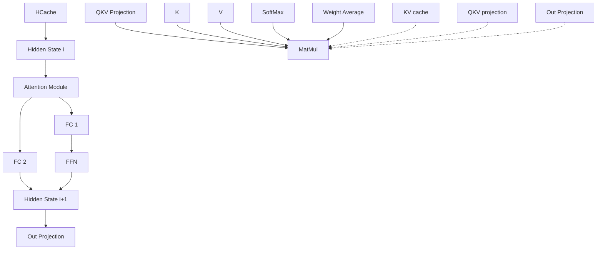
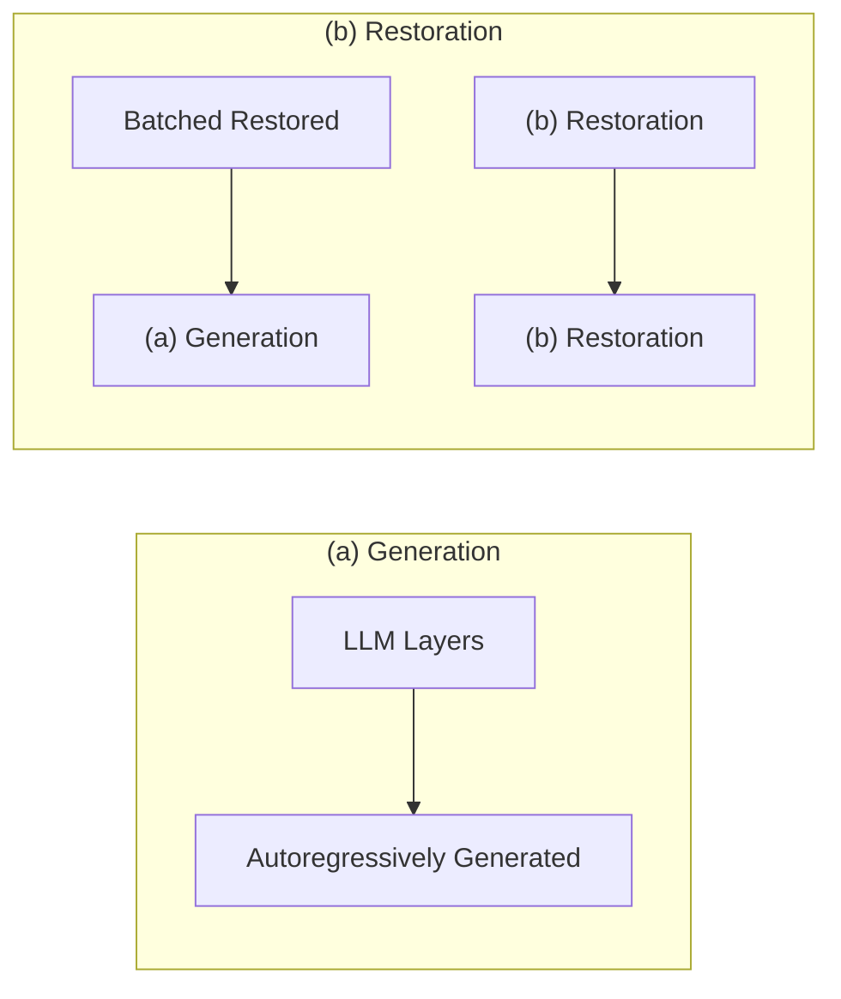
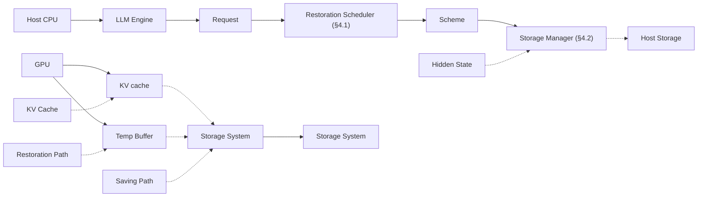

# Fast State Restoration in LLM Serving with HCache

Shiwei Gao

Tsinghua University

Youmin Chen

Tsinghua University

Jiwu Shu<sup>∗</sup>

Tsinghua University

## Abstract

The growing complexity ofLLM usage today, e.g., multi-round conversation and retrieval-augmented generation (RAG), makes contextual states (i.e., KV cache) reusable across user requests. Given the capacity constraints of GPU memory, only a limited number of contexts can be cached on GPU for reusing. Existing inference systems typically evict part of the KV cache and restore it by recomputing it from the original tokens or ofloading it to host storage for later retrieval, both of which introduce substantial computational or I/O overheads.

We propose HCache, a novel LLM state restoration method. Its key idea is to restore LLM states from intermediate activations and thus utilize computational and I/O resources with low overhead. We enhance HCache with two techniques, including i) a bubble-free restoration scheduler that integrates resource-complementary methods to optimize the balance between computation and IO tasks; and ii) a chunk-based storage manager to address the layout mismatch issue (i.e., layer-before-token saving versus token-before-layer restoration). Our evaluations, conducted using real-world tasks, show that HCache reduces the TTFT by up to 1.93× compared to KV ofload while consuming 1.92-2.40× less storage space; compared to token recomputation, HCache achieves up to 5.73× reduction in TTFT.

CCS Concepts: • Information systems → Storage management.

Keywords: LLM, machine learning system, state management

## ACM Reference Format:

Shiwei Gao, Youmin Chen, and Jiwu Shu. 2025. Fast State Restoration in LLM Serving with HCache. In Twentieth European Conference on Computer Systems (EuroSys ’25), March 30–April 3, 2025, Rotterdam, Netherlands. ACM, New York, NY, USA, 16 pages. https://doi.org/ 10.1145/3689031.3696072

## 1 Introduction

Large Language Models (LLMs) [25, 40, 47, 49] have demon strated substantial potential across a wide array of applications,

<sup>∗</sup>Jiwu Shu is the corresponding author (shujw@tsinghua.edu.cn).

Permission to make digital or hard copies of all or part of this work for personal or classroom use is granted without fee provided that copies are not made or distributed for profit or commercial advantage and that copies bear this notice and the full citation on the first page. Copyrights for third-party components of this work must be honored. For all other uses, contact the owner/author(s).

EuroSys ’25, March 30–April 3, 2025, Rotterdam, Netherlands

© 2025 Copyright held by the owner/author(s).

ACM ISBN 979-8-4007-1196-1/25/03

https://doi.org/10.1145/3689031.3696072


<details>
<summary>bar</summary>

| System | Method | State Restoration Time |
| --- | --- | --- |
| Recomputation | vLLM, DeepSpeed | ~100% |
| KV Offload | AttentionStore, APIServe, Pensieve; | 1/6 |
| HCache | — | 1/2 |
</details>

Figure 1. State Restoration Method Comparison. Recomputation: compute KV cachefrom history tokens when reused; KV cache ofload: save KV cache at host storage andfetch them to GPU memory when reused; HCache saves 6× computational and 2× IO resources. such as content generation [11, 66], code comprehension [13, 35], and the development of intelligent agents [51, 53]. LLMs commonly serve user queries in two phases, including a prefill phase to process a user’s prompt and a generation phase that sequentially generates new tokens autoregressively. During both phases, intermediate states (a.k.a., KV cache) are generated and cached for each token to avoid their recomputation.

Many existing LLM serving systems are stateless among user requests; the KV cache is discarded once the request is finished. Some recent techniques aim at optimizing individual requests, such as request batching [61], GPU memory management [28], and request scheduling [3, 22, 52], among others. However, the increasing complexity of LLM usage today makes user requests depend on historical contexts. For example, in multi-round conversational chatbots, the historical dialogue, including a user’s prompts and the LLM’s outputs, is accumulated as contextual states to enhance the LLM’s understanding of the conversation background. In typical LLM chatbots such as Claude [6], the length of history dialogues can reach 200K [38]. There are also long-context applications, such as Retrieval-Augmented Generation (RAG). RAG applications search domain-specific knowledge related to user requests and use it to help LLMs generate more accurate answers and alleviate the hallucination problem [24, 48]. We call these applications as stateful LLMs.

Yet, stateful LLMs raise new challenges for managing the states of their historical contexts. When serving new user requests, simply prefilling the prompt with historical contexts (i.e., token recomputation) will significantly increase computing overhead, potentially causing response time to multiply by tens of times. Recent work proposes directly reusing the KV cache among user requests [20, 60, 67]. Nevertheless, our analysis of two popular LLM traces, i.e., ShareGPT4 [1] and L-Eval [5], shows that a single A100-40GB GPU can keep up to 7-20 multi-round conversations or 1-3 long contexts. As a result, large-volume KV caches of historical contexts must be ofloaded to host storage (i.e., KV ofload [2, 19, 62]), which again introduces high latencies when loading KV caches from host storage to GPU memory.

We observe that both token recomputation and KV ofload adhere to the standard LLM inference process, maintaining the LLM forward pass or KV cache as is to manage and restore historical contextual states. Consequently, these approaches occupy the extreme ends of the design spectrum, solely uti lizing GPU computational or I/O capabilities, thus leaving system resources underutilized. In this paper, we introduce HCache, a novel LLM state restoration method to break this conventional wisdom by using GPU computational and IO resources simultaneously in a low overhead manner compared with existing methods (see Figure 1).

At the core of HCache is to exploit LLM’s intrinsic structure characteristic – regaining the KV cache by computing it from rather smaller intermediate activations – for fast state restoration. Fortunately, the hidden states between adjacent LLM layers have such good properties and can be used as an alternative to the KV cache. Specifically, the hidden states are half the size of the KV cache, thus reducing the IO transmission time by 2× compared to KV ofload. Furthermore, recomputing KV cache from hidden states instead of original tokens eliminates two computationally intensive modules in LLM, including the quadratic complexity attention mechanism and the feed-forward network (FFN); hence, HCache reduces the computation cost by at least 6×.

Restoring the contextual states with HCache involves two parts – transmitting the hidden states to GPU memory and recomputing it into KV cache via common GEMM operations. By applying pipeline techniques, the above two steps can be performed concurrently to utilize both the IO and computational resources, further reducing state restoration time. As a whole, HCache significantly reduces the computation and IO overhead and is faster than existing approaches on mainstream platforms. However, fully leveraging the capabilities of HCache presents two technical challenges and we design techniques tailored to each issue.

First, state restoration with HCache involves both recom putation and IO transmission, whose completion times are not always the same under varying hardware setups, producing pipeline bubbles. The actual restoration speed is bounded by the slower one of the two steps. To address this problem, we introduce the bubble-free restoration scheduler, which incorporates a resource-complementary restoration method to eliminate pipeline bubbles. Second, hidden states are generated and saved autoregressively in a layer-before-token order, but are fetched as a whole batch in a token-before-layer order in restoration. This incurs mismatched storage visiting orders in saving and restoration, presenting a hard design trade-of in the storage format to manage hidden states efectively. A storage format optimized for one stage inevitably results in small and random IOs for the other stage. In HCache, we introduce a chunk-based storage format tailored for fast state restoration since reducing state restoration time is our primary design goal. To mitigate the performance impact on the generation phase, we use a two-stage saving strategy to store newly generated hidden states.


<details>
<summary>flowchart</summary>


</details>

Figure 2. Transformer Architecture.

We implement HCache by integrating it into an LLM serving system and evaluating it with varying models and real-world LLM traces. Evaluation results show that HCache reduces the TTFT (Time To First Token) by up to 1.93× against KV ofload, adding less than 4% overhead on TBT (Time Between Token). Compared to token recomputation, HCache reduces TTFT by up to 5.73×. We also evaluated HCache on platforms with various computing and transmission speeds. With diferent hardware configurations, HCache improves the restoration speed by 1.33-2.66× against KV ofload.

In summary, we make the following contributions:

• We propose HCache, a novel method to restore historical LLM states utilizing intermediate activations.  
• We introduce the bubble-free restoration scheduler and chunk-based storage management to enhance HCache.  
• We evaluate HCache on various hardware setups and show that it outperforms the state-of-the-art solutions such as AttentionStore [19] and DeepSpeed-MII [15].

## 2 Background and Motivation

## 2.1 Transformer Architecture

In this section, we first provide the background on the transformer architecture (§2.1) and LLM serving systems (§2.2). Then, we show the examples, characteristics, and overhead of stateful LLM applications in §2.3 and §2.4.

Most LLMs today adopt the transformer architecture as their building block. As shown in Figure 2, LLM has N repetitive transformer layers, each comprising two major components: the attention module and the FFN (feed-forward network).

An LLM forward pass is conducted with a batch of tokens. At the start of each layer, each token has a highdimension representation, we call it the hidden states. The first layer’s hidden states come from the embedding table. The hidden states in other layers are the output of the previous transformer layer. The attention module projects each token’s hidden states to three diferent tensors: K, Q, and V. The model then uses the muti-head-attention (MHA) [50] to inter act information between tokens. Every token first computes its attention score by getting the softmaxed inner product of their 𝑄 with the 𝐾 of other tokens. Next, the token computes the weighted average of 𝑉 of other tokens using their corresponding attention score. The weighted average is then multiplied by the out projection to get the final attention result. The attention module in one layer can be summarized by the following equations:

$$
Q _ {L} ^ {i}, K _ {L} ^ {i}, V _ {L} ^ {i} = W _ {L} ^ {q, k, v} * H _ {L} ^ {i}
$$

$$
A t t e n t i o n _ {L} ^ {i} (q, k, v) = \sum_ {m = 1} ^ {i - 1} \frac {e ^ {Q _ {L} ^ {i} * K _ {m}}}{\sum_ {n = 1} ^ {i - 1} e ^ {Q _ {L} ^ {i} * K _ {n}}} * V _ {i}
$$

$$
O u t _ {L} ^ {i} = W _ {L} ^ {o} * A t t e n t i o n _ {L} ^ {i} (q, k, v)
$$

FFN module consists of two linear projections with an activation function in between. The output of the FFN module (i.e., hidden states) is the input of the next transformer layer.

$$
H _ {L + 1} ^ {i} = F C 2 \left(F C 1 \left(O u t _ {L} ^ {i}\right)\right)
$$

The above equations ignore less compute-intensive mod ules, including residual connection, layer norm, input embedding, and position embeddings. The internal architectures vary between diferent LLMs. We only discuss the common transformer structure in LLMs without loss of generality.

KV cache is an important design to speed up existing LLM inference engines. In the attention module, the attention computation of a token depends on all previous KV values in the sequence. To avoid redundant KV recomputation, once a token’s key and value are generated, they are stored in a dedicated storage area on GPU, i.e., the KV cache. The generation for the latter tokens of the sequence can visit KV cache instead of recomputing KV values of history tokens.

## 2.2 LLM Serving

Once trained, LLMs can be deployed as a service to respond to user requests. LLM inference systems process a user request in two phases – prompt prefilling and response generation. During the prompt prefilling phase, LLM performs a transformer forward pass with input prompt tokens, generating the KV cache for them. In the response generation phase, LLM generates new tokens autoregressively and puts the key-value tensors of the newly generated token into the KV cache. One sequence’s generation process continues until reaching an end-of-sequence (EOS) token or a maximum token budget.

Inference systems typically process user requests in batch to improve LLM serving eficiency. Instead of a stop-wait batch ing mechanism, which may incur high latency for early-arrived requests, most current LLMs use continuous batching [61]. Specifically, the inference engine batches multiple requests in the generation phase at a fine-grained iteration level, where new requests can be added (exited) to (from) a batch dynami cally at each iteration. TTFT (Time To First Token) and TBT (Time Between Token) are important metrics describing the


<details>
<summary>line</summary>

| # of Tokens | Prompt Length (K) | Output Length (K) |
| --- | --- | --- |
| 0 | ~16 | ~1 |
| 400 | ~0 | ~1 |
| 800 | ~0 | ~0 |
| 1200 | ~0 | ~0 |
</details>

(a)


<details>
<summary>line</summary>

| # of Tokens | CDF |
| --- | --- |
| 0 | 0 |
| ~2500 | ~0.4 |
| ~5000 | ~0.65 |
| ~10000 | ~0.9 |
| ~15000 | ~0.98 |
</details>

(b)  
Figure 3. Charactreistic of Multi-Round Conversation.

LLM serving quality. TTFT is the time it takes to generate the first token; TBT represents the average time to generate a token for each request except for the first token.

## 2.3 Stateful LLM Applications

The basic usage of LLM assumes that LLM inference is stateless – user requests are independent and irrelevant to previous ones, and the KV cache is discarded when the generation is finished. However, the increasing complexity of LLM usage today provides user requests with rich contextual contents, such as chat history and auxiliary documents, to help LLMs provide context-dependent, accurate, and informative responses. Hence, a request may rely on the context previously assimilated by the engine, making LLM inference a stateful task. Below, we characterize diferent stateful LLM tasks.

Multi-round conversations. Taking ChatGPT [40] as an example, a user starts a conversation by creating a “New Chat” session. In this session, the user keys in an instruction and waits for the response from ChatGPT; based on the response, the user can further send new questions to start a next-round conversation. To produce better answers in a multi-round conversation, the LLM generates a new response by considering both the tokens from all previous conversation rounds and the tokens from the current input.

A representative dataset of multi-round conversation is ShareGPT4 [1], a trace of human conversations with GPT-4. Figure 3a shows the average length of new prompt tokens and output tokens in one round. The average input length of each round is 66.8 tokens, and the output is 358.8 tokens. Though one round’s input and output length is relatively short, they gradually accumulate in the conversation’s history as the dialogue progresses. Figure 3b depicts the CDF of the length of history tokens (truncated at 16K), and we can see that the length of half of the conversations is over 2.5K.

Long-context applications. Many LLM applications (e.g., LangChain [12]) also supplement user prompts with additional contexts to help LLM react better.

• In contextual question and answer (Q&A) applications, LLMs receive a long context text, such as an academic paper, law document, or textbook, and answer related user questions. For example, a user can upload a PDF of a language programming guide; after processing it, the LLM can answer the demo usage of diferent APIs.

<table><tr><td>Tasktype</td><td>Context</td><td>Input</td><td>Output</td></tr><tr><td>Paper Assistant</td><td>10603.5</td><td>142.7</td><td>404.8</td></tr><tr><td>GSM-100 [14]</td><td>5451.7</td><td>77.4</td><td>4.3</td></tr><tr><td>QuALITY [41]</td><td>7053.9</td><td>92.4</td><td>19.2</td></tr><tr><td>AVG. (20 sub-tasks)</td><td>16340.2</td><td>44.7</td><td>50.2</td></tr></table>

Table 1. Statistics of the L-Eval [5] Dataset.

• Retrieval-Augmented Generation (RAG) application is also a popular workflow of LLMs [10, 29, 31]. In response to user requests, RAG applications first search question-related content in their inner databases or on the Internet. Then, the retried documents and the user question are supplemented to the LLM. LLM uses the retrieved auxiliary knowledge to generate more accurate results for user questions.

L-Eval [5] is an open-sourced dataset tailored for longcontext LLM evaluation. It contains 20 sub-tasks, including long context Q&A, few-shot examples helped reasoning, and deducing the output of a piece of code. In Table 1, we present the statistics of three representative sub-tasks in L-Eval. These traces exhibit bimodal characteristics – the average length of context contents can extend up to 16K. In contrast, the lengths of instructions and outputs typically remain below 100.

## 2.4 State Restoration and Its Overhead

In stateful LLM inference, the KV cache of shared tokens can be reused across diferent requests. Recent studies [8, 20, 60] have explored caching and reusing the KV cache between diferent requests on GPU to reduce the TTFT of user requests. However, the limited memory capacity of GPUs poses a significant challenge in retaining all necessary KV cache. For instance, PagedAttention [28], a state-of-the-art KV cache management technique, enables an A100-40G GPU to store up to 17K tokens with Llama2-13B and 48K tokens with Llama2-7B, which equates to only 1–3 extended contexts or 7–20 conversation sessions.

Due to the GPU memory limitation [57], current inference systems often evict less frequently accessed KV cache to free up space for more immediate contexts [28, 67]. When evicted KV cache is needed again, it must be restored. We refer to this process as state restoration in stateful LLM serving. Prior work has demonstrated that state restoration is a prevalent issue in inference systems. In multi-turn conversations, the interval between interactions often leads to a low GPU cache hit ratio [19], and in long context applications, the same context may be reused hours apart [32].

Two primary approaches exist for restoring LLM state. The first method is recomputation, which involves re-executing the prefill phase to regenerate the KV cache from the original tokens [7, 15, 28, 39]. The second method is ofloading the KV cache to host memory or storage devices [2, 19, 26, 32], with it being transmitted back to GPU memory when needed for subsequent requests.

  
Figure 4. Comparison of State Restoration Overhead. We use the L-Eval trace; Opt-30B runs on 4× A100-40G GPUs with tensor parallelism, while the rest two run on one A100; 4× PM9A3 SSDs are used as the storage backend to save ofloaded KV caches.

Both state restoration methods result in substantial performance degradation compared to the ideal case where no restoration is needed. Our evaluation in Figure 4 shows that the TTFT for recomputation is 20.0-26.0× slower than the ideal case, while KV ofloading is 6.5-13.0× slower.

A key point of the ineficiency of current state restoration methods relates to how they utilize the hardware resources. At one extreme, recomputation solely relies on GPU’s computation capability to restore the KV cache from tokens, whose computational complexity increases quadratically [42] with the sequence’s length. As the contrasting approach, KV ofload solely relies on host storage and PCIe bus to load large-volume KV cache, whose size is 10<sup>5</sup> larger than that of history tokens in typical LLM models [32]. As a result, both approaches incur non-negligible overhead for KV cache restoration.

## 3 HCache: Caching the Hidden States

To accelerate the state restoration speed, we aim to seek a new approach that simultaneously utilizes the computation capability and transmission bandwidth, while reducing unnecessary data transfers and recomputations. Our initial attempt is a simple combination of recomputation and KV ofload. Specifically, the contextual tokens are divided into two parts, and we use recomputation and KV ofload to restore them concurrently; hence, the computation and transmission resources can be utilized in parallel. However, this naive hybrid approach still keeps the LLM forward pass or KV cache as is, which does not fundamentally reduce the computation and IO overhead, resulting in suboptimal performance (see §6.3.1).

To this end, we introduce HCache, a novel state restoration method that eficiently utilizes both computational and I/O resources with reduced computing and transferring overhead.

## 3.1 HCache Overview

Instead ofdirectly restoring the KV cache, the core idea behind HCache is to utilize the LLM’s intermediate activations (i.e., hidden states) at each transformer layer for state restoration.

Recall from Figure 2 that the hidden states represent the input to each transformer layer. Within each transformer layer, the KV tensor pairs of each token are derived directly from the hidden states by performing the projection operation in the attention module. Specifically, we can use the following equations to restore the KV cache for token 𝑖:

  
Figure 5. Example of Pipelined Restoration with HCache.

$$
K _ {L} ^ {i} = W _ {L} ^ {k} \cdot H _ {L} ^ {i}
$$

$$
V _ {L} ^ {i} = W _ {L} ^ {v} \cdot H _ {L} ^ {i}
$$

where $H _ { L } ^ { i }$ is the hidden state for a token 𝑖 at layer $L , K _ { L } ^ { i }$ and $V _ { L } ^ { i }$ represents the key and value tensors for token 𝑖 at that layer, and $W _ { L } ^ { k }$ and $W _ { L } ^ { v }$ are the linear projection parameters.

An LLM serving system working with HCache makes the following changes to reuse contextual contents. First, hidden states should be saved for future reuse. Specifically, in multi-round conversations, whenever a layer’s hidden states is generated in a LLM forward pass, it is dumped to the host storage concurrently with this layer’s computation; in RAG applications, hidden states can be generated and saved ofline. Upon new user requests arrive, the related HCache is retrieved from the host storage into the GPU memory, then, we can use the GEMM operator to restore the KV cache from hidden states with the above equation.

Importantly, transmission and computation can be pipelined to utilize both the computation capability and transmission bandwidth at the same time. As shown in Figure 5, the transmission of $L _ { n + 1 }$ and recomputation from the hidden states to KV cache of $L _ { n }$ can be done concurrently.

Next, We theoretically analyze how caching hidden states can reduce both computational and data transfer volumes.

## 3.2 Restoration Cost Analysis

We compare HCache with the two aforementioned methods: KV ofload and recomputation. We analyze the restoration for one transformer layer that uses muti-head-attention (MHA).

Restoration time with HCache. Restoration from hidden states involves two parts: hidden states transmission and recomputation from the hidden states to KV cache. The time for transmitting hidden states is:

$$
I O _ {h i d d e n} = \frac {N _ {s e q} * D _ {h i d d e n}}{B W},
$$

where $N _ { s e q }$ indicates the number of tokens in the sequence, $D _ { d i d d e n }$ is the LLM hidden dimension, and 𝐵𝑊 is the band width between hidden states’ GPU and storage backend. The computation time1 from hidden states to KV cache is:

$$
C _ {h i d d e n} = \frac {4 * N _ {s e q} * D _ {h i d d e n} * D _ {h i d d e n}}{F L O P S},
$$

where 𝐹𝐿𝑂𝑃𝑆 is the FLOPS ofthe GPU. With the computation transmission pipeline implemented in Figure 5, the end-to-end restore time is dominated by the maximum of $T _ { h i d d e n }$ and

$C _ { h i d d e n }$ . Hence, the state restoration time of HCache is:

$$
T _ {h i d d e n} = \max (I O _ {h i d d e n}, C _ {h i d d e n}).
$$

Restoration time with KV ofload. The restoration process of KV ofload only involves transferring the KV cache from the host to GPU memory, whose time is:

$$
T _ {k v} = I O _ {K V} = \frac {2 * N _ {s e q} * D _ {h i d d e n}}{B W}.
$$

Restoration time with recomputation. The restoration process of recomputation involves a full computation from history tokens to their KV caches. We ignore the time required to transfer tokens to GPU since their size is small.

$$
\begin{array}{l} C _ {a t t n} = \frac {8 * N _ {s e q} * D _ {h i d d e n} ^ {2} + N _ {s e q} ^ {2} * D _ {h i d d e n}}{F L O P S} \\ C _ {f f n} = \frac {1 6 * N _ {s e q} * D _ {h i d d e n} ^ {2}}{F L O P S} \\ T _ {r e c} = C _ {a t t n} + C _ {f f n} + \epsilon \\ = \frac {2 4 * N _ {s e q} * D _ {h i d d e n} ^ {2} + N _ {s e q} ^ {2} * D _ {h i d d e n}}{F L O P S} + \epsilon \\ \end{array}
$$

Here 𝜖 indicates the remaining computation overhead, including normalization and residual connection, which are bounded by $O ( N _ { s e q } * D _ { h i d d e n } )$ and can be negligible.

Comparison. For the I/O transmission part, the hidden state tensors have the same shape as keys and values in the KV cache. Hence, the I/O time of transmitting hidden states is half that of directly transmitting the KV cache. For the computation part. The relative speedup of HCache compared with recomputation is:

$$
\frac {2 4 * N _ {s e q} * D _ {h i d d e n} ^ {2} + N _ {s e q} ^ {2} * D _ {h i d d e n}}{4 * N _ {s e q} * D _ {h i d d e n} ^ {2}} = 6 + \frac {N _ {s e q}}{4 * D _ {h i d d e n}}.
$$

Hence, the lower bound for the speed up is 6×. The computational speedup is attributed to two factors. First, the FFN and attention modules are highly compute-intensive, reflected by the constant 24 in the above equation. In contrast, the projection of hidden states to the KV cache is relatively lightweight, corresponding to a constant of 4. This ensures a minimum 6× speed-up. Second, the quadratic complexity attention computation is the dominant component for long sequences but is unnecessary in restoring the hidden state. So HCache scales linearly with history length.

Conclusion. As a whole, the transmission size of HCache is always 2× less than that of transmitting the KV cache, while the recomputation of KV cache from hidden states is at least 6× faster than token recomputation. This theoretical support makes HCache beneficial on mainstream platforms (see §6.2). Nevertheless, when employing HCache to existing LLM serving systems, we still face two main challenges:

C1: Pipeline bubbles. As shown in Figure 5, the computation and transmission of HCache restoration do not always take the same time. Hence, the actual restoration speed is bounded by the slower one, which creates pipeline bubbles and wastes system resources. In extreme hardware configurations, where the IO speed far exceeds computation speeds, or vice versa, HCache may not ofer any benefits.


<details>
<summary>flowchart</summary>


</details>

Figure 6. State Generation and Restoration Order. The high lighted red block: the hidden states ofthe 2<sup>𝑛𝑑</sup> token at the 2<sup>𝑛𝑑</sup> layer.

C2: Storage format. Unlike KV cache that owns dedicated GPU memory space, hidden states are intermediate activations in temporary bufers repeatedly reused among transformer layers. Therefore, these hidden states should be dumped to host storage immediately once they are generated. However, hidden states’ generation and restoration order are inconsistent, making it hard to design an eficient storage format to manage hidden states. As shown in Figure 6a, the HCache is generated autoregressively, exhibiting a layer-before-token order. In state restoration, instead, the hidden states of multiple tokens are restored as a batch at each layer (i.e., token-before-layer, Figure 6b). As a result, a storage format optimized for state saving (i.e., placing a token’s hidden states at diferent layers in a continuous place) incurs random, small-sized IOs at restoration, or vice versa.

## 4 HCache Design

To address the above challenges, we further enhance HCache with bubble-free restoration and eficient storage management. Figure 7 depicts the overall architecture of HCache and how it interacts with an LLM inference engine. When a user request arrives, the inference engine first decides whether the request’s history states should be restored. If so, the inference engine utilizes the bubble-free restoration scheduler (§4.1) to generate an optimal restoration scheme to restore its KV cache (to solve C1). With the restored KV cache, the user request is further processed with prompt prefilling and token generation to generate an answer. During the prefilling and token generation phase, the storage manager (§4.2) eficiently saves the newly computed hidden states to host storage (to solve C2). Since HCache focuses on state restoration speed, we do not cache and reuse KV cache in GPU.

By default, our storage manager utilizes SSDs as the back end storage devices. SSDs are cost-efective, ofer substantial capacity, and deliver high I/O bandwidth, making them ideal for storing large volumes of hidden states. In environments lacking SSDs, host DRAM can be used as an alternative.


<details>
<summary>flowchart</summary>


</details>

Figure 7. HCache Overview.

Previous research has suggested using a hierarchical storage backend that combines host DRAM and SSDs [19]. They also integrate prefetching and caching strategies, allowing frequently accessed contextual states to reside in the host DRAM. Contextual state caching is orthogonal to our work and can be incorporated to enhance performance further.

## 4.1 Bubble-Free Restoration Scheduler

The bubble-free restoration scheduler combines diferent restoration methods dynamically to eliminate pipeline bubbles. Specifically, the scheduler partitions a model’s state across layers, with most states be managed via hidden states, while using a resource-complementary method (token recomputation or KV ofload) for other states to fill in the bubble. For example, bubbles exist in transmission when the computation speed is slow, so we ofload part of the model’s state as KV cache to prevent the need for computation. HCache determines an optimal partition scheme via ofline profiling of the hardware characteristics. We further illustrate how a model’s state should be partitioned (§4.1.1) and the detailed partition algorithm (§4.1.2).

4.1.1 State Partition Method. When employing diferent restoration methods to eliminate pipeline bubbles, model states are partitioned like prior work [17, 36], with each using a diferent restoration method. There are two approaches to partitioning the model state: token-wise partition and layerwise partition.

Figure 8a shows a LLM model with 6 layers and a history context containing 3 tokens. With a token-wise partition scheme, these states are vertically split into two parts, where the first two tokens are managed via HCache and the rest one is managed using a complementary method (e.g., KV ofload). State restoration with token-wise partition is shown in Figure 8c. At layer 𝑖, KV recomputation from hidden states of the first two tokens is done concurrently with the transmission of layer 𝑖+1 (hidden states of the first two tokens and KV cache of the 3rd token). In layer-wise partition, model states are horizontally partitioned. As shown in Figure 8b, the first 4 layers of an LLM are managed with HCache while the KV cache of the last two layers is ofloaded to the host. State restoration with token-wise partition is shown in Figure 8d, where the transmission of hidden states can occur continuously without requiring synchronization at each layer, provided it is faster than recomputation. Once complete, the KV cache of the last two layers is fetched into GPU memory.


<details>
<summary>flowchart</summary>

```mermaid
graph TD
  subgraph Layer_6 [Layer-6]
  L6T_a_c --> L6T_c
  end

  subgraph Layer_2 [Layer_2]
  L4T_a_c --> L4T_c
  end

  subgraph Layer_1 [Layer_1]
  L4T_a_c --> L1T_c
  end

  subgraph Partitioning [Token-wise Partition]
  L6T_a_c --> L6T_c
  L4T_a_c --> L4T_c
  L4T_a_c --> L1T_c
  end

  subgraph Restore [Token-wise Restore]
  L1T_a_b --> L2T_a_b
  L1T_a_b --> L3T_a_b
  L1T_a_b --> L4T_a_b
  L1T_a_b --> L5T_a_b
  L1T_a_b --> L6T_a_b
  L2T_a_b --> L3T_a_b
  L2T_a_b --> L4T_a_b
  L2T_a_b --> L1T_c
  L2T_a_b --> L6T_a_b
  L3T_a_b --> L4T_a_b
  L3T_a_b --> L1T_c
  L3T_a_b --> L5T_a_b
  L4T_a_c --> L5T_a_c
  L4T_a_c --> L6T_a_c
  end

  subgraph Recompute [Recompute] [Recompute]
  HCache_IO["HCache IO"] --> KV_cache_IO["KV cache IO"]
  KV_cache_IO --> HCache_Recompute["HCache Recompute"]
  end
```
</details>

Figure 8. Two Ways to Combine HCache with KV cache. $\mathrm { L } _ { \mathrm { i } }$ and Tj indicate layer i and token j, respectively.

Performance considerations. In practice, token-wise partition does not always fully eliminate the bubbles in state restoration. We observe that the execution time of GEMM operations does not vary proportionally with the number of tokens involved. The GEMM kernel in the cuBLAS library is well-optimized for standard matrix sizes. However, the token-wise partition can generate a scheme that forms an irregular matrix and is less optimized by cuBLAS. As a result, executing a GEMM kernel with fewer tokens may consume a similar amount of time as one with more tokens. Even if we round the partition scheme to the nearest optimized size, bubbles still exist in the computation and transmission, resulting in suboptimal performance.

Such a performance issue does not exist in layer-wise partition since all tokens at a layer are recomputed together. Furthermore, current LLM engines typically set a fixed minibatch length to limit the intermediate bufer size and sequences larger than a mini-batch will be split and processed sequentially. Hence, We use the layer-wise partition and set the mini-batch length to be an optimized size in cuBLAS.

4.1.2 State Partition Algorithm. We introduce the state partition algorithm to generate a bubble-free restoration scheme according to the hardware setups. We introduce two variables $- L _ { H }$ and $L _ { O } - \mathrm { t o }$ indicate the number of model layers managed with HCache and other methods, respectively.

Specifically, on a platform with faster computation speed, HCache is combined with token recomputation, where the first $L _ { O }$ layers are restored with token recomputation, and the remaining 𝐿 layers with HCache. When recompute of the first $L _ { O }$ layers. The hidden states of the latter layers are prefetched. When token recomputation finishes, HCache restoration is started to continue the computation. On a platform with faster I/O transmission speed, HCache is combined with KV offload. For the first $L _ { H }$ layers, we copy their hidden states and recompute them to restore the KV cache. Since the I/O transmission of hidden states is faster, it will finish earlier than the computation, so we copy the KV cache of the rest $L _ { O }$ layers in the remaining time.

Our state partition algorithm sets $L _ { H }$ and $L _ { O }$ such that data transmission and computation finish almost simultaneously, thus eliminating bubbles. To solve $L _ { H }$ and $L _ { O }$ , we profile the transmission and computation speed of a specific hardware platform ofline, where the transmission time of hidden states is $I O _ { H }$ , transmission time of KV cache is $I O _ { K V }$ , computation time from token is $C _ { T o k e n } .$ , from hidden states to KV cache is $C _ { H }$ . We formulate the bubble-free target as a min-max optimization problem. Below is an example of combining HCache with KV cache:

$$
\operatorname{argmin} \max \left(C _ {H} * L _ {H}, I O _ {H} * L _ {H} + I O _ {K V} * L _ {O}\right)
$$

$$
L _ {H}, L _ {O}
$$

$$
\text {subject to} L _ {H} + L _ {O} = N _ {\text {Layer}}
$$

Given a hardware configuration, $L _ { H }$ and $L _ { O }$ are derived via:

$$
L _ {H} = \lceil \frac {N _ {L a y e r} * I O _ {K V}}{I O _ {K V} + C _ {H} - I O _ {H}} \rceil , i f C _ {H} > I O _ {H}
$$

$$
L _ {H} = \lceil \frac {N _ {\text {Layer}} * C _ {\text {Token}}}{C _ {\text {Token}} + I O _ {H} - C _ {H}} \rceil , \text {if} C _ {H} \leq I O _ {H}
$$

$$
L _ {O} = N _ {\text {layer}} - L _ {H}
$$

## 4.2 HCache Storage Manager

The storage manager is tasked with managing contextual states in host storage. We have adopted a storage format optimized for state restoration, as reducing TTFT is our primary design goal. Additionally, we introduce a two-stage state-saving mechanism to mitigate the overhead associated with saving newly generated states. Note that with our state partition algorithm in §4.1.2, the contextual states at each model layer are stored either in hidden states, KV cache, or original tokens. Here, we focus on the management of hidden states since the KV cache can be managed similarly.

4.2.1 Storage Format. We introduce a storage format designed for fast restoration. Since we adopt a layer-wise approach to restore the states for the history context, the hidden states of all tokens from the same layer are copied together. Conceptually, the hidden states of tokens in the same layer is colocated in a continuous large data block to maximize transferring bandwidth. In practice, we split the tokens of one layer into multiple fix-sized (64 tokens) chunks. The chunks of a layer are distributed on multiple SSDs following the round-robin manner. The chunk-based storage format is designed for the following reasons: First, when multiple SSDs are present in the system, we should distribute the data of a layer across all SSDs instead of a large continuous block on a single SSD. This can facilitate parallel I/O operations and en hance the transmission speed of one layer through bandwidth aggregation. Second, LLM generates tokens autoregressively, whose output length is unpredictable [28, 61]. This forbids us from reserving the storage space for a layer’s hidden states as an entire bufer – reserving space according to its maximum length would result in serious internal fragmentation.

4.2.2 Two-Stage State Saving. Next, we explore how the storage manager saves newly generated hidden states using a chunk-based storage format. As we mentioned before, hidden states are intermediate activations generated at each layer, if they are not saved in a timely manner, computation tasks will be blocked. In the token generation phase with continuous batching enabled, a batch generates hidden states of diferent sequences, which should be organized into separate chunks before being saved. Directly transferring these hidden states to diferent chunks at host storage can lead to numerous small write operations, potentially compromising the eficiency of the generation task.

We adopt a two-stage strategy to address this problem. First, the hidden states of the batch, encompassing tokens from various sequences, are collectively copied to the host memory using a single cudaMemcpy call. This method efectively snapshots the hidden states to the host, allowing the GPU memory bufer to be properly reused for subsequent layers. Second, a host daemon running on the CPU orchestrates chunk management. It copies HCache to appropriate chunk bufers and flushes them to storage devices.

In this way, the overhead of saving hidden states to host storage is moved of the critical path of LLM processing; meanwhile, small-sized writes are reorganized into large chunks, which host storage (e.g., SSDs) favors.

## 5 Implementation

We implement HCache with 5731 lines of code in Cuda, C++, and Python. Our implementation is based on DeepSpeed MII v0.2.0 [15], a state-of-the-art LLM serving system that supports the SplitFuse [3] scheduling algorithm. We add support restoring from hidden states to KV cache in DeepSpeed-MII. Specifically, we use the cuBLAS library to project the hidden states to primeval KV values. Following prior work [19], we write a custom kernel to apply the ROPE posi tion embedding [46] to the recomputed KV values and copy the result to the KV cache.

Request scheduling. The scheduler of HCache derives from the continuous batching [22] method. There are two main phases in continuous batching, namely prefilling and decoding. HCache adds an extra restoration phase. The request arrived in the system with evited history KV cache will first execute this phase with bubble-free restoration. When the restoration phase is finished, The prefill phase is then conducted using the request’s newly arrived prompt. Finally, the request is added to the decoding batch. We also apply the SplitFuse [3] scheduling algorithm to opportunistically fuse prefill with decoding generation to mitigate the interference between prefilling and decoding.

Pipelined state transmission. On the GPU side, we use dedicated streams for state transmission – one for the upstream state transmission and the other for the downstream state snapshot. We use cudaEvent to coordinate the ordering of operations among diferent streams. For example, the snapshot of one layer’s hidden states is followed by an event, which is waited by the first compute operator of the next layer so as to keep the bufer a consistent version when accessed.

Storage management. To save hidden states, we use 8 background threads on the host side to collect dumped hidden states and append them to corresponding data chunks. Once a chunk is fully populated, it is promptly written to the NVMe device. To restore hidden states, similar to FlashNeuron [9], we co-use SPDK [59] and GDRCopy [37] to realize GPUDirect Storage, which transfers data between the GPU and SSD directly. Specifically, we pin several memory bufers on the GPU’s BAR (Base Address Register) space in advance; when the GPU reads data from the SSD, we set the NVMe read command’s destination address as the exposed GPU BAR address, thus achieving a direct P2P copy, which eliminates redundant memory copies with minimized I/O latencies.

Multi-GPU support. We also add support for HCache to serve large models that run on multiple GPUs. With tensor parallelism, each GPU node should have a full version of hidden states to compute the KV cache. To avoid redundant read of the hidden states from diferent GPUs, we let all GPUs read disjoint shards (split by token) of hidden states concurrently. This operation can aggregate the read bandwidth of all GPUs with no read amplification. Then, GPUs run an all gather communication operator to reconstruct the full hidden state from shards. Since the GPU is connected via the fast NVlink interconnect, the all-gather operation will only incur a small overhead compared with the transmission part. With pipeline parallelism. The restoration of each layer’s HCache is independent of each other. So, each GPU node can fetch the hidden states of its responsible layers concurrently and recompute it to attain the KV cache of corresponding layers.

## 6 Evaluation

We evaluate HCache to answer the following questions:

• How does HCache perform in terms of TTFT and TBT compared to state-of-the-art state restoration methods?  
• How does HCache perform on platforms with various GPUs, storage devices, and context length?  
• How do HCache’s individual techniques afect HCache’s performance?

Testbed. Unless otherwise stated, all our experiments are conducted on a server equipped with 4× A100-40G SXM4 connected via NVLink. The host has 2× AMD EPYC 7642

  
Figure 9. Overall Performance Results On ShareGPT4 Trace.

CPUs, 256G DDR4 memory, and 4× Samsung PM9A3 4TB enterprise SSDs. In our sensitivity experiments, we change the hardware configuration by using cloud servers equipped with diferent GPUs. For these cloud servers, we directly use the host DRAM as the storage backend. The hardware characteristics of these GPUs are shown in Table 2.

Models: We use Llama2-7B, Llama2-13B, OPT-30B as our test models. We expand the maximum context length of these models to 16K to accommodate L-Eval benchmarks and long conversation history. For Llama2-7B/13B, we use a single A100 GPU to serve them. For OPT-30B, we run it on 4 A100 GPUs with tensor parallelism unless otherwise stated. We use the ShareGPT4 and L-Eval described in §2.3 as our test traces to imitate the real-world LLM use cases like multi-round conversation chatbot or RAG application.

Metrics. When evaluating the overall performance, we report TTFT (Time to First Token), which is the duration of the restoration and prefill phase, and TBT (Time between Token), which represents the average time taken to generate a token for each request except for the first token. TTFT is highly related to user experiences, and we mainly report TTFT to show HCache’s performance improvements. We report TBT to prove that HCache poses negligible impact on decoding requests. In other case studies, we run restoration requests with a batch size equal to 1, so we report the restoration speed instead, which is defined as the number of restored historical tokens divided by the restoration time.

<table><tr><td>GPU</td><td>HBM Size</td><td>FLOPS*</td><td>Transmission Speed</td></tr><tr><td>A100</td><td>40G</td><td>312T</td><td>32GB/s</td></tr><tr><td>A30</td><td>24G</td><td>165T</td><td>32GB/s</td></tr><tr><td>4090</td><td>24G</td><td>330T</td><td>32GB/s</td></tr><tr><td>L20</td><td>48G</td><td>120T</td><td>32GB/s</td></tr><tr><td>H800</td><td>80G</td><td>990T</td><td>64GB/s</td></tr></table>

Table 2. Hardware Characteristics of Diferent Platforms. Note that <sup>★</sup> indicates the FLOPS ofFP16 operations.

Baselines. We compare HCache to the following baselines. Recomputation: DeepSpeed-MII[15] is an LLM serving system that supports the SplitFuse scheduling algorithm and uses PagedAttention to manage KV cache. We use it as the baseline for token recomputation. KV ofload: AttentionStore [19] ofloads KV cache to multi-tiered secondary storage. We implement it on top of DeepSpeed-MII to serve as the KV ofload baseline. We do not implement the decoupled position embedding because we already expand the context length for models. Ideal: We also implement an ideal system without the restoration overhead. Here, we do not keep all KV caches in GPU memory; instead, we allocate the placeholder KV values in GPU, which are used repeatedly across all user requests. This achieves the theoretical lower bounds for the TTFT and TBT metrics, assuming all the history KV cache is cached on GPU and reused.

## 6.1 Overall Performance

6.1.1 Multi-Round Conversation. We evaluate the overall performance of HCache against baseline methods in the multi-round conversation setting with ShareGPT4. In this experiment, we use 4 SSDs as the storage backend. Following prior work [19, 28], we set the arrival time of diferent sessions with the Poisson distribution. The interval between conversation rounds in one session is set to 30s. All restoration methods do not reuse the KV cache on GPU for a fair comparison. The KV cache are evicted when one round of conversation ends.


<details>
<summary>bar_stacked</summary>

| Workload | Configuration | Recomputation (s) | KV Offload (s) | HCache (s) | Ideal (s) |
| :--- | :--- | :--- | :--- | :--- | :--- |
| Paper Assistant | Llama-7B | ~0.68 | ~0.22 | ~0.14 | ~0.03 |
| Paper Assistant | Llama-13B | ~0.75 | ~0.23 | ~0.14 | ~0.04 |
| Paper Assistant | Opt-30B | ~0.92 | ~0.63 | ~0.34 | ~0.05 |
| GSM-100 | Llama-7B | ~0.42 | ~0.15 | ~0.10 | ~0.03 |
| GSM-100 | Llama-13B | ~1.20 | ~0.33 | ~0.20 | ~0.05 |
| GSM-100 | Opt-30B | ~0.60 | ~0.43 | ~0.23 | ~0.05 |
| QuALITY | Llama-7B | ~0.55 | ~0.18 | ~0.11 | ~0.03 |
| QuALITY | Llama-13B | ~0.88 | ~0.25 | ~0.16 | ~0.04 |
| QuALITY | Opt-30B | ~0.77 | ~0.54 | ~0.28 | ~0.05 |
| Mixed | Llama-7B | ~0.50 | ~0.16 | ~0.10 | ~0.03 |
| Mixed | Llama-13B | ~1.00 | ~0.28 | ~0.16 | ~0.05 |
| Mixed | Opt-30B | ~0.71 | ~0.49 | ~0.26 | ~0.05 |
</details>

Figure 10. Performance of Long-Context Applications.

TTFT and throughput. Figures 9a-c show the TTFT under diferent request rates in the multi-round conversation. Overall, HCache can provide 1.27-1.90× TTFT speedup compared with the KV ofload and 2.21-3.57× better than token recomputation. For 7B/13B models, the one running GPU has 4 SSDs, providing suficient IO bandwidth for state restoration. Hence, the KV ofload method is fast, but our methods can still be 1.27-1.60× faster than it. Instead, OPT-30B runs on 4 GPUs, each with one SSD, so the restoration time of OPT-30B is longer, and HCache can achieve up to 1.90× TTFT speedup compared with KV ofload.

The 13B model has a lower peak throughput compared to 7B/30B models. This is bounded by the limited GPU memory for the KV cache. The throughput of diferent restoration methods is nearly the same in this case. For the 7B/30B model, HCache can sustain up to 11% more requests than KV ofloading since the restoration cost for HCache is lower.

TBT. Figures 9d-f show the TBT of diferent models in the multi-round conversation setting. Compared with the ideal case, in which no restoration is needed, HCache’s TBT is at most 4% higher, almost the same as the ideal case. The low TBT overhead benefits from the high restoration speed of HCache , which reduces GPU time spent on the restoration, so the token generation is stalled long.

6.1.2 Long-Context Applications. We evaluate the overall performance of HCache against baseline methods in the long-context applications setting with the L-Eval trace. Since the GPU HBM can only serve 1-3 long-context requests, we evaluate diferent models with a batch size equal to 1.

<table><tr><td rowspan="2">Model</td><td rowspan="2">Schedule</td><td colspan="2">Per Token Storage Cost</td></tr><tr><td>HCACHE</td><td>KV Offload</td></tr><tr><td>7B</td><td>31 H + 1 KV</td><td>132 KiB</td><td>256 KiB</td></tr><tr><td>13B</td><td>36 H + 4 KV</td><td>210 KiB</td><td>400 KiB</td></tr><tr><td>30B</td><td>40 H + 8 RE</td><td>280 KiB</td><td>672 KiB</td></tr></table>

Table 3. Scheduling Results and Storage Cost. H, KV, and RE indicate hidden states, KV cache, and recomputation, respectively.

Figure 10 shows the TTFT of three representative subtasks and the sampled 200 requests from the trace (i.e., mixed). HCache can achieve 1.62-1.93× speed up for TTFT compared over KV ofload and 2.66-5.73× over token recomputation. It is worth noticing that these tasks’ history length spans within a large range from 4K to 16K, demonstrating HCache’s excellent scalability.

6.1.3 In-Depth Analysis. In Table 3, we report the schedule results of HCache, in terms of how model layers are managed and the per-token storage space consumption. We also report the storage cost ofKV ofload as a comparison. Specifically, the 7B model on one A100 has balanced speed for recomputation from hidden states into KV cache and the transmission of hidden states, so we use hidden states for 31 layers and only transmit the KV cache for one layer to fill in the bubble. For the 13B and 30B model, HCache use hidden states for more than 80% layers, while the rest of the layers are managed via diferent resource-complementary methods. Regarding space consumption, the size of hidden states for one token is half that of KV cache. Combined with the zero-bubble scheduler, some layers may not even need to be stored because they can be recomputed from tokens. As a result, HCache’s per token storage space is 1.92-2.40× lower than KV ofload. To achieve a balanced speed between computation and transmission using only hidden states, approximately 24GB/s, 21GB/s, and 37GB/s of storage bandwidth are needed for the 7B, 13B, and 30B models, respectively.

## 6.2 Sensitivity Analysis

The state restoration speed of an LLM is highly relevant to the model size, IO transmission bandwidth, computation power, and historical context length. We vary them to analyze the sensitivity of HCache against baseline methods.

6.2.1 Varying GPU Devices. The restoration phase of HCache includes the projection of hidden states to KV cache, so its performance is sensitive to the computation power of GPU. We evaluate the restoration speed of HCache and baselines on various GPU platforms. We use host DRAM as the storage backend so that the transmission speed is not the bottleneck. Figures 11a-c shows that HCache outperforms KV ofload by 1.33–1.81× and Recomputation by 5.04–9.05× in restoration speed across diferent platforms. Platforms with low computation capability are unfriendly to HCache, such as running a 7B model on an A30 GPU. In this case, HCache computation is longer than transmission and makes the speed up less than 2×. Even so, HCache still restores 1.33× faster than KV ofload. On platforms with faster computation speeds, HCache shows improved performance, achieving a 1.66× increase on A100 GPU and a 1.77× increase on the H800 GPU for 13B models compared to KV ofload. Compared to token recomputation, HCache achieves 5.04-9.05× speed up on diferent GPUs. This is attributed to the 6× theoretical speedup against token recomputation by skipping the attention and FFN modules.

  
Figure 11. Sensitivity Analysis by Various Factors. (a-c): Varying GPU computation capability and using DRAM as the storage backend. (d-f): Varying number ofSSDs in the default testbed. (g-i): Varying context length with the default testbed.

6.2.2 Varying Storage Bandwidth. LLM state restoration is sensitive to the transmission speed. We evaluate the restoration speed of HCache and baselines with diferent numbers of disks. One PM9A3 SSD provides a read bandwidth of 6.9 GB/s, and using 4 disks can saturate the upstream PCIe bandwidth of the A100 GPU. For the 30B model, we use DRAM to simulate 8-16 disks since our platform does not have enough PCIe slots. The history length is set to 1024.

Figures 11d-f present the sensitivity evaluation results related to transmission speed. In terms of the restoration speed across various disk configurations, HCache significantly out performs KV ofload, delivering a 1.7 to 2.6× improvement and surpasses recomputation with a 2.3-6.1× enhancement. For platforms with fewer disks, IO transmission can be slower than computation tasks; based on our theoretical analysis, HCache can perform at least 2× better, and the bubble-free scheduler can bring extra speed up. For example, on the plat form with one SSD per GPU, the overall improvement of

HCache over KV ofload is 2.09-2.66×. For platforms with more disks, instead, the recomputation operation in HCache can be longer than the transmission in this setting, so the speed up can be less than 2×. However, the recomputation overhead is much lower than token recomputation. The overall speedup is 1.33-1.81× on 7B-30B models compared with KV ofload and 5.46-6.08× compared with recomputation from the token.

6.2.3 Varying Sequence Length. We further investigate the impact of sequence length on HCache’s restoration speed. Following the same configuration as the overall experiment, we test diferent models’ restoration speeds on A100 GPUs with 4 SSDs by varying the history length. As shown in Figures 11g-i, token recomputation can not scale well with the increasing history length; the restoration speed of a 7B model drops by 28% as the history length increases from 1K to 16K. Token recomputation’s quadratic complexity attention mechanism incurs a high overhead in contexts with a long history. The KV cache can scale well with diferent history lengths because its transmission size is proportional to the number of tokens. HCache also scales well with diferent history lengths for two reasons. First, the transmission size of hidden states and recomputation cost from it to KV cache are all proportional to the number of tokens (see §3.2). Second, HCache has the bubble-free restoration scheduler and may opportunistically combine the usage of the token recomputation to fill in the bubble in the short context. With long historical contexts, the scheduler detects that token computation is very expensive and falls back to the HCache-only approach.


<details>
<summary>bar</summary>

| Category | Recomputation | KV Offload | HCache-O | Naive Hybrid | HCache |
| --- | --- | --- | --- | --- | --- |
| IO-Sufficient A30+7B+4SSD | ~7 | ~46 | ~41 | ~52 | ~67 |
| Compute-Sufficient A100+7B+1SSD | ~16 | ~14 | ~27 | ~29 | ~36 |
| Balanced A100+13B+4SSD | ~8 | ~30 | ~48 | ~36 | ~51 |
</details>

Figure 12. Ablation Study on Bubble-Free Scheduler.


<details>
<summary>bar</summary>

| Category | Restoration Speed (K tokens/s) | Restoration Time \((\mu s)\) |
| --- | --- | --- |
| Token-Wise | ~20 | — |
| Token-Wise+Round | ~21 | — |
| Layer-Wise | ~22 | — |
| Token-Wise+Round (Step) | — | ~300 |
| Token-Wise+Round (Step) | — | ~340 |
| Token-Wise+Round (Step) | — | ~375 |
| Token-Wise+Round (Step) | — | ~370 |
| Token-Wise+Round (Step) | — | ~400 |
</details>

Figure 13. Ablation Study on State Partition Methods.

## 6.3 Ablation Study

6.3.1 Bubble-Free Scheduler. We first compare diferent scheduling methods for state restoration. We implement two variants of HCache, including HCache-O and Naive hybrid. HCache-O only uses hidden states for state restoration without the bubble-free scheduler. Naive Hybrid uses the bubble-free restoration scheduler to mix token recomputation and KV ofload without using hidden states. We compare them under three hardware settings: balanced, compute-, and IO-suficient.

The results are shown in Figure 12. Without hidden states, Naive hybrid is the best method that uses both compute and transmission resources. HCache outperforms this approach by 1.28-1.42×. Both methods have no bubbles, so the perfor mance gain of HCache comes from the hidden states as it has theoretically lower computational and IO overhead.

The bubble-free scheduler plays a key role on resourceskewed platforms. HCache-O incurs pipeline bubbles and waste resources. For example, in the IO-suficient setting, the bubble in the HCache-O lets it be 13% slower than KV ofload because the recomputation in HCache is slow and IO resources are wasted. The bubble-free scheduler can integrate HCache-O with resource-complementary methods, thus improving the speed of HCache-O by 1.35-1.64× in skewed hardware configuration and making HCache consistently perform better than KV ofload by 1.45-2.66×.

6.3.2 State Partition Methods. We compare diferent meth ods to partition the state of the model. We measure the restoration speed of the 13B model using history contexts with 1024 tokens. We run the model on one A100 with one SSD. With the layer-wise partition, our algorithm produces a scheme that uses hidden states for 31 layers and token recomputation for the remaining 9 layers. Instead, a naive token-wise partition uses hidden states for 794 tokens and token recomputation for the remaining 230 tokens. A round-up optimization over the token-wise partition uses the nearest optimal size (i.e., 768) to manage tokens with HCache. As Figure 13 shows, the restoration speed with the naive token-wise partition is 12% slower. While the round-up optimization can improve performance by issuing a more performant cuBLAS kernel, it is still 7% slower than layer-wise partition because of the unbalanced workload in computation and transmission. As auxiliary information, we also report the restoration time of GEMM operation in one layer with varying numbers of tokens (see Figure 13b).


<details>
<summary>line</summary>

| Batch Size | Model | DirectIO (s) | HCache (s) | Ideal (s) |
| --- | --- | --- | --- | --- |
| 1 | Llama2-7B | ~0.014 | ~0.014 | ~0.014 |
| 5 | Llama2-7B | ~0.015 | ~0.015 | ~0.015 |
| 10 | Llama2-7B | ~0.019 | ~0.018 | ~0.018 |
| 15 | Llama2-7B | ~0.024 | ~0.020 | ~0.020 |
| 20 | Llama2-7B | ~0.030 | ~0.021 | ~0.021 |
| 1 | Llama2-13B | ~0.024 | ~0.024 | ~0.024 |
| 5 | Llama2-13B | ~0.028 | ~0.028 | ~0.028 |
| 10 | Llama2-13B | ~0.033 | ~0.033 | ~0.033 |
| 15 | Llama2-13B | ~0.037 | ~0.037 | ~0.037 |
| 20 | Llama2-13B | ~0.041 | ~0.041 | ~0.041 |
| 25 | Llama2-13B | ~0.046 | ~0.044 | ~0.044 |
| 30 | Llama2-13B | ~0.051 | ~0.045 | ~0.045 |
</details>

Figure 14. Ablation Study on Two-Stage HCache Saving.

6.3.3 Two-stage State Saving. To evaluate the efectiveness of the two-stage hidden states saving strategy. We implement a variant of HCache, which directly saves hidden states to SSDs (i.e., DirectIO in Figure 14). We test the TBT with diferent numbers of sequences in the decoding batch and set the history length of each to 512.

As shown in the figure, HCache’s TBT is consistent with the ideal case. This is because cudaMemcpy can eficiently copy the hidden states to host DRAM. DirectIO achieves a similar efect when the batch size is small because the I/O time is less than one layer’s decoding time. However, when the batch size is large, DirectIO can not store one batch’s hidden states to the device on time and will stall the decoding phase. DirectIO’s TBT can be 34% higher with the 7B model when the batch size reaches 16. With the 13B model, DirectIO’s TBT is less significant because each layer’s decoding time becomes longer. However, as the batch size increases to 32, DirectIO still increases TBT by 13%.

It is important to note that no stalling occurred during hidden state snapshots in our experiments. For example, prefilling 1,024 tokens in a single layer of the Llama2-13B model generates approximately 10MB of hidden states in 3ms. This results in an equivalent bandwidth of 3GB/s, which is lower than the PCIe bandwidth. The hidden state generation speed during the decoding phase is even slower.

## 6.4 Performace with on GPU KV Reusing

Real-world LLM serving systems [20, 67] typically reuse the KV cache on GPU. We evaluate the TTFT of HCache against baseline state restoration methods, along with a GPU-resident KV cache.


<details>
<summary>bar_line</summary>

| Skewness \((\alpha)\) | Recomputation (TTFT ms) | KV Offload (TTFT ms) | HCache (TTFT ms) | Cache Hit Ratio |
| --- | --- | --- | --- | --- |
| Uniform | 200 | ~150 | ~90 | ~18 |
| 1.2 | 200 | ~95 | ~60 | ~45 |
| 1.4 | ~150 | ~60 | ~40 | ~72 |
| 1.6 | ~85 | ~40 | ~30 | ~88 |
| 1.8 | ~75 | ~35 | ~28 | ~92 |
| 2 | ~50 | ~28 | ~25 | ~96 |
</details>

Figure 15. Performace with on GPU KV Reusing

In this experiment, we use the L-Eval dataset and reuse the KV cache for long-context tasks on the GPU, employing an LRU-based cache, as done in prior work [67]. When a cache miss occurs on the GPU, the KV cache is restored using diferent state restoration methods. Following prior work [45, 55, 56], we synthetic the arrival pattern of contexts in the L-Eval dataset with varying Zipfian skewness values (𝛼). We evaluate the 7B model with 4 SSDs, and we report both the cache hit ratio and TTFT under diferent skewness levels.

The results are shown in Figure 15. With a uniform arrival pattern, the cache hit ratio is 15%, and the TTFT is similar to the overall experiment, which does not incorporate caching. In the uniform setting, HCache is 1.67× faster than KV ofloading. As the skewness increases from uniform to 𝛼 = 2.0, the cache hit ratio rises to 94%, allowing the GPU cache to significantly reduce TTFT by 3.76× to 10.03×. A high cache hit ratio diminishes the performance gains of HCache due to fewer state restoration events. Nevertheless, HCache remains 1.15× faster than KV ofloading and 1.98× faster than recomputation in high-skewness workloads.

## 7 Related Work

Stateful LLM optimizations. Recent work optimized for stateful LLMs all maintain the KV cache as is. Prompt Cache [20], SGLang [67] and ChunkAttention [60] proposes to cache and reuse the on-chip KV cache for shared tokens across diferent requests. They optimize the GPU cache hit path and are complementary to HCache which optimize the cache miss path. For larger than GPU memory KV cache management, At tenionStore [19] ofloads the KV cache to tiered host storage, including DRAM and SSDs. RAGCache[26], Pensieve[62], and APIServe [2] maintain a multi-tier KV cache storage sys tem across GPU memory and host DRAM based on hotness and restoration overhead. FlexGen [44] is an ofline inference system that ofloads both KV cache and output activations of each layer to facilitate batched inference. Our work is distinguished from them by exploiting hidden states, and the above caching mechanisms can be further applied in our system to boost performance.

LLM state compression. One alternative to reducing LLM’s state restoration time is to compress the KV cache, but at the cost of compromised model accuracy. Instead, HCache is a lossless method for state restoration.

Quantization [16, 21, 23, 27, 33, 58, 63] is the representative methods for KV cache compression. These methods compress the KV cache from 16-bit into 4-bit or even lower. CacheGen [32] is the most relevant work that combines KV ofload with quantization. CacheGen mitigates the KV transferring overhead by reducing its size with quantization-based compression algorithms. These quantization-based methods can be applied in HCache to reduce the size of hidden states. Moreover, LLM weight quantization methods [18, 30, 54, 65] are also applicable to reduce computing overhead and can be combined with HCache to improve state restoration speed.

Token drop methods. Some recent work [34, 64] drops the KV cache of less important tokens directly based on attention scores. These methods reduce the KV cache size by reducing the number of tokens that need to be stored. They can also be integrated into HCache to reduce the transmission and computation overhead.

MQA and GQA. Algorithm improvements like MQA [43] and GQA [4] have been designed to reduce the sizes of KV cache by using low-rank KV representation. These methods can apply to HCache by first projecting the hidden states into a low-rank representation and then storing it. This involves changing the model structure, which is beyond the scope of this paper. HCache can currently support LLMs using the MHA mechanisms without any change of the model structure, including 20,000 famous LLM models on Hugging Face like Llama2 [49], Gemma [47], Phi2 [25], and Qwen1.5.

## 8 Conclusion

We present HCache, a novel method for LLM state restoration. HCache stores the intermediate activation of LLM and combines the transmission and computation resources to restore the LLM state with low overhead. To further improve HCache’s performance, we propose bubble-free restoration to use resource-complementary methods to improve the restoration speed, and introduce a chunk-based storage layout for HCache and save the HCache using a two-stage strategy. We evaluate HCache with a range of models and hardware platforms. The experimental results show that HCache can reduce TTFT by up to 1.93× compared with KV ofload and 5.73× compared with token recomputation. Moreover, HCache can also reduce the storage cost by 1.92-2.4×.

## Acknowledgements

We sincerely thank our shepherd Rong Chen and anonymous reviewers for their feedback and suggestions. This work is supported by the National Key R&D Program of China (Grant No. 2022YFB4500302) and the National Natural Science Foundation of China (Grant No. U22B2023, 62202255).

## References

[1] 2024. Sharegpt4 Dataset. https://huggingface.co/datasets/openchat/ openchat\_sharegpt4\_dataset. [Computer software].  
[2] Reyna Abhyankar, Zijian He, Vikranth Srivatsa, Hao Zhang, and Yiying Zhang. 2024. APIServe: Eficient API Support for Large-Language Model Inferencing. arXiv:2402.01869 [cs.LG]  
[3] Amey Agrawal, Nitin Kedia, Ashish Panwar, Jayashree Mohan, Nipun Kwatra, Bhargav Gulavani, Alexey Tumanov, and Ramachandran Ram jee. 2024. Taming Throughput-Latency Tradeof in LLM Inference with Sarathi-Serve. In 18th USENIX Symposium on Operating Systems Design and Implementation (OSDI 24). USENIX Association, Santa Clara, CA, 117–134. https://www.usenix.org/conference/osdi24 presentation/agrawal  
[4] Joshua Ainslie, James Lee-Thorp, Michiel de Jong, Yury Zemlyanskiy, Federico Lebron, and Sumit Sanghai. 2023. GQA: Training Generalized Multi-Query Transformer Models from Multi-Head Checkpoints. In Proceedings of the 2023 Conference on Empirical Methods in Natural Language Processing. 4895–4901.  
[5] Chenxin An, Shansan Gong, Ming Zhong, Mukai Li, Jun Zhang, Ling peng Kong, and Xipeng Qiu. 2023. L-Eval: Instituting Standardized Eval uation for Long Context Language Models. arXiv:2307.11088 [cs.CL]  
[6] anthropic. 2024. Claude. https://claude.ai/. [Computer software].  
[7] LightLLM authors. 2024. LightLLM. https://github.com/ModelTC lightllm. [Computer software].  
[8] RTP-LLM authors. 2024. RTP-LLM. https://github.com/alibaba/rtpllm. [Computer software].  
[9] Jonghyun Bae, Jongsung Lee, Yunho Jin, Sam Son, Shine Kim, Hak beom Jang, Tae Jun Ham, and Jae W. Lee. 2021. FlashNeuron: SSD Enabled Large-Batch Training of Very Deep Neural Networks. In 19th USENIX Conference on File and Storage Technologies (FAST 21). USENIX Association, 387–401. https://www.usenix.org/conference fast21/presentation/bae  
[10] Sebastian Borgeaud, Arthur Mensch, Jordan Hofmann, Trevor Cai, Eliza Rutherford, Katie Millican, George van den Driessche, Jean-Baptiste Lespiau, Bogdan Damoc, Aidan Clark, Diego de Las Casas, Aurelia Guy, Jacob Menick, Roman Ring, T. W. Hennigan, Safron Huang, Lorenzo Maggiore, Chris Jones, Albin Cassirer, Andy Brock, Michela Paganini, Geofrey Irving, Oriol Vinyals, Simon Osindero, Karen Simonyan, Jack W. Rae, Erich Elsen, and L. Sifre. 2021. Improving language models by retrieving from trillions of tokens. In International Conference on Machine Learning. https://api.semanticscholar.org/CorpusID: 244954723  
[11] Yihan Cao, Siyu Li, Yixin Liu, Zhiling Yan, Yutong Dai, Philip S Yu, and Lichao Sun. 2023. A comprehensive survey of ai-generated content (aigc): A history of generative ai from gan to chatgpt. arXiv preprint arXiv:2303.04226 (2023).  
[12] Harrison Chase. 2022. LangChain. https://github.com/langchainai/langchain  
[13] Mark Chen, Jerry Tworek, Heewoo Jun, Qiming Yuan, Henrique Ponde de Oliveira Pinto, Jared Kaplan, Harri Edwards, Yuri Burda, Nicholas Joseph, Greg Brockman, Alex Ray, Raul Puri, Gretchen Krueger, Michael Petrov, Heidy Khlaaf, Girish Sastry, Pamela Mishkin, Brooke Chan, Scott Gray, Nick Ryder, Mikhail Pavlov, Alethea Power, Lukasz Kaiser, Mohammad Bavarian, Clemens Winter, Philippe Tillet, Felipe Petroski Such, Dave Cummings, Matthias Plappert, Fotios Chantzis, Elizabeth Barnes, Ariel Herbert-Voss, William Hebgen Guss, Alex Nichol, Alex Paino, Nikolas Tezak, Jie Tang, Igor Babuschkin, Suchir Balaji, Shantanu Jain, William Saunders, Christopher Hesse, Andrew N. Carr, Jan Leike, Josh Achiam, Vedant Misra, Evan Morikawa, Alec Radford, Matthew Knight, Miles Brundage, Mira Murati, Katie Mayer, Peter Welinder, Bob McGrew, Dario Amodei, Sam McCandlish, Ilya Sutskever, and Wojciech Zaremba. 2021. Evaluating Large Language Models Trained on Code. arXiv:2107.03374 [cs.LG]  
[14] Karl Cobbe, Vineet Kosaraju, Mohammad Bavarian, Mark Chen, Heewoo Jun, Lukasz Kaiser, Matthias Plappert, Jerry Tworek, Jacob Hilton, Reiichiro Nakano, et al. 2021. Training verifiers to solve math word problems. arXiv preprint arXiv:2110.14168 (2021).  
[15] DeepSpeed. 2024. DeepSpeed-MII. https://github.com/microsoft/ DeepSpeed-MII. [Computer software].  
[16] Shichen Dong, Wen Cheng, Jiayu Qin, and Wei Wang. 2024. QAQ: Quality Adaptive Quantization for LLM KV Cache. arXiv preprint arXiv:2403.04643 (2024).  
[17] Yangyang Feng, Minhui Xie, Zijie Tian, Shuo Wang, Youyou Lu, and Jiwu Shu. 2023. Mobius: Fine Tuning Large-Scale Models on Commodity GPU Servers. In Proceedings ofthe 28th ACM International Conference on Architectural Supportfor Programming Languages and Operating Systems, Volume 2 (Vancouver, BC, Canada) (ASPLOS 2023). Association for Computing Machinery, New York, NY, USA, 489–501. https://doi.org/10.1145/3575693.3575703  
[18] Elias Frantar, Saleh Ashkboos, Torsten Hoefler, and Dan Alistarh. 2022. OPTQ: Accurate quantization for generative pre-trained transformers. In The Eleventh International Conference on Learning Representations.  
[19] Bin Gao, Zhuomin He, Puru Sharma, Qingxuan Kang, Djordje Jevdjic, Junbo Deng, Xingkun Yang, Zhou Yu, and Pengfei Zuo. 2024. Cost-Eficient Large Language Model Serving for Multi-turn Conversations with CachedAttention. In 2024 USENIX Annual Technical Conference (USENIX ATC 24). USENIX Association, Santa Clara, CA, 111– 126. https://www.usenix.org/conference/atc24/presentation/gao-bincost  
[20] In Gim, Guojun Chen, Seung-seob Lee, Nikhil Sarda, Anurag Khandelwal, and Lin Zhong. 2024. Prompt Cache: Modular Attention Reuse for Low-Latency Inference. In Proceedings ofMachine Learning and Systems, P. Gibbons, G. Pekhimenko, and C. De Sa (Eds.), Vol. 6. 325–338. https://proceedings.mlsys.org/paper\_files/paper/2024/file/ a66caa1703fe34705a4368c3014c1966-Paper-Conference.pdf  
[21] Robert M. Gray and David L. Neuhof. 1998. Quantization. IEEE transactions on information theory 44, 6 (1998), 2325–2383.  
[22] Connor Holmes, Masahiro Tanaka, Michael Wyatt, Ammar Ahmad Awan, Jef Rasley, Samyam Rajbhandari, Reza Yazdani Aminabadi, Heyang Qin, Arash Bakhtiari, Lev Kurilenko, and Yuxiong He. 2024. DeepSpeed-FastGen: High-throughput Text Generation for LLMs via MII and DeepSpeed-Inference. arXiv:2401.08671 [cs.PF]  
[23] Coleman Hooper, Sehoon Kim, Hiva Mohammadzadeh, Michael W Mahoney, Yakun Sophia Shao, Kurt Keutzer, and Amir Gholami. 2024. KVQuant: Towards 10 Million Context Length LLM Inference with KV Cache Quantization. arXiv preprint arXiv:2401.18079 (2024).  
[24] Lei Huang, Weijiang Yu, Weitao Ma, Weihong Zhong, Zhangyin Feng, Haotian Wang, Qianglong Chen, Weihua Peng, Xiaocheng Feng, Bing Qin, and Ting Liu. 2023. A Survey on Hallucination in Large Language Models: Principles, Taxonomy, Challenges, and Open Questions. arXiv:2311.05232 [cs.CL]  
[25] Mojan Javaheripi, Sébastien Bubeck, Marah Abdin, Jyoti Aneja, Sebastien Bubeck, Caio César Teodoro Mendes, Weizhu Chen, Allie Del Giorno, Ronen Eldan, Sivakanth Gopi, et al. 2023. Phi-2: The surprising power of small language models. Microsoft Research Blog (2023).  
[26] Chao Jin, Zili Zhang, Xuanlin Jiang, Fangyue Liu, Xin Liu, Xuanzhe Liu, and Xin Jin. 2024. RAGCache: Eficient Knowledge Caching for Retrieval-Augmented Generation. arXiv:2404.12457 [cs.DC]  
[27] Hao Kang, Qingru Zhang, Souvik Kundu, Geonhwa Jeong, Zaoxing Liu, Tushar Krishna, and Tuo Zhao. 2024. GEAR: An Eficient KV Cache Compression Recipe for Near-Lossless Generative Inference of LLM. arXiv:2403.05527 [cs.LG]  
[28] Woosuk Kwon, Zhuohan Li, Siyuan Zhuang, Ying Sheng, Lianmin Zheng, Cody Hao Yu, Joseph Gonzalez, Hao Zhang, and Ion Stoica. 2023. Eficient Memory Management for Large Language Model Serving with PagedAttention. In Proceedings of the 29th Symposium  
on Operating Systems Principles (, Koblenz, Germany,) (SOSP ’23). Association for Computing Machinery, New York, NY, USA, 611–626. https://doi.org/10.1145/3600006.3613165  
[29] Patrick Lewis, Ethan Perez, Aleksandra Piktus, Fabio Petroni, Vladimir Karpukhin, Naman Goyal, Heinrich Küttler, Mike Lewis, Wen-tau Yih, Tim Rocktäschel, et al. 2020. Retrieval-augmented generation for knowledge-intensive nlp tasks. Advances in Neural Information Processing Systems 33 (2020), 9459–9474.  
[30] Ji Lin, Jiaming Tang, Haotian Tang, Shang Yang, Xingyu Dang, and Song Han. 2023. Awq: Activation-aware weight quantization for llm compression and acceleration. arXivpreprint arXiv:2306.00978 (2023).  
[31] Jerry Liu. 2022. LlamaIndex. https://doi.org/10.5281/zenodo.1234  
[32] Yuhan Liu, Hanchen Li, Yihua Cheng, Siddhant Ray, Yuyang Huang, Qizheng Zhang, Kuntai Du, Jiayi Yao, Shan Lu, Ganesh Anantha narayanan, Michael Maire, Henry Hofmann, Ari Holtzman, and Junchen Jiang. 2024. CacheGen: KV Cache Compression and Streaming for Fast Large Language Model Serving. In Proceedings ofthe ACM SIGCOMM 2024 Conference (Sydney, NSW, Australia) (ACM SIGCOMM ’24). Association for Computing Machinery, New York, NY, USA, 38–56. https://doi.org/10.1145/3651890.3672274  
[33] Zirui Liu, Jiayi Yuan, Hongye Jin, Shaochen Zhong, Zhaozhuo Xu, Vladimir Braverman, Beidi Chen, and Xia Hu. 2024. KIVI: A Tuning Free Asymmetric 2bit Quantization for KV Cache. arXiv preprint arXiv:2402.02750 (2024).  
[34] Jesse Mu, Xiang Lisa Li, and Noah Goodman. 2023. Learning to Compress Prompts with Gist Tokens. In Thirty-seventh Conference on Neural Information Processing Systems. https://openreview.net forum?id=2DtxPCL3T5  
[35] Daye Nam, Andrew Macvean, Vincent Hellendoorn, Bogdan Vasilescu, and Brad Myers. 2024. Using an llm to help with code understanding. In Proceedings of the IEEE/ACM 46th International Conference on Software Engineering. 1–13.  
[36] Deepak Narayanan, Aaron Harlap, Amar Phanishayee, Vivek Seshadri, Nikhil R. Devanur, Gregory R. Ganger, Phillip B. Gibbons, and Matei Zaharia. 2019. PipeDream: generalized pipeline parallelism for DNN training. In Proceedings of the 27th ACM Symposium on Operat ing Systems Principles (Huntsville, Ontario, Canada) (SOSP ’19). Association for Computing Machinery, New York, NY, USA, 1–15. https://doi.org/10.1145/3341301.3359646  
[37] NVIDIA. 2024. gdrcopy. https://github.com/NVIDIA/gdrcopy. [Com puter software].  
[38] NVIDIA. 2024. Long context prompting for Claude 2.1. https://www. anthropic.com/news/claude-2-1-prompting. [Website].  
[39] NVIDIA. 2024. TensorRT-LLM. https://github.com/NVIDIA/ TensorRT-LLM. [Computer software].  
[40] OpenAI. 2024. ChatGPT. https://chat.openai.com/. [Computer software].  
[41] Richard Yuanzhe Pang, Alicia Parrish, Nitish Joshi, Nikita Nangia, Jason Phang, Angelica Chen, Vishakh Padmakumar, Johnny Ma, Jana Thompson, He He, and Samuel Bowman. 2022. QuALITY: Ques tion Answering with Long Input Texts, Yes!. In Proceedings of the 2022 Conference ofthe North American Chapter ofthe Associationfor Computational Linguistics: Human Language Technologies. Association for Computational Linguistics, Seattle, United States, 5336–5358. https://aclanthology.org/2022.naacl-main.391  
[42] Bo Peng, Eric Alcaide, Quentin Anthony, Alon Albalak, Samuel Arcadinho, Huanqi Cao, Xin Cheng, Michael Chung, Matteo Grella, Kranthi Kiran GV, et al. 2023. Rwkv: Reinventing rnns for the transformer era. arXiv preprint arXiv:2305.13048 (2023).  
[43] Noam Shazeer. 2019. Fast transformer decoding: One write-head is all you need. arXiv preprint arXiv:1911.02150 (2019).  
[44] Ying Sheng, Lianmin Zheng, Binhang Yuan, Zhuohan Li, Max Ryabinin, Beidi Chen, Percy Liang, Christopher Ré, Ion Stoica, and Ce Zhang. 2023. FlexGen: high-throughput generative inference of large language  
models with a single GPU. In Proceedings of the 40th International Conference on Machine Learning (, Honolulu, Hawaii, USA,) (ICML’23). JMLR.org, Article 1288, 23 pages.  
[45] Xiaoniu Song, Yiwen Zhang, Rong Chen, and Haibo Chen. 2023. UGACHE: A Unified GPU Cache for Embedding-based Deep Learning. In Proceedings ofthe 29th Symposium on Operating Systems Principles (Koblenz, Germany) (SOSP ’23). Association for Computing Machinery, New York, NY, USA, 627–641. https://doi.org/10.1145/3600006. 3613169  
[46] Jianlin Su, Murtadha Ahmed, Yu Lu, Shengfeng Pan, Wen Bo, and Yunfeng Liu. 2024. Roformer: Enhanced transformer with rotary position embedding. Neurocomputing 568 (2024), 127063.  
[47] Gemma Team, Thomas Mesnard, Cassidy Hardin, Robert Dadashi, Surya Bhupatiraju, Shreya Pathak, Laurent Sifre, Morgane Rivière, Mihir Sanjay Kale, Juliette Love, Pouya Tafti, Léonard Hussenot, Pier Giuseppe Sessa, Aakanksha Chowdhery, Adam Roberts, Aditya Barua, Alex Botev, Alex Castro-Ros, Ambrose Slone, Amélie Héliou, Andrea Tacchetti, Anna Bulanova, Antonia Paterson, Beth Tsai, Bobak Shahriari, Charline Le Lan, Christopher A. Choquette-Choo, Clément Crepy, Daniel Cer, Daphne Ippolito, David Reid, Elena Buchatskaya, Eric Ni, Eric Noland, Geng Yan, George Tucker, George-Christian Muraru, Grigory Rozhdestvenskiy, Henryk Michalewski, Ian Tenney, Ivan Grishchenko, Jacob Austin, James Keeling, Jane Labanowski, Jean-Baptiste Lespiau, Jef Stanway, Jenny Brennan, Jeremy Chen, Johan Ferret, Justin Chiu, Justin Mao-Jones, Katherine Lee, Kathy Yu, Katie Millican, Lars Lowe Sjoesund, Lisa Lee, Lucas Dixon, Machel Reid, Maciej Mikuła, Mateo Wirth, Michael Sharman, Nikolai Chinaev, Nithum Thain, Olivier Bachem, Oscar Chang, Oscar Wahltinez, Paige Bailey, Paul Michel, Petko Yotov, Rahma Chaabouni, Ramona Comanescu, Reena Jana, Rohan Anil, Ross McIlroy, Ruibo Liu, Ryan Mullins, Samuel L Smith, Sebastian Borgeaud, Sertan Girgin, Sholto Douglas, Shree Pandya, Siamak Shakeri, Soham De, Ted Klimenko, Tom Hennigan, Vlad Feinberg, Wojciech Stokowiec, Yu hui Chen, Zafarali Ahmed, Zhitao Gong, Tris Warkentin, Ludovic Peran, Minh Giang, Clément Farabet, Oriol Vinyals, Jef Dean, Koray Kavukcuoglu, Demis Hassabis, Zoubin Ghahramani, Douglas Eck, Joelle Barral, Fernando Pereira, Eli Collins, Armand Joulin, Noah Fiedel, Evan Senter, Alek Andreev, and Kathleen Kenealy. 2024. Gemma: Open Models Based on Gemini Research and Technology. arXiv:2403.08295 [cs.CL]  
[48] SM Tonmoy, SM Zaman, Vinija Jain, Anku Rani, Vipula Rawte, Aman Chadha, and Amitava Das. 2024. A comprehensive survey of hallucination mitigation techniques in large language models. arXiv preprint arXiv:2401.01313 (2024).  
[49] Hugo Touvron, Louis Martin, Kevin Stone, Peter Albert, Amjad Almahairi, Yasmine Babaei, Nikolay Bashlykov, Soumya Batra, Prajjwal Bhargava, Shruti Bhosale, Dan Bikel, Lukas Blecher, Cristian Canton Ferrer, Moya Chen, Guillem Cucurull, David Esiobu, Jude Fernandes, Jeremy Fu, Wenyin Fu, Brian Fuller, Cynthia Gao, Vedanuj Goswami, Naman Goyal, Anthony Hartshorn, Saghar Hosseini, Rui Hou, Hakan Inan, Marcin Kardas, Viktor Kerkez, Madian Khabsa, Isabel Kloumann, Artem Korenev, Punit Singh Koura, Marie-Anne Lachaux, Thibaut Lavril, Jenya Lee, Diana Liskovich, Yinghai Lu, Yuning Mao, Xavier Martinet, Todor Mihaylov, Pushkar Mishra, Igor Molybog, Yixin Nie, Andrew Poulton, Jeremy Reizenstein, Rashi Rungta, Kalyan Saladi, Alan Schelten, Ruan Silva, Eric Michael Smith, Ranjan Subramanian, Xiaoqing Ellen Tan, Binh Tang, Ross Taylor, Adina Williams, Jian Xiang Kuan, Puxin Xu, Zheng Yan, Iliyan Zarov, Yuchen Zhang, Angela Fan, Melanie Kambadur, Sharan Narang, Aurelien Rodriguez, Robert Stojnic, Sergey Edunov, and Thomas Scialom. 2023. Llama 2: Open Foundation and Fine-Tuned Chat Models. arXiv:2307.09288 [cs.CL]  
[50] Ashish Vaswani, Noam Shazeer, Niki Parmar, Jakob Uszkoreit, Llion Jones, Aidan N Gomez, Łukasz Kaiser, and Illia Polosukhin. 2017. Attention is all you need. Advances in neural information processing systems 30 (2017).  
[51] Lei Wang, Chen Ma, Xueyang Feng, Zeyu Zhang, Hao Yang, Jingsen Zhang, Zhiyuan Chen, Jiakai Tang, Xu Chen, Yankai Lin, Wayne Xin Zhao, Zhewei Wei, and Jirong Wen. 2024. A survey on large language model based autonomous agents. Frontiers ofComputer Science 18, 6 (March 2024). https://doi.org/10.1007/s11704-024-40231-1  
[52] Bingyang Wu, Yinmin Zhong, Zili Zhang, Gang Huang, Xuanzhe Liu, and Xin Jin. 2023. Fast distributed inference serving for large language models. arXiv preprint arXiv:2305.05920 (2023).  
[53] Zhiheng Xi, Wenxiang Chen, Xin Guo, Wei He, Yiwen Ding, Boyang Hong, Ming Zhang, Junzhe Wang, Senjie Jin, Enyu Zhou, Rui Zheng, Xiaoran Fan, Xiao Wang, Limao Xiong, Yuhao Zhou, Weiran Wang, Changhao Jiang, Yicheng Zou, Xiangyang Liu, Zhangyue Yin, Shihan Dou, Rongxiang Weng, Wensen Cheng, Qi Zhang, Wenjuan Qin, Yongyan Zheng, Xipeng Qiu, Xuanjing Huang, and Tao Gui. 2023. The Rise and Potential of Large Language Model Based Agents: A Survey. arXiv:2309.07864 [cs.AI]  
[54] Guangxuan Xiao, Ji Lin, Mickael Seznec, Hao Wu, Julien Demouth, and Song Han. 2023. SmoothQuant: Accurate and Eficient Post Training Quantization for Large Language Models. In Proceedings of the 40th International Conference on Machine Learning (Proceedings of Machine Learning Research, Vol. 202), Andreas Krause, Emma Brunskill, Kyunghyun Cho, Barbara Engelhardt, Sivan Sabato, and Jonathan Scarlett (Eds.). PMLR, 38087–38099. https://proceedings. mlr.press/v202/xiao23c.html  
[55] Minhui Xie, Youyou Lu, Jiazhen Lin, Qing Wang, Jian Gao, Kai Ren, and Jiwu Shu. 2022. Fleche: an eficient GPU embedding cache for personalized recommendations. In Proceedings of the Seventeenth European Conference on Computer Systems (Rennes, France) (EuroSys ’22). Association for Computing Machinery, New York, NY, USA, 402–416. https://doi.org/10.1145/3492321.3519554  
[56] Minhui Xie, Youyou Lu, Qing Wang, Yangyang Feng, Jiaqiang Liu, Kai Ren, and Jiwu Shu. 2023. PetPS: Supporting huge embedding models with persistent memory. Proceedings ofthe VLDB Endowment 16, 5 (2023), 1013–1022.  
[57] Minhui Xie, Kai Ren, Youyou Lu, Guangxu Yang, Qingxing Xu, Bihai Wu, Jiazhen Lin, Hongbo Ao, Wanhong Xu, and Jiwu Shu. 2020. Kraken: memory-eficient continual learning for large-scale real-time recommendations. In SC20: International Conference for High Performance Computing, Networking, Storage and Analysis. IEEE, 1–17.  
[58] June Yong Yang, Byeongwook Kim, Jeongin Bae, Beomseok Kwon, Gunho Park, Eunho Yang, Se Jung Kwon, and Dongsoo Lee. 2024. No Token Left Behind: Reliable KV Cache Compression via Importance Aware Mixed Precision Quantization. arXiv preprint arXiv:2402.18096 (2024).  
[59] Ziye Yang, James R Harris, Benjamin Walker, Daniel Verkamp, Chang peng Liu, Cunyin Chang, Gang Cao, Jonathan Stern, Vishal Verma, and Luse E Paul. 2017. SPDK: A development kit to build high performance storage applications. In 2017 IEEE International Conference on Cloud Computing Technology and Science (CloudCom). IEEE, 154–161.  
[60] Lu Ye, Ze Tao, Yong Huang, and Yang Li. 2024. ChunkAttention: Eficient Attention on KV Cache with Chunking Sharing and Batching. https://openreview.net/forum?id=9k27IITeAZ  
[61] Gyeong-In Yu, Joo Seong Jeong, Geon-Woo Kim, Soojeong Kim, and Byung-Gon Chun. 2022. Orca: A distributed serving system for {Transformer-Based} generative models. In 16th USENIX Symposium on Operating Systems Design and Implementation (OSDI 22). 521–538.  
[62] Lingfan Yu and Jinyang Li. 2023. Stateful Large Language Model Serving with Pensieve. arXiv:2312.05516 [cs.LG]  
[63] Tianyi Zhang, Jonah Yi, Zhaozhuo Xu, and Anshumali Shrivastava. 2024. KV Cache is 1 Bit Per Channel: Eficient Large Language Model Inference with Coupled Quantization. arXiv preprint arXiv:2405.03917 (2024).  
[64] Zhenyu Zhang, Ying Sheng, Tianyi Zhou, Tianlong Chen, Lianmin Zheng, Ruisi Cai, Zhao Song, Yuandong Tian, Christopher Ré, Clark Barrett, et al. 2024. H2o: Heavy-hitter oracle for eficient generative inference of large language models. Advances in Neural Information Processing Systems 36 (2024).  
[65] Yilong Zhao, Chien-Yu Lin, Kan Zhu, Zihao Ye, Lequn Chen, Size Zheng, Luis Ceze, Arvind Krishnamurthy, Tianqi Chen, and Baris Kasikci. 2023. Atom: Low-bit quantization for eficient and accurate llm serving. arXiv preprint arXiv:2310.19102 (2023).  
[66] Zoie Zhao, Sophie Song, Bridget Duah, Jamie Macbeth, Scott Carter, Monica P Van, Nayeli Suseth Bravo, Matthew Klenk, Kate Sick, and Alexandre LS Filipowicz. 2023. More human than human: LLMgenerated narratives outperform human-LLM interleaved narratives. In Proceedings of the 15th Conference on Creativity and Cognition. 368–370.  
[67] Lianmin Zheng, Liangsheng Yin, Zhiqiang Xie, Jef Huang, Chuyue Sun, Cody Hao Yu, Shiyi Cao, Christos Kozyrakis, Ion Stoica, Joseph E. Gonzalez, Clark Barrett, and Ying Sheng. 2023. Eficiently Programming Large Language Models using SGLang. arXiv:2312.07104 [cs.AI]